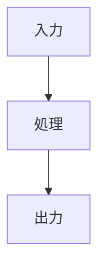

# AGENTS.md

各エージェントはこのリポジトリで作業するときに必ずこのファイルを読むこと

---

## 目次

1. [プロジェクト概要](#プロジェクト概要)
2. [ディレクトリ構造](#ディレクトリ構造)
3. [記事ファイルの命名規則](#記事ファイルの命名規則)
4. [フロントマター](#フロントマター)
5. [カテゴリ](#カテゴリ)
6. [タグ](#タグ)
7. [文体・文章スタイル](#文体文章スタイル)
8. [タイトルの作り方](#タイトルの作り方)
9. [構成パターン](#構成パターン)
10. [図・画像の使い分け](#図画像の使い分け)
11. [過去記事へのリンク](#過去記事へのリンク)
12. [情報の鮮度管理](#情報の鮮度管理)
13. [やってはいけないこと](#やってはいけないこと)
14. [ローカル確認](#ローカル確認)
15. [コミット規則](#コミット規則)
16. [AIチャットからの記事化ワークフロー](#AIチャットからの記事化ワークフロー)
17. [AgentCommands](#AgentCommands)

---

## プロジェクト概要

**Waka-DS.com** ── ITコンサルタントによる技術ブログ。
Jekyll + jekyll-theme-yat で構築されたスタティックサイト。GitHub Pages でホストされている。

主なコンテンツ: Data Engineering・AI Agent 開発・SaaS 最適化など。

---

## ディレクトリ構造

```
_posts/         記事ファイル（日本語・英語とも置く）
_drafts/        作成中の記事（公開前の下書き。ビルド対象外）
_rejected/      没記事の保管場所（ビルド対象外）
_includes/      Liquid テンプレートのパーツ
_layouts/       ページレイアウト
_sass/          スタイルシート
_template/      新規記事のテンプレート
_data/          サイトデータ（ナビなど）
assets/         画像・CSS・JS
en/             英語サイトのインデックス系ページ
```

---

## 記事ファイルの命名規則

```
_posts/YYYY-MM-DD-slug.md        日本語記事
_posts/YYYY-MM-DD-slug-en.md     英語記事（日本語と対になる場合）
_drafts/slug.md                  下書き（日付不要。Jekyll慣例）
```

- slug はハイフン区切りの英小文字
- 日英セットにする場合は、同じ slug を使い `-en` サフィックスで英語版を作る
- `_drafts/` に置いた記事はビルド対象外。公開時は日付を付けて `_posts/` へ移す

---

## フロントマター

### 日本語記事

```yaml
---
layout: post
title: "タイトル"
subtitle: サブタイトル（省略可）
categories: 開発
tags: ["タグ1", "タグ2"]
lang: ja
ref: slug-name   # 日英対応させる場合のみ。英語版と同じ値にする
last_modified_at: YYYY-MM-DD   # 公開後に内容を更新した場合のみ
image:   # アイキャッチを設定する場合のみ
  path: /assets/images/posts/YYYY-MM-DD-slug/eyecatch.png
  alt: 画像の内容が分かる説明
---
```

### 英語記事

```yaml
---
layout: post
title: "Title"
subtitle: Subtitle (optional)
categories: Development
tags: ["tag1", "tag2"]
lang: en
ref: slug-name   # 日本語版と同じ値
last_modified_at: YYYY-MM-DD   # Only after updating published content
image:   # Only when the post has an eyecatch image
  path: /assets/images/posts/YYYY-MM-DD-slug/eyecatch.png
  alt: Description of the image
---
```

### フィールドの注意点

- `title` に `──` 以降のサブタイトル的な文言を含めない。タイトルはシンプルに保つ
- `subtitle` は省略してもよい。書く場合は記事の内容を短く補足するだけにする
  - NG: `〇〇・△△・□□まで体系的に解説` / `〇〇の使い方からCIでの活用法まで丁寧に解説`
  - OK: `Claude Code の Hooks・Ralph Loop の設計と実装`（何が書いてあるかを素直に示す）
- `ref` は日英対応が不要なら省略してよい
- `last_modified_at` は公開後に記事内容を更新した場合のみ追加する。初回公開時や軽微な誤字修正では省略する
- `image` は記事にアイキャッチを表示する場合のみ追加する。`path` と内容が分かる `alt` をセットで指定する
- 投稿のアイキャッチには `banner` を使わない。`banner` はページ全体の背景画像として文字やサイトヘッダーと重なるためである

---

## カテゴリ

カテゴリは以下のリストから選ぶ。リストにないものを使いたい場合は追加を提案すること（勝手に増やさない）。

### 日本語記事

| カテゴリ | 使いどころ |
| :--- | :--- |
| `開発` | 技術的な実装・ツール・言語・サービス全般 |
| `AI開発` | AI・LLM・エージェント開発に特化した内容 |
| `データエンジニアリング` | データパイプライン・分析基盤・DB設計など |
| `インフラ` | クラウド・ホスティング・デプロイ・Docker など |
| `ブログ` | ブログ自体に関するメタな記事 |

### 英語記事

| Category | 使いどころ |
| :--- | :--- |
| `Development` | `開発` の英語版 |
| `AI Development` | `AI開発` の英語版 |
| `Data Engineering` | `データエンジニアリング` の英語版 |
| `Infrastructure` | `インフラ` の英語版 |
| `Blog` | `ブログ` の英語版 |

---

## タグ

既存記事で使われているタグ。新規タグを追加する場合は既存のものと重複・類似していないか確認すること。

### 日本語タグ

日本語記事では、固有名詞・プロダクト名は英語表記のまま使う（例: `Claude Code`, `Docker`）。

**AIエージェント系**  
`AIエージェント`, `AIネイティブ開発`, `AIセーフティ`,
`マルチエージェント`, `ハーネスエンジニアリング`, `コンテキスト管理`,
`自動化`, `報酬ハッキング`, `アライメント`,
`コーディングエージェント`

**プロダクト・ツール（英語表記）**  
`Claude`, `Claude Code`, `Codex`, `Codex CLI`, `opencode`, `agmsg`, `MCP`,
`Ralph Loop`, `Black`, `Alembic`, `SQLAlchemy`,
`Docker`, `Docker Compose`, `Dockerfile`,
`Python`, `Git`, `VSCode`,
`PostgreSQL`, `JSONB`, `SQL`,
`Supabase`, `Railway`, `Neon`,
`Vercel`, `Netlify`, `Cloudflare`, `Next.js`,
`OpenAPI`, `Swagger`, `API`, `REST`,
`GitHub Pages`, `Jekyll`,
`LLM`, `AI`, `OSS`, `CLI`

**汎用（日本語）**  
`データベース`, `バックエンド`, `フロントエンド`, `ホスティング`,
`開発環境`, `コードフォーマッター`, `ドキュメント`,
`マイグレーション`, `設計`

### 英語タグ

**AI / Agent**  
`AI`, `LLM`, `AI-Native Development`, `Coding Agent`,
`Claude`, `Claude Code`, `Codex`, `Codex CLI`, `opencode`, `agmsg`,
`Ralph Loop`

**バックエンド / データ**  
`Python`, `Docker`, `PostgreSQL`, `SQL`, `JSONB`,
`Alembic`, `SQLAlchemy`, `Database`, `Backend`,
`Supabase`, `Railway`, `Neon`, `BaaS`, `PaaS`

**フロントエンド / インフラ**  
`Vercel`, `Netlify`, `Cloudflare`, `Next.js`, `Frontend`, `Hosting`

**API / 仕様**  
`OpenAPI`, `REST`, `API`, `Swagger`, `Documentation`

**ツール / 環境**  
`Git`, `VSCode`, `Docker Compose`, `Development Environment`,
`Code Formatter`, `Black`, `CLI`, `OSS`,
`GitHub Pages`, `Jekyll`

---

## 文体・文章スタイル

### 基本方針

- 文体は常体（だ・である調）
- プレーンな文章を中心に書く。「引き」のある表現は記事全体で数回あれば十分
- 強い表現・印象的な言い回しを多用しない。多用するとAIらしさが出る

### 避けるべきパターン（AIらしい文章の典型）

#### 太字・強調の乱用

- NG: 段落ごとにボールドが入る、「**これが最も重要だ**」「**ここが核心だ**」
- OK: 本当に目を止めてほしい箇所だけ。記事全体で数か所

#### 冒頭の大仰な宣言

- NG: 「これが今日最も考えるべき問いだ。」「ここが設計の核心だ。」
- OK: 普通に事実を述べる

#### 「つまり」「すなわち」「換言すると」の多用

- NG: 段落の締めに毎回まとめを入れる
- OK: 本当に要約が必要な場面だけ

#### 箇条書きへの過剰依存

- NG: 文章で書けるものまですべてリスト化する
- OK: 並列関係にあるものだけリスト化する

#### 平行構造の繰り返し

- NG: 同じ長さ・同じ文末の文が連続する（「〇〇する。△△する。□□する。」）
- OK: 文の長さや構造を自然に変える

#### 最後の「まとめ」的な一言

- NG: セクションの末尾に「これが〜の本当の意味だ。」と締める
- OK: 次のセクションへ自然につなぐか、何も言わず終わる

#### 強調副詞の多用

「非常に」「まさに」「絶対に」「最も」など。使うなら記事全体で1〜2回まで。

### 文章のトーン

記事によって合うトーンが異なる。無理に統一しない。

- 実装・ツール解説 → 淡々とした説明調
- 比較・選定 → 自分が調べているときの視点で書く（Supabase記事のように）
- 思想・設計論 → 少し距離を置いた考察調

---

## タイトルの作り方

タイトルは記事の内容・価値・対象読者が伝わるように作る。以下のパターンを参考に。

| パターン | 例 |
| :--- | :--- |
| ゴール＋手段 | "エージェントを長く自律動作させるためのコンテキスト設計" |
| 問題＋解消 | "Claude と Codex のマルチエージェント引き継ぎ問題と解消パターン" |
| 疑問形 | "なぜフロントエンドに Vercel を選ぶのか" |
| 対象者＋ツール名 | "AI コーディング向けの Python フォーマッター Black" |
| 動詞句（何をするか） | "OpenAPI で API の仕様とドキュメントを同期させる" |
| 比較 | "Supabase vs Railway vs Neon バックエンド選定 (2026年版)" |

**避けるパターン:**
- `〇〇とは何か` だけで止めない。用途・対象・文脈を加える
- `──` は禁止ではないが、使いすぎない。タイトルの主語が完結していれば `──` で足さない
- `〇〇から△△まで解説` / `〇〇まで体系的に解説` は使わない（subtitle も同様）

---

## 構成パターン

記事ごとに合う構成を選ぶ。毎回同じパターンにしない。

### パターン A: 結論先行型

仕組みやツールの解説に向く。

```
導入（問題提起）
## 結論を先に
## 各セクション
## まとめ（表）
## 参考
```

### パターン B: 調査ログ型

比較・選定・調べてみた系の記事に向く。Supabase vs Railway 記事がこの例。

```
導入（自分のユースケースや背景）
## 軸の整理 or 前提
## サービスA
## サービスB
## 比較・まとめ
## 参考
```

### パターン C: 問題分解型

原因と対処を掘り下げる記事に向く。

```
導入（現象・問題）
## なぜ起きるか
## 構造の整理
## 対処パターン or 解決策
## まとめ
```

### パターン D: 自由形式

上記に収まらない場合は無理に型に合わせない。読んで自然に流れる構成にする。

---

## 図・画像の使い分け

記事内で構造や関係を示す場合は、文字で罫線を描いたASCIIアートではなく、Mermaidまたは画像を使う。

### Mermaidを使う場合

構成図、処理フロー、状態遷移図、シーケンス図など、テキストで構造を管理できる図はMermaidを第一候補にする。

このリポジトリは`jekyll-spaceship`のMermaid Processorを使うため、コードフェンスには通常の`mermaid`ではなく、末尾に`!`を付けた`mermaid!`を指定する。

````markdown

````

- スマートフォンでの表示を考え、原則として横方向の`LR`より縦方向の`TB`を使う
- ノード内の文章は短くし、説明が多い場合は本文へ分ける
- ノードや接続が多い図は、1枚へ詰め込まず複数の図へ分割する
- Mermaidで表現しにくい装飾や厳密な配置が必要な場合はSVGへ切り替える

### 画像を使う場合

| 形式 | 用途 |
| :--- | :--- |
| SVG | 複雑な構成図、厳密なレイアウト、拡大表示が必要な図 |
| PNG / WebP | スクリーンショット、UI操作、写真 |

- 画像は`assets/images/posts/YYYY-MM-DD-slug/`以下へ置く
- MermaidからSVGを書き出す場合は、再編集用の`.mmd`ファイルも同じディレクトリへ残す
- 画像には内容が分かるaltテキストを付ける。`alt text`のような仮文字列を残さない
- 重要な図を外部サービス上の画像だけに依存させない。長期的な表示安定性が必要ならリポジトリ内へSVGを保存する

### 記事のアイキャッチ

記事のアイキャッチはフロントマターの `image.path` と `image.alt` で指定する。設定した画像は記事ヘッダーの下とHomeの記事一覧に表示され、OGP画像としても使われる。

- 原則として16:9、1200×675pxで作成する。小さい画像を拡大して使わない
- 画像内へ記事タイトルを埋め込まない。タイトルはHTML側で表示する
- Homeではサムネイル表示されるため、小さく表示しても主題が伝わる構図にする
- アイキャッチが不要な記事では `image` を省略する。画像なし記事の表示は従来どおりとする

AIでアイキャッチを生成する場合は、[アイキャッチ画像生成ワークフロー](docs/eyecatch-image-generation-workflow.md)に従う。

- 記事のカテゴリではなく、記事固有の出来事または一つの強い比喩を描く
- 1記事について画風の異なる候補を最低4つ生成し、ユーザーの選定前にフロントマターへ設定しない
- 同じプロンプトのseed違いではなく、媒体・配色・構図・抽象度を変える
- リソグラフ／スクリーンプリントを基準候補に含める
- `dark navy`、`neon`、`glowing network`などの汎用的な技術表現だけで構成しない
- 候補と旧生成物は`.eyecatch-work/`へ置き、採用画像だけを`assets/images/posts/`へ置く
- コンテキスト/トークン消費を抑えるため、エージェントは生成画像を視認評価せず、候補ファイルの存在だけを確認して選定をユーザーへ委任する
- 採用後に記事ヘッダー、Homeのサムネイル、OGPメタデータが採用画像のパスとaltを参照していることを生成HTMLで確認する

### ASCII表現を使える範囲

ASCII表現は`入力 → 処理 → 出力`のような1行程度の単純な流れ、ディレクトリツリー、短いコマンド出力に限定する。

箱、分岐、複数階層を罫線文字で描くASCII図は使用しない。コードブロックのフォント、画面幅、日本語と英数字の幅の違いによって表示が崩れるためである。

---

## 過去記事へのリンク

関連する既存記事があれば積極的にリンクする。サイト内の周遊を促し、記事の価値が上がる。

- **リンク記法**: `[表示テキスト]()`
- 1記事あたり1〜3本が目安。文脈上自然につながる場合のみ使う
- 無理に探す必要はない。文脈に合うものがなければ入れない
- **「参考」セクションとの使い分け**: 内部リンク（自サイト記事）は本文中に自然に組み込む。「参考」セクションは外部リンク（公式ドキュメント・GitHub・外部記事）専用とする

---

## 情報の鮮度管理

### 基本原則

カットオフ時点の知識を「最新」とみなしてはならない。
以下の情報を記事に含める場合は、**必ずweb検索で現在の状態を確認してから**書くこと。

### web検索が必須のトリガー

- LLM・AIモデルのバージョン・名称（GPT-X、Claude X、Gemini X など）
- CLIツールのバージョン・機能仕様（Codex CLI、opencode、Goose など）
- SaaSの料金・プラン・制限値（Vercel、Supabase、Railway、Neon など）
- ベンチマーク・性能比較の数値
- API仕様・エンドポイント・パラメータ名
- 「現在」「最新」「最近」「今」などの現在時制を使う記述
- 年付き情報（「2026年版」「2026年時点」など）

### 検索の仕方

- クエリに現在年を含める（例: `"Vercel pricing 2026"`）
- 公式ドキュメント・changelogを一次情報として優先する
- 検索結果のURLは記事の「参考」セクションに含める

### 記事作成後の処理

陳腐化リスクが高い情報（料金・モデル名・ツール仕様など）を含む記事を書いたら、`_data/stale_watch.yml` に追記すること。

### 定期レビュー手順

`_data/stale_watch.yml` に記載された記事を定期的に確認する。

#### レビューの実行

1. `_data/stale_watch.yml` を読み込む
2. `stale_risk: high` の記事から順に確認する
3. 各記事の `reason` に書かれた情報をweb検索で現状と照合する
4. 差分があれば記事を更新し、`last_modified_at` をフロントマターに追記する
5. 確認済みの場合は `stale_watch.yml` の `last_verified` を今日の日付に更新する

#### 更新頻度の目安

| stale_risk | 対象 | 確認頻度 |
| :--- | :--- | :--- |
| `high` | 料金・モデル名など頻繁に変わるもの | 3ヶ月ごと |
| `medium` | ツール仕様・API仕様など | 6ヶ月ごと |
| `low` | 概念・設計論で時制が入っているもの | 1年ごと |

---

## やってはいけないこと

- `_config.yml` を変更しない（サイト全体に影響する）
- `_site/` 以下のファイルを直接編集しない（ビルド成果物）
- 既存記事のフロントマターの `ref` 値を変更しない（日英リンクが壊れる）
- 投稿のアイキャッチ用途で `banner:` を設定しない（タイトルやサイトヘッダーと画像が重なる）
- **コミットは実行しない**。作業完了後にコミットメッセージの案を提示すること

---

## ローカル確認

```bash
# Docker で起動（推奨）
docker compose up

# ブラウザで確認
# http://localhost:4000

# _drafts/ の記事もプレビューしたい場合
docker compose run --rm jekyll bundle exec jekyll serve --drafts
```

Mermaidを含む記事は、Jekyllビルド後のHTMLでコードブロックのまま残っていないことを確認する。

```bash
docker compose run --rm jekyll bundle exec jekyll build

# 生成HTMLにMermaidの画像または要素が存在するか確認
rg 'class="mermaid"|mermaid.ink' _site/
```

---

## コミット規則

コミットはユーザーが実行する。作業完了後に以下の形式で案を提示すること。

```
add: 新規記事を追加したとき
fix: 記事内容の修正
update: 既存記事のアップデート
refactor: テンプレートや構造の変更（記事内容は変えない）
```

---

## AIチャットからの記事化ワークフロー

ChatGPT、Claude、Gemini などとの会話ログや共有リンクをもとに記事を作成する場合は、以下の手順に従う。

### 基本方針

- 共有リンクだけに依存しない。Issue本文に貼られた会話本文・要点を一次入力として扱う
- 会話の内容をそのまま要約するのではなく、読者に価値がある記事構成へ再編集する
- ユーザーの発言、AIの提案、未検証の推測を区別する
- 未確認情報を断定しない
- 社内情報、個人情報、機密情報が混ざっていそうな箇所は記事化前に除外または一般化する
- 公開前提の記事は、必ずPRでレビューできる状態にする

### 作業手順

1. Issue本文から source link / raw transcript / article goal を読む
2. 会話の主要論点を抽出する
3. 記事に含める内容と捨てる内容を分ける
4. タイトル、subtitle、category、tags、slug を提案する
5. `_posts/YYYY-MM-DD-slug.md` として記事ファイルを作成する
6. front matter はこのリポジトリの規則に従う
7. 現在性のある情報はweb検索で確認し、参考リンクを追加する
8. PR本文に、記事の狙い・確認ポイント・公開前の注意点を書く

### 記事化してはいけないもの

- 社内プロジェクト名、顧客名、未公開情報
- 個人が特定される情報
- APIキー、トークン、環境変数
- 有料記事や書籍などの長い引用
- AIとの会話をそのまま貼っただけの記事

---

## AgentCommands

このリポジトリでは、IssueまたはPRコメント内の以下のコマンドをエージェント向けの作業指示として扱う。

### `/quick-blog`

Issue本文をもとに、ブログ記事ドラフトを作成する。

#### 使い方

Issue本文またはコメントに以下を含める。

```text
/quick-blog
```

#### 入力の前提

Issue本文は、短い依頼文、AIチャット共有リンク、会話コピペ、箇条書きメモだけの場合がある。
入力が不完全でも、エージェントは文脈を補って記事化を進める。

#### 動作

1. Issue本文からテーマ、参考情報、記事化方針を読み取る
2. 想定読者、記事ゴール、記事タイプ、カテゴリ、タグを仮提案する
3. 会話ログやメモをそのまま要約せず、読者に価値がある記事構成へ再編集する
4. 社内情報、個人情報、未公開情報が含まれそうな箇所は一般化または除外する
5. 現在性の高い事実は、信頼できる情報源で確認する
6. AGENTS.mdの既存ルールに従って、GitHub Pages用Markdown記事を作成する
7. 直接mainへpushせず、PRとして提出する

#### 確認方針

原則として、記事ファイルを作る前にIssueへ以下をコメントする。

* 読み取った記事テーマ
* 想定読者
* 記事のゴール
* タイトル案
* 見出し案
* 除外・一般化すべき情報
* 追加確認したい点があれば最大3つ

ただし、依頼者が「確認不要」「そのまま進めて」「PRまで作って」と明記している場合は、上記をPR本文に含めたうえで記事作成まで進めてよい。

---

## PR作成

ClaudeがIssueから記事作成や修正作業を行う場合は、原則としてPull Requestまで作成する。

### Required flow

1. mainブランチへ直接pushしない
2. 作業用branchを作成する
3. 変更をcommitする
4. remote branchへpushする
5. Pull Requestを作成する
6. PR URLを元Issueにコメントする

### Branch naming

記事作成の場合:

- `article/quick-blog-{issue-number}`
- `article/{short-slug}`

修正の場合:

- `fix/{short-description}`

### PR body

PR本文には以下を含める。

- Summary
- Created / Updated Files
- Article Goal
- Verification
- Review Points
- Related Issue

### Do not stop after pushing branch

branchをpushしただけで作業完了にしない。  
GitHubが表示する "Create pull request" リンクを人間に押させるのではなく、Claude自身がPull Requestを作成する。
