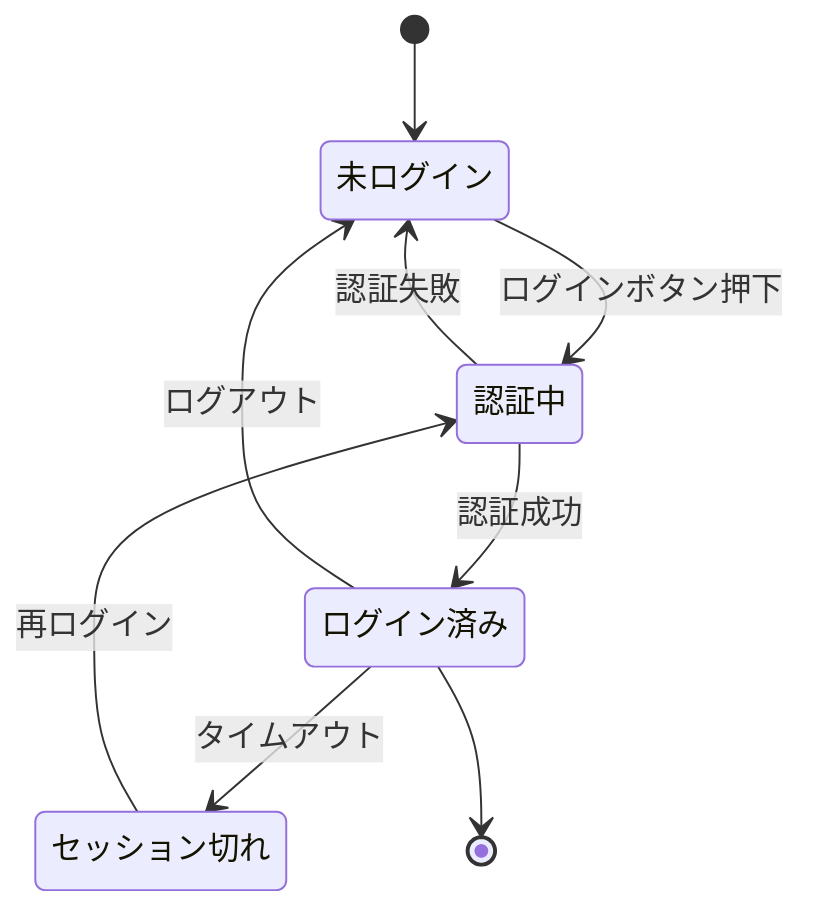

設計ドキュメントのなかで、状態遷移図はわりと判断が難しい部類だ。「書いた方がいいのはわかるけど、いつ書くのか」という感覚はあっても、実際に書くきっかけをうまくつかめないことがある。

書くべき場面と、書かなくていい場面を整理しておく。

---

## 状態遷移図とは

システムやオブジェクトが取りうる「状態」と、それらの間の「遷移」を図にしたもの。状態機械（ステートマシン）とも呼ぶ。

基本的な構成要素は4つだ。

- **状態（State）**: システムが取りうる条件の一つ。「ログイン済み」「処理中」「エラー」など
- **遷移（Transition）**: ある状態から別の状態へ移ること
- **イベント（Event）**: 遷移のきっかけになる出来事。「ボタン押下」「タイムアウト」「APIレスポンス受信」など
- **アクション（Action）**: 遷移が起きたときに実行される処理（省略することもある）

---

## 書き方

Mermaid を使うと Markdown 内に直接書ける。GitHub、Notion などでそのまま描画できる。

`[*]` が開始点・終了点を表す。`状態A --> 状態B : イベント` の形式でほぼすべてのケースを書ける。

PlantUML も同等の表現ができる。どちらを選ぶかはチームが使っているツールに合わせれば十分だ。

---

## 役立つ場面

**状態数が多く、遷移に条件がある場合**

「この状態のときだけこの操作ができる」という制約が複数絡んでいると、コードだけでは把握しにくい。注文管理（pending → confirmed → shipped → delivered）や課金ステータスなど、ビジネスロジックが絡む状態管理はこれにあたる。

**オンボーディングやレビューのとき**

新しいメンバーへの説明や設計レビューの場で、状態遷移図があると議論の具体性が上がる。「この状態からキャンセルできますか？」「エラーからはどこに戻りますか？」という質問が出やすくなる。コードを全部読まなくても全体像を把握できる。

**バグ調査**

「なぜこのケースでエラーが出るのか」が不明なとき、状態遷移図を書いてみると未定義の遷移（想定外の経路）が見つかることがある。図を書くことで設計の穴を発見するツールとして使える。

**AIエージェントのオーケストレーション設計**

複数のエージェントが連携するシステムでは、タスクや会話の状態管理が複雑になりやすい。[エージェントを長く自律動作させるためのコンテキスト設計]()で触れた問題は、エージェントの状態遷移として整理すると設計の見通しが良くなる。どのフェーズで何を保持し、どこでリセットするかが可視化できる。

---

## 書かなくていいケース

**単純なCRUD**

作成・読み取り・更新・削除だけで状態が変わらないシステムは、状態遷移図を書いても得るものが少ない。テーブル設計やAPI仕様の方が有用だ。

**線形なパイプライン**

「A → B → C → D」と一方向にしか進まない処理は、フロー図や箇条書きの方が伝わる。状態遷移は「条件による分岐」「ループ」「戻り」があるときに価値を持つ。

**状態がコードで自明なとき**

`isLoading`、`hasError`、`isComplete` のようなフラグで状態が明確に表現されていて、かつ遷移が単純な場合は、図に起こす労力に見合わないことも多い。

---

## 気をつけること

**エラー状態と例外経路を忘れない**

ハッピーパスだけ書いて終わりにしがちだが、「タイムアウトしたらどこへ行くか」「途中でキャンセルされたらどうなるか」が抜けると実装時に困る。エラー状態から復帰できるかどうか、復帰先はどこかも明示する。

**初期状態を明示する**

「どこからスタートするか」が曖昧な図はよくある。`[*]` やそれに相当する記法で開始点を必ず示す。

**状態の爆発に注意する**

フラグの組み合わせで状態を表現し始めると（「ログイン済み × 課金済み × メール確認済み」など）、状態数が指数的に増える。20を超えてきたら、責務ごとに別の状態機械に分割する方が管理しやすい。

**イベントとアクションを混同しない**

「ボタンを押した」はイベント、「APIを呼び出す」はアクション。矢印のラベルに何を書くか迷ったら、「何が起きたか（イベント）」と「何をするか（アクション）」を分けて整理する。どちらを矢印に書くかはプロジェクトで統一しておくと読みやすくなる。

---

## ツールの選び方

| ツール | 向いている場面 |
| :--- | :--- |
| Mermaid | Markdown 埋め込み。GitHub・Notion で描画できる |
| PlantUML | 複雑な図。VS Code 拡張で描画できる |
| XState | ステートマシンをそのままコードで実装する場合 |
| draw.io | GUI で直感的に書きたい場合。共同編集もしやすい |

軽い設計メモや README に埋め込むなら Mermaid が手軽だ。実際に動くコードと状態機械を一致させたいなら、XState のような実装ライブラリに踏み込む価値がある。

---

## 参考

- [Mermaid: State diagrams](https://mermaid.js.org/syntax/stateDiagram.html) — Mermaid の状態遷移図構文リファレンス
- [XState documentation](https://stately.ai/docs) — ステートマシンをコードで実装するためのライブラリ
- [Statecharts: A Visual Formalism for Complex Systems](https://www.sciencedirect.com/science/article/pii/0167642387900359) — David Harel による状態遷移図の拡張（ステートチャート）の原論文
