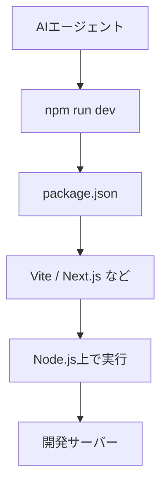
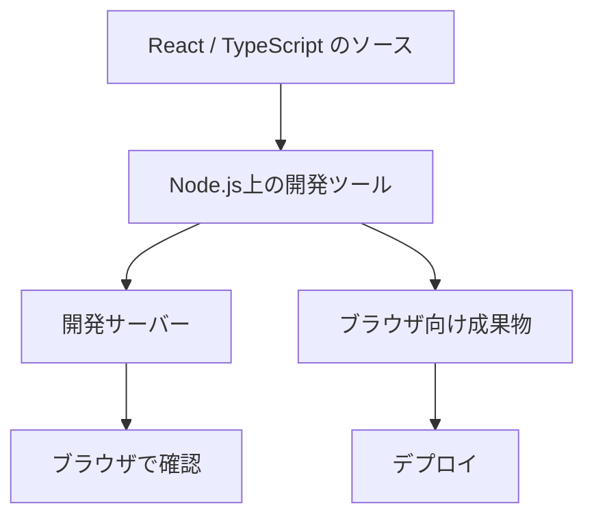
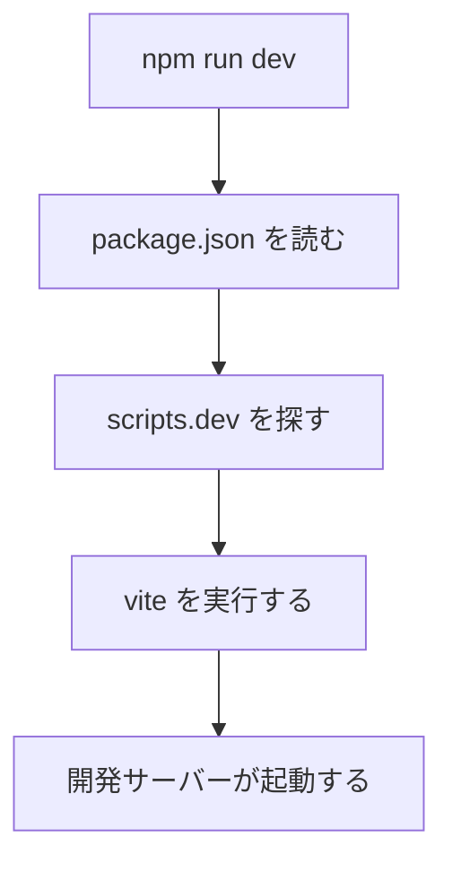
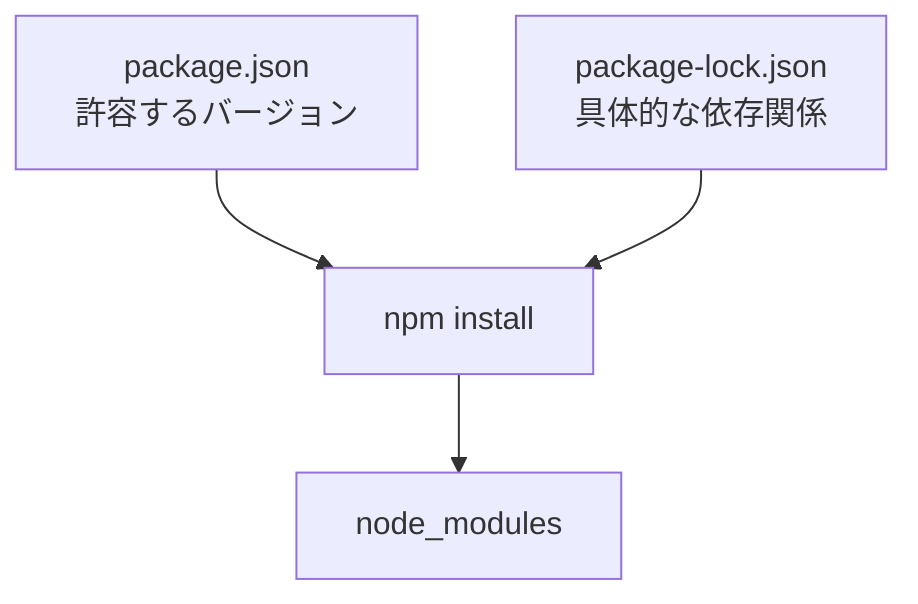
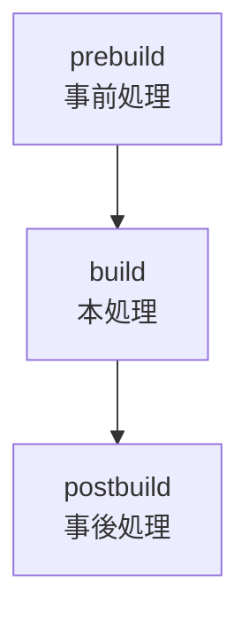

AIエージェントを使ってWebアプリを開発していると、Node.js周辺の用語やファイルが頻繁に現れる。

```bash
node -v
npm install
npm run dev
npm run build
npm run lint
npm test
```

ほかにも、`package.json`、`node_modules`、`.env`、TypeScript、Vite、Next.jsといった名前が一度に出てくる。エージェントが操作してくれるため、意味を知らなくても開発自体は進む。しかし、エラーが起きたときに「どの層で失敗したのか」が分からないと、エージェントの説明や修正案が妥当か判断しにくい。

バイブコーディングで必要なのは、Node.jsを使って一から実装できる知識ではない。実行環境、パッケージ、開発ツール、設定ファイルの関係を把握し、エージェントが何を変更・実行しているか追えることである。

---

## 結論を先に

Node.js周辺は、次のように分けると理解しやすい。

| 領域 | 代表的なもの | 何をしているか |
| :--- | :--- | :--- |
| 実行環境 | Node.js | JavaScriptをブラウザの外で動かす |
| パッケージ管理 | npm、Yarn、pnpm | ライブラリや開発ツールを導入する |
| プロジェクト設定 | `package.json` | 依存関係や実行コマンドを定義する |
| 開発ツール | Vite、Next.js、TypeScript、ESLint | 開発サーバー、変換、検査などを行う |
| 設定値 | `.env`、環境変数 | API URLや秘密情報などを実行環境へ渡す |
| 実行結果 | 開発サーバー、ビルド成果物 | ブラウザ確認やデプロイに使う |

AIエージェントが `npm run dev` を実行している場合、npmだけが動いているわけではない。npmが `package.json` を読み、ViteやNext.jsなどの開発ツールを呼び、そのツールがNode.js上で動いている。



この記事では、Node.js周辺でよく見るものをこの順番で整理する。その中でも出現頻度の高い `npm run` と依存関係については、少し詳しく扱う。

---

## 最初に押さえる7つのポイント

細部へ入る前に、バイブコーディングで判断材料になるポイントを先に並べておく。

1. Node.jsはプログラミング言語ではなく、JavaScriptの実行環境である
2. npmはNode.jsそのものではなく、パッケージ管理とコマンド実行を担う
3. そのリポジトリの作業内容は `package.json` に書かれている
4. `npm run dev` の中身はプロジェクトごとに異なる
5. 開発サーバーと本番用ビルドは別の処理である
6. `.env` は設定値を渡す仕組みで、秘密情報を含む場合がある
7. Node.jsやパッケージマネージャーのバージョン違いで動作が変わる

この7点を知っていれば、エージェントへ確認すべきことや、ログのどこを見るべきかがかなり明確になる。

---

## Node.js・npm・package.jsonの関係

最初に、似た言葉の役割を分けておきたい。

| 名前 | 役割 |
| :--- | :--- |
| Node.js | JavaScriptをブラウザの外でも動かす実行環境 |
| npm | パッケージの導入やスクリプト実行を行うCLI |
| npm registry | 公開されたパッケージを配布する場所 |
| `package.json` | プロジェクトの設定や依存関係を書くファイル |
| `package-lock.json` | 実際に導入する依存関係の正確な構成を記録するファイル |
| `node_modules/` | インストールされたパッケージが置かれるディレクトリ |

Node.jsをインストールすると、一般的にはnpm CLIも一緒に利用できるようになる。それぞれが使えるかは、次のコマンドで確認できる。

```bash
node -v
npm -v
```

Node.jsがプログラムを動かす環境で、npmはその周辺の道具を管理する役割を持つ。npm自身がアプリを開発するのではなく、Vite、Next.js、ESLint、Vitestなどのツールを導入し、決められた方法で呼び出している。

---

## JavaScriptとNode.jsは同じものではない

JavaScriptはプログラミング言語であり、Node.jsはJavaScriptを動かす実行環境である。

JavaScriptはもともとブラウザ上で動くものとして広く使われてきた。ブラウザには画面を操作するDOMや、現在のページを表す `window` などの機能がある。一方、Node.jsにはファイルを読み書きする機能や、HTTPサーバーを動かす機能がある。

同じJavaScriptでも、実行する場所によって利用できる機能が違う。

| 実行場所 | 主な用途 | 代表的な機能 |
| :--- | :--- | :--- |
| ブラウザ | 画面表示・ユーザー操作 | DOM、`window`、ブラウザAPI |
| Node.js | サーバー・開発ツール・スクリプト | ファイル操作、プロセス、サーバー |

フロントエンド開発でもNode.jsが登場するのは、ブラウザで動く画面そのものだけでなく、開発サーバー、TypeScript変換、コード検査、ビルドなどをNode.js上のツールが担当するためである。



エラーに `window is not defined` や `document is not defined` と出る場合は、ブラウザ向けの処理がNode.js側で動いている可能性がある。反対に、ブラウザ側でNode.js専用のファイル操作を使おうとして失敗することもある。

---

## package.jsonはプロジェクトの案内板

Node.jsを使うプロジェクトでは、ルートディレクトリに `package.json` が置かれていることが多い。

```json
{
  "name": "sample-app",
  "private": true,
  "scripts": {
    "dev": "vite",
    "build": "vite build",
    "lint": "eslint .",
    "test": "vitest run"
  },
  "dependencies": {
    "react": "^19.0.0",
    "react-dom": "^19.0.0"
  },
  "devDependencies": {
    "eslint": "^9.0.0",
    "vite": "^7.0.0",
    "vitest": "^3.0.0"
  }
}
```

最初からすべてを読む必要はない。バイブコーディングでまず見る場所は、次の3つである。

### scripts

プロジェクトで実行できる作業の一覧である。

```json
"scripts": {
  "dev": "vite",
  "build": "vite build",
  "lint": "eslint .",
  "test": "vitest run"
}
```

登録されているスクリプトは、引数なしの `npm run` でも確認できる。

```bash
npm run
```

AIエージェントが見慣れないコマンドを実行しようとしている場合は、まず `package.json` の `scripts` を見れば、実体を確認できる。

### dependencies

アプリを動かすために必要なパッケージを書く場所である。Reactのように、実行するアプリ本体から利用するライブラリが入る。

### devDependencies

主に開発中に使うパッケージを書く場所である。リンター、テストツール、ビルドツールなどが代表例だ。

ただし、`dependencies` と `devDependencies` の使い分けはプロジェクトの構成によって変わる。名前だけで必要性を決めず、既存の設定に従うのが基本になる。

---

## npm runはpackage.jsonに登録された作業を呼び出す

`npm run dev` は、npmに組み込まれた「開発サーバー起動機能」を直接呼んでいるわけではない。

プロジェクトの `package.json` に登録された `dev` という名前のコマンドを探し、その中身を実行している。

たとえば、`package.json` に次の設定があるとする。

```json
{
  "scripts": {
    "dev": "vite",
    "build": "vite build",
    "lint": "eslint .",
    "test": "vitest run"
  }
}
```

このプロジェクトで次のコマンドを実行すると、

```bash
npm run dev
```

npmは `scripts` の `dev` を探し、実際には `vite` を実行する。



`dev`、`build`、`lint` といった名前は、プロジェクト内の作業に付けられたラベルだと考えると分かりやすい。

---

## npm runの一行を分解する

次のコマンドを、単語ごとに見てみる。

```bash
npm run build
```

| 部分 | 意味 |
| :--- | :--- |
| `npm` | npm CLIを起動する |
| `run` | `package.json` のスクリプトを実行する |
| `build` | `scripts` から `build` という名前を選ぶ |

`package.json` に次の記述があれば、実際に動くのは `vite build` である。

```json
{
  "scripts": {
    "build": "vite build"
  }
}
```

ここで重要なのは、同じ `npm run build` でもプロジェクトによって中身が違うことだ。

```json
"build": "vite build"
```

の場合もあれば、

```json
"build": "next build"
```

の場合もある。複数の処理をまとめていることもある。

```json
"build": "npm run generate && vite build"
```

したがって、`npm run build` という文字だけを見て処理内容を断定することはできない。判断の基準は、そのリポジトリの `package.json` である。

---

## ローカルのツールを呼び出せる仕組み

先ほどの例では、`vite` や `eslint` を直接実行していた。

```json
{
  "scripts": {
    "dev": "vite",
    "lint": "eslint ."
  }
}
```

これらのツールをOS全体へインストールしていなくても、プロジェクトの依存関係として導入されていれば `npm run` から呼び出せる。

npmはスクリプトを実行するとき、ローカルにインストールされた実行ファイルがある `node_modules/.bin` を検索対象へ追加する。そのため、`node_modules/.bin/vite` のような長いパスを書かずに `vite` と記述できる。

この仕組みには、プロジェクトごとに必要なバージョンのツールを使いやすいという利点がある。

---

## よく使うコマンドの違い

npmのコマンドは、役割で分けると理解しやすい。

| コマンド | 主な役割 | 注意点 |
| :--- | :--- | :--- |
| `npm install` | 依存関係をインストールする | 条件によってlockfileを更新する |
| `npm install <package>` | パッケージを追加する | `package.json` とlockfileを更新する |
| `npm ci` | lockfileどおりに依存関係を入れ直す | 既存の `node_modules/` を削除する |
| `npm run <name>` | 登録済みスクリプトを実行する | 変更内容はスクリプト次第 |
| `npm test` | `test` スクリプトを実行する | 実体は `scripts.test` で確認する |
| `npm exec <command>` | パッケージが提供するコマンドを実行する | 未導入のパッケージを取得する場合がある |
| `npx <command>` | `npm exec` に近い形でコマンドを実行する | 未導入のパッケージを取得する場合がある |

`npm run lint` だからファイルを書き換えない、とは限らない。スクリプトの中に `--fix` が含まれていれば、コードが修正される場合がある。

```json
{
  "scripts": {
    "lint": "eslint .",
    "lint:fix": "eslint . --fix"
  }
}
```

コマンド名は説明の手がかりにはなるが、実際の処理はスクリプトの中身で判断する。

---

## npm installは依存関係を用意する

GitHubからプロジェクトを取得した直後は、通常 `node_modules/` が存在しない。依存パッケージはリポジトリへ含めず、各環境でインストールすることが多いためだ。

そこで実行するのが `npm install` である。

```bash
npm install
```

npmは `package.json` と `package-lock.json` を読み、必要なパッケージを `node_modules/` へ配置する。



インストールが終わると、`npm run dev` などからローカルのツールを呼び出せるようになる。

### パッケージを追加する場合

引数付きの `npm install` は、プロジェクトへ新しい依存関係を追加する。

```bash
npm install zod
```

この操作では、通常 `package.json` と `package-lock.json` が更新される。単に一時的なコマンド実行ではなく、プロジェクトの構成変更である。

AIエージェントがパッケージを追加した場合は、少なくとも次の点を確認したい。

- なぜそのパッケージが必要なのか
- 既存の依存関係で代替できないか
- `package.json` とlockfileの差分が意図したものか
- 本番用か開発用か

---

## package-lock.jsonは再現性のためにある

`package.json` のバージョンには、次のように幅を持たせることがある。

```json
{
  "dependencies": {
    "example-package": "^2.3.0"
  }
}
```

一方、`package-lock.json` には実際に解決されたバージョンと依存関係の構成が記録される。別のPCやCIでも同じ依存関係を再現しやすくするためのファイルである。

そのため、`package-lock.json` は通常Gitへコミットする。`node_modules/` はサイズが大きく環境依存でもあるため、通常はコミットしない。

| ファイル | Gitで管理 | 役割 |
| :--- | :---: | :--- |
| `package.json` | する | プロジェクト設定と依存関係の宣言 |
| `package-lock.json` | する | 解決済みの依存関係を固定 |
| `node_modules/` | 通常しない | インストール済みパッケージの実体 |

lockfileにはnpm以外の種類もある。

| パッケージマネージャー | 主なlockfile |
| :--- | :--- |
| npm | `package-lock.json` |
| Yarn | `yarn.lock` |
| pnpm | `pnpm-lock.yaml` |

既存リポジトリでは、lockfileを見て採用されているパッケージマネージャーを確認する。理由なくnpm、Yarn、pnpmを混在させると、依存関係の差分が分かりにくくなる。

---

## npm installとnpm ciの違い

どちらも依存関係をインストールするが、目的が異なる。

### npm install

ローカル開発で依存関係を追加・更新するときに使う。`package.json` と `package-lock.json` の内容が一致していない場合は、条件に合うバージョンを解決してlockfileを更新することがある。

### npm ci

CIや再現性を重視する環境で、既存の `package-lock.json` どおりにクリーンインストールするときに使う。

```bash
npm ci
```

`package.json` とlockfileが一致しなければエラーになり、lockfileを自動更新しない。既存の `node_modules/` がある場合は削除してからインストールする。

| 比較 | `npm install` | `npm ci` |
| :--- | :--- | :--- |
| lockfileの更新 | 起こりうる | しない |
| 依存パッケージの追加 | できる | できない |
| `node_modules/` | 現状を使いながら調整 | 削除して入れ直す |
| 主な用途 | 日常の開発・依存関係変更 | CI・検証・クリーンな再構築 |

AIエージェントに「依存関係を入れてビルドを確認して」と依頼しただけなのにlockfileが更新された場合は、`npm install` を使った理由と差分を確認した方がよい。

---

## 開発サーバーとビルドは別の処理

Webアプリ開発で混同しやすいのが、`dev` と `build` である。

### 開発サーバー

`npm run dev` は、開発中の確認に使うサーバーを起動することが多い。

```bash
npm run dev
```

開発サーバーには、ファイル変更を検知して画面を更新する機能や、エラーを詳しく表示する機能が含まれる。コマンドを実行したターミナルは、サーバーが動いている間は処理中のままになる。

停止するときは、通常 `Ctrl+C` を使う。

開発サーバーが起動したまま別のエージェントが同じコマンドを実行すると、ポート競合が起きることがある。エージェントが複数のターミナルやバックグラウンドプロセスを使っている場合は、何が起動中か確認する必要がある。

### ビルド

`npm run build` は、デプロイや本番実行に使う成果物を作る処理であることが多い。

```bash
npm run build
```

ビルドでは、プロジェクトによって次のような処理が行われる。

- TypeScriptや新しいJavaScript構文の変換
- 複数ファイルの結合や分割
- コードの圧縮
- サーバー側とブラウザ側のコードの振り分け
- 静的HTMLやアセットの生成
- 型チェックや設定値の検証

開発サーバーで画面が表示できても、ビルドが成功するとは限らない。開発中には通っていた型エラーや、デプロイ環境にない環境変数がビルド時に見つかることもある。

| 比較 | 開発サーバー | ビルド |
| :--- | :--- | :--- |
| 代表的なコマンド | `npm run dev` | `npm run build` |
| 目的 | 開発中の確認 | デプロイ用成果物の作成 |
| 実行時間 | 停止するまで動き続ける | 処理完了後に終了する |
| 最適化 | 開発しやすさを優先 | 配布・実行を意識する |
| 結果 | ローカルのURLで確認 | ディレクトリやサーバー用コードを生成 |

---

## TypeScriptはそのまま動かしているとは限らない

AIエージェントが生成するWebアプリでは、JavaScriptではなくTypeScriptが使われることが多い。

```typescript
function greet(name: string): string {
  return `Hello, ${name}`;
}
```

`: string` のような型情報は、コードの間違いを見つけるために使われる。プロジェクトによっては、TypeScriptをJavaScriptへ変換してからブラウザやNode.jsで実行する。

この周辺では、異なる役割をまとめて「ビルド」と呼ぶことがある。

| 処理 | 役割 |
| :--- | :--- |
| 型チェック | 型の矛盾を検出する |
| トランスパイル | TypeScriptなどを実行可能なJavaScriptへ変換する |
| バンドル | 複数のファイルや依存関係を配布しやすい形へまとめる |
| 最適化 | 圧縮や不要コードの除去を行う |

`npm run build` が失敗したときは、「ビルドが失敗した」だけでは原因が分からない。TypeScriptの型チェック、フレームワークの変換、コード生成のどこで失敗したかを見る必要がある。

`tsconfig.json` はTypeScriptの主要な設定ファイルである。AIエージェントがこのファイルを変更した場合、単なるコード修正ではなく、プロジェクト全体の型チェックや変換ルールが変わる可能性がある。

---

## 環境変数と.envはコードの外から設定を渡す

APIのURL、実行モード、外部サービスの認証情報などは、コードへ直接書かず環境変数として渡すことがある。

Node.jsでは、環境変数を `process.env` から参照できる。

```javascript
const apiUrl = process.env.API_URL;
```

ローカル開発では、`.env` というファイルに値を書く構成もよく使われる。

```dotenv
API_URL=https://api.example.com
API_TOKEN=replace-with-local-token
```

環境変数について、バイブコーディングで知っておきたい点は次のとおりだ。

- `.env` にはAPIキーやトークンが含まれる場合がある
- 秘密情報を含む `.env` は通常Gitへコミットしない
- 必要な変数名だけを書いた `.env.example` を共有することがある
- 環境変数の値は文字列として扱われるため、数値や真偽値は変換が必要になる
- フレームワークによって、ブラウザへ公開される変数の命名規則が異なる
- `.env` を変更した後は、開発サーバーの再起動が必要な場合がある

特に注意したいのが、サーバー側だけで使う秘密情報と、ブラウザへ渡してよい公開設定の違いである。フロントエンドへ埋め込まれた値は、利用者から見える可能性がある。

AIエージェントが環境変数を追加した場合は、「どこで参照するか」「秘密情報か」「デプロイ先にも設定が必要か」を確認した方がよい。

---

## Node.jsのバージョンはプロジェクトの前提条件

同じコードでも、Node.jsのバージョンが違うと動作しない場合がある。

現在使っているバージョンは次のコマンドで確認できる。

```bash
node -v
npm -v
```

プロジェクト側では、次のようなファイルや設定で利用するバージョンを示すことがある。

| 場所 | 役割 |
| :--- | :--- |
| `.nvmrc` | nvmで選ぶNode.jsバージョン |
| `.node-version` | バージョン管理ツール向けの指定 |
| `package.json` の `engines` | 対応するNode.jsやnpmの範囲 |
| Dockerfile | コンテナ内で使うNode.jsバージョン |
| CI設定 | テストやビルドで使うNode.jsバージョン |

ローカルでは動くのにCIやデプロイで失敗する場合、Node.jsのバージョン差が原因になることがある。依存パッケージのインストールエラーや、利用できない構文・APIのエラーとして現れる場合もある。

エージェントへ「最新のNode.jsへ上げて」と依頼する前に、ローカル、Docker、CI、デプロイ先の指定をまとめて確認する必要がある。一か所だけ変更すると、環境ごとの不一致が残る。

---

## importとrequireはモジュール方式の違い

Node.jsのコードでは、外部ファイルやパッケージを読み込む書き方として、主に次の2種類を見かける。

### ES Modules

```javascript
import express from "express";
export function createApp() {}
```

### CommonJS

```javascript
const express = require("express");
module.exports = { createApp };
```

どちらもコードをファイルへ分けて再利用する仕組みだが、読み込み方法が異なる。`package.json` の `"type": "module"`、ファイル拡張子、利用するツールの設定などによって扱いが決まる。

```json
{
  "type": "module"
}
```

`Cannot use import statement outside a module` や `require is not defined` といったエラーは、ES ModulesとCommonJSの前提が合っていないときに出ることがある。

この問題を直すために、エージェントが `package.json` の `type` を変更することがある。しかし、この設定はプロジェクト内の広い範囲へ影響する。エラーが出た1ファイルだけでなく、設定ファイルやビルドツールも含めて互換性を確認する必要がある。

---

## dev・build・lint・testは何をしているのか

スクリプト名は自由に付けられるが、よく使われる名前には慣習がある。

| 名前 | よくある役割 |
| :--- | :--- |
| `dev` | 開発サーバーを起動する |
| `build` | 配布・デプロイ用の成果物を作る |
| `start` | アプリケーションを起動する |
| `lint` | コードの問題やルール違反を検出する |
| `format` | コードの見た目を整える |
| `test` | 自動テストを実行する |
| `typecheck` | 型の矛盾を検出する |
| `check` | lint、型チェック、テストなどをまとめて実行する |

これらはあくまで慣習である。`npm run check` が何をするかは、プロジェクトごとに異なる。

```json
{
  "scripts": {
    "check": "npm run lint && npm run typecheck && npm test"
  }
}
```

この例では、左から順に実行し、途中で失敗すれば後続の処理へ進まない。

lintやformatの役割をもう少し詳しく知りたい場合は、Python向けの記事だが[AI コーディング向けの Python フォーマッター Black]()で、フォーマッター・リンター・テストの違いを整理している。

---

## 引数を追加するときの「--」

登録されたスクリプトへ追加の引数を渡したい場合は、`--` を挟む。

```bash
npm run test -- --watch
```

`--` より前はnpm自身への指定、後ろは実際に呼び出されるスクリプトへの指定として扱われる。

`package.json` が次の内容なら、

```json
{
  "scripts": {
    "test": "vitest"
  }
}
```

実質的には次のような呼び出しになる。

```bash
vitest --watch
```

AIエージェントのログに長いnpmコマンドが出たときは、`--` の前後を分けて見ると理解しやすい。

---

## npm runの前後に別の処理が動くことがある

npm scriptsには、スクリプト名の前に `pre`、後ろに `post` を付ける仕組みがある。

```json
{
  "scripts": {
    "prebuild": "npm run generate",
    "build": "vite build",
    "postbuild": "node scripts/report-size.js"
  }
}
```

この状態で次を実行すると、

```bash
npm run build
```

`prebuild`、`build`、`postbuild` の順に動く。



`build` の一行だけを見て終わりだと思っていると、生成ファイルの更新やレポート出力を見落とすことがある。スクリプトを確認するときは、同名の `pre...` と `post...` も確認したい。

---

## npxは未導入のパッケージを取得する場合がある

次のようなコマンドもよく見かける。

```bash
npx create-vite
```

`npx` は `npm exec` に近い方法で、パッケージが提供するコマンドを実行する。対象がローカルの依存関係に存在しない場合、npmのキャッシュ用ディレクトリへパッケージを取得して実行する場合がある。

このため、`npx` は単なる「すでにあるコマンドの呼び出し」とは限らない。

AIエージェントが `npx` で見慣れないツールを実行しようとしている場合は、パッケージ名、実行するバージョン、生成・変更されるファイルを確認した方がよい。特に初期化ツールやコード生成ツールは、多数のファイルを書き換えることがある。

---

## npmコマンドは安全な読み取り処理とは限らない

`npm run` は、最終的には `package.json` に書かれたコマンドをシェルで実行する仕組みである。ファイル削除、データベース操作、外部通信なども記述できる。

```json
{
  "scripts": {
    "reset": "node scripts/reset-database.js",
    "deploy": "node scripts/deploy.js"
  }
}
```

名前が `check` でも読み取りだけとは限らず、名前が `reset` なら必ず危険とも限らない。中身を確認する必要がある。

また、`npm install` や `npm ci` では、パッケージ側が定義したライフサイクルスクリプトが動く場合がある。信頼できないリポジトリや依存関係を扱うときは、「インストールだけだから何も実行されない」とは考えない方がよい。

---

## AIエージェントに実行を任せる前に見るもの

毎回すべてを手作業で確認する必要はない。影響が大きそうなコマンドでは、次の順番で確認すると判断しやすい。

### 1. 今いるディレクトリ

```bash
pwd
```

モノレポや複数アプリを含むリポジトリでは、ディレクトリごとに別の `package.json` がある。違う場所で実行すると、スクリプトが見つからなかったり、別アプリの依存関係を変更したりする。

### 2. Node.jsのバージョン

```bash
node -v
npm -v
```

`.nvmrc`、`package.json`、Dockerfile、CI設定などに指定されたバージョンと一致しているか確認する。

### 3. パッケージマネージャーとlockfile

`package-lock.json`、`yarn.lock`、`pnpm-lock.yaml` のどれがあるかを見る。既存のパッケージマネージャーに合わせる。

### 4. package.jsonのscripts

```bash
npm run
```

または `package.json` を直接読み、実行対象の中身と `pre`・`post` スクリプトを確認する。

### 5. 必要な環境変数

`.env.example`、README、デプロイ設定などを確認し、ローカルと実行先で必要な変数が揃っているかを見る。秘密情報の値をログやコミットへ出さないことも確認する。

### 6. コマンドが書き換えるもの

lintの自動修正、コード生成、DBマイグレーション、デプロイ、依存関係の追加など、変更を伴う処理か確認する。

### 7. 実行後の差分とプロセス

```bash
git status --short
git diff
```

「コマンドが成功した」ことと「意図した変更になった」ことは別である。終了コードが `0` でも、不要な生成ファイルやlockfile更新が混ざることはある。開発サーバーを起動した場合は、確認後もプロセスを残すのか停止するのかを明確にする。

---

## エージェントへの依頼を少し具体的にする

単に「動作確認して」と頼むと、エージェントが妥当だと思ったコマンドを広く実行することがある。次のように確認内容を含めると、作業を追いやすくなる。

```text
Node.js のバージョン、package.json の scripts、lockfile、
必要な環境変数を確認し、
採用されているパッケージマネージャーに合わせてください。
npm run build が実際に何を実行するか説明してから実行し、
終了後に変更ファイル、エラー、起動中のプロセスを報告してください。
```

依存関係を変更してほしくない場合は、その条件も明示する。

```text
依存パッケージは追加・更新せず、既存のスクリプトだけで
lint、型チェック、テストを実行してください。
```

知識がなくても、実行前に「何を読むか」、実行後に「何を報告するか」は指定できる。

---

## よくあるエラーの読み方

エラー全文を理解できなくても、発生した段階を切り分けると状況が見える。

### Missing script

```text
Missing script: "dev"
```

実行した場所の `package.json` に、指定したスクリプトが存在しない可能性が高い。

確認するもの:

```bash
pwd
npm run
```

### command not found

```text
sh: 1: vite: not found
```

スクリプト自体は見つかったが、その中で呼んでいるツールが見つかっていない。依存関係が未インストール、インストール失敗、または `package.json` の設定ミスが候補になる。

### package.jsonが見つからない

```text
Could not read package.json
```

実行ディレクトリが違う可能性がある。むやみに新しい `package.json` を作る前に、リポジトリ内の正しい配置を確認する。

### ポートが使用中

```text
EADDRINUSE
```

開発サーバーが使おうとしたポートを、別のプロセスがすでに使用している。コードの不具合ではなく、別の開発サーバーが起動したままになっている場合も多い。

### 環境変数がない

```text
API_URL is not defined
Missing required environment variable
```

`.env` の不足、変数名の違い、開発サーバーの再起動忘れ、デプロイ先での設定漏れなどが候補になる。値そのものをログへ表示する前に、秘密情報ではないか確認する。

### importやrequireで失敗する

```text
Cannot use import statement outside a module
require is not defined
```

ES ModulesとCommonJSの設定が合っていない可能性がある。`package.json` の `type`、ファイル拡張子、TypeScriptやビルドツールの設定を確認する。

### Node.jsのバージョンが合わない

```text
Unsupported engine
The engine "node" is incompatible
```

プロジェクトや依存パッケージが要求するNode.jsの範囲と、実際の実行環境が一致していない。ローカルだけでなく、Docker、CI、デプロイ先も確認する。

### テストやlintが失敗した

npm自体が壊れているとは限らない。npmは呼び出し役であり、実際の失敗はESLint、TypeScript、テストランナーなどが報告している。

ログでは、次の順番で見るとよい。

1. どのnpm scriptを実行したか
2. scriptの実体は何か
3. 最初に失敗を報告したツールは何か
4. 最初の具体的なエラーメッセージは何か
5. 終了後にファイル変更が残っているか

最後の大量のスタックトレースより、最初に出た具体的なエラーの方が原因に近いことが多い。

---

## バイブコーディングで覚えておく最小セット

すべてを覚える必要はない。まずは次の対応関係が分かれば、エージェントの作業を追いやすくなる。

| 見かけたもの | 理解しておくこと |
| :--- | :--- |
| Node.js | JavaScriptをブラウザ外で動かす実行環境 |
| `node -v` | 現在使っているNode.jsのバージョンを確認する |
| `npm run dev` | `package.json` の `scripts.dev` を実行する |
| 開発サーバー | 停止するまで動くプロセスで、ポートを使用する |
| `npm run build` | デプロイ用の変換・生成内容はプロジェクトごとに異なる |
| `npm install` | 依存関係を用意し、設定ファイルを更新する場合がある |
| `npm ci` | lockfileどおりに依存関係を入れ直す |
| `npx ...` | 未導入のパッケージを取得して実行する場合がある |
| `package.json` | コマンドと依存関係の宣言を見る |
| `package-lock.json` | 解決済みの依存関係を再現する |
| `node_modules/` | インストールされたパッケージの実体 |
| TypeScript | 型チェックやJavaScriptへの変換が関係する |
| `.env` | 実行時の設定値を渡し、秘密情報を含む場合がある |
| `import` / `require` | 異なるモジュール方式の書き方 |
| コマンド失敗 | npmではなく、呼び出されたツールが原因の場合も多い |

Node.js周辺で分からなくなったときは、まず「どの環境で動くコードか」「どのツールを呼んでいるか」「どの設定ファイルを読んでいるか」を分ける。そのうえで `package.json`、lockfile、Node.jsのバージョン、環境変数を確認すると、AIエージェントが何をしているのかを具体的に追えるようになる。

---

## 参考

- [Introduction to Node.js](https://nodejs.org/learn/getting-started/introduction-to-nodejs) ── Node.jsの役割と実行モデル
- [Run Node.js scripts from the command line](https://nodejs.org/learn/command-line/run-nodejs-scripts-from-the-command-line) ── Node.jsでJavaScriptを実行する基本
- [Environment Variables](https://nodejs.org/api/environment_variables.html) ── `process.env` と `.env` の公式仕様
- [Modules: Packages](https://nodejs.org/api/packages.html) ── ES Modules・CommonJSと `package.json` の `type`
- [Downloading and installing Node.js and npm](https://docs.npmjs.com/downloading-and-installing-node-js-and-npm/) ── Node.jsとnpm CLIの導入・バージョン確認
- [package.json](https://docs.npmjs.com/cli/v11/configuring-npm/package-json/) ── scripts・dependencies・devDependenciesなどの公式仕様
- [npm run](https://docs.npmjs.com/cli/v11/commands/npm-run/) ── package scriptsの実行方法
- [npm install](https://docs.npmjs.com/cli/v11/commands/npm-install/) ── 依存関係のインストールとlockfileの扱い
- [npm ci](https://docs.npmjs.com/cli/v11/commands/npm-ci/) ── lockfileを使ったクリーンインストール
- [package-lock.json](https://docs.npmjs.com/cli/v11/configuring-npm/package-lock-json/) ── lockfileの目的と管理方法
- [npm exec](https://docs.npmjs.com/cli/v11/commands/npm-exec/) ── ローカルまたは取得したパッケージのコマンド実行
