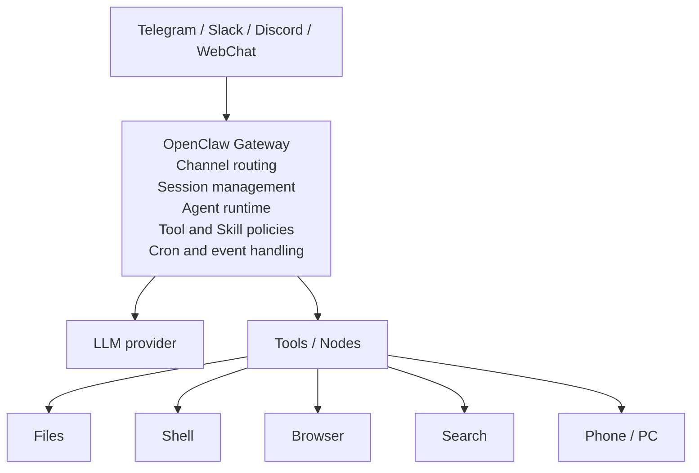

ChatGPTやClaudeに質問すると、その場で回答が返ってくる。Claude CodeやCodex CLIに依頼すると、開いているプロジェクトのファイルを読み、コードを編集してくれる。

OpenClawは、そのどちらとも少し違う。自分のPCやサーバーで常時動かし、TelegramやSlackなど普段使っているメッセージアプリから呼び出せる、オープンソースのパーソナルAIアシスタントだ。

予定の確認、定期レポート、ブラウザ操作、ファイル処理、複数端末との連携といった作業を、ひとつの常駐エージェントにまとめられる。一方で、ローカルファイルやシェルへアクセスできるため、導入時には権限と公開範囲を慎重に決める必要がある。

この記事では、2026年6月13日時点の公式ドキュメントをもとに、OpenClawの仕組み、できること、導入方法、安全に使い始めるための考え方を整理する。

---

## 結論を先に

OpenClawは、LLMそのものではない。**LLM、メッセージアプリ、ツール、端末、スケジュール実行を束ねる常駐型のエージェント基盤**である。

| 要素 | OpenClawでの役割 |
| :--- | :--- |
| LLM | 依頼を理解し、次に使うツールや返答を判断する |
| Gateway | メッセージ、セッション、ツール、端末を管理する |
| Channel | Telegram、Slack、Discord、WhatsAppなどの入口になる |
| Tool | シェル、ファイル、ブラウザ、検索などを実行する |
| Skill | 特定の作業手順を`SKILL.md`として追加する |
| Node | PCやスマートフォンの機能をGatewayへ接続する |
| Cron | 指定時刻や間隔でエージェントを起動する |

普通のチャットAIが「質問されたら答える」ものだとすれば、OpenClawは「常駐し、複数の入口から依頼を受け、必要な道具を使って作業する」ものだ。

便利さの源は、エージェントに現実の操作権限を渡せることにある。危険性の源も同じ場所にある。そのため、最初から万能な権限を与えるのではなく、専用環境と小さな権限で始めるのがよい。

---

## OpenClawは何をするソフトウェアか

OpenClawの公式READMEは、自分の端末上で動かすパーソナルAIアシスタントと説明している。対話画面だけを提供するアプリではなく、バックグラウンドでGatewayを動かし、複数のメッセージ経路やツールをひとつのエージェントへ接続する。

たとえばTelegramから次のように依頼する。

```text
今日の予定と未読メールを確認して、
対応が必要なものだけ箇条書きにして
```

設定された権限の範囲で、エージェントは必要な情報を取得し、結果をTelegramへ返す。同じエージェントにWeb UIやSlackから話しかけることもできる。

ここで重要なのは、TelegramのBot自体がAIなのではない点だ。Telegramは入口にすぎず、実際のセッション管理、LLMの呼び出し、ツール実行はGateway側が受け持つ。

### チャットAIとの違い

一般的なチャットAIは、サービス提供者のWebサイトやアプリの中で完結する。OpenClawは自分で実行環境を用意し、利用するモデル、接続するチャンネル、公開するツールを組み合わせる。

| 観点 | 一般的なチャットAI | OpenClaw |
| :--- | :--- | :--- |
| 実行場所 | 提供者のサービス | 自分のPC、サーバー、VPSなど |
| 主な入口 | 専用Web・アプリ | メッセージアプリ、Web UI、CLI |
| 操作範囲 | サービスが用意した機能 | 設定したローカルツールや外部サービス |
| 常駐運用 | サービス側で管理 | 自分でGatewayを管理 |
| 権限設計 | 提供者側が決める | 利用者が決める |

### コーディングエージェントとの違い

Claude CodeやCodex CLIは、ソフトウェア開発の作業ディレクトリを中心に設計されている。OpenClawは開発だけでなく、日常の連絡、情報収集、端末操作、定期処理を含む個人アシスタントを主な対象にしている。

コードを扱うこともできるが、リポジトリ単位の実装作業だけが目的ではない。メッセージアプリからいつでも呼び出せることと、Gatewayを常駐させておけることが大きな違いになる。

---

## Gatewayを中心にした構造

OpenClawの中心はGatewayである。Gatewayは長時間動作するプロセスで、チャンネル、クライアント、エージェント、ツール、端末の接続を管理する。



Web UI、CLI、端末NodeはWebSocketでGatewayへ接続する。初期設定ではGatewayは`127.0.0.1:18789`で待ち受けるため、同じ端末からだけアクセスできる。

### Channel

Channelは、ユーザーがエージェントへメッセージを送る入口だ。公式READMEではTelegram、Slack、Discord、WhatsApp、Signal、Microsoft Teams、LINE、WebChatなど多数のチャンネルが案内されている。

複数のチャンネルをつないでも、Gateway側でセッションと配送先を管理できる。スマートフォンではTelegram、PCではWebChatという使い分けも可能だ。

### Agentとセッション

エージェントは、モデル、ワークスペース、ツール、スキル、セッションを組み合わせた実行単位になる。複数エージェントを用意し、チャンネルや相手ごとに振り分ける構成も取れる。

たとえば個人用エージェントと業務用エージェントを分ければ、参照するファイルや利用できるツールを変えられる。ただし、同じGatewayを使う限り、完全に敵対的な利用者を隔離する境界にはならない。信頼関係が異なる用途は、GatewayやOSユーザーごと分ける必要がある。

### ToolとNode

Toolはエージェントが使う操作手段である。ファイルの読み書き、コマンド実行、ブラウザ操作、検索などを、ポリシーで許可された範囲で呼び出す。

Nodeは、別の端末が持つ機能をGatewayへ公開する仕組みだ。スマートフォンやPCをペアリングすると、構成に応じてカメラ、画面、位置情報、Canvasなどをエージェントから扱える。

この構造は強力だが、ペアリングされたNodeへの操作は、単なるチャットの返答ではなく端末への遠隔操作になる。接続先と権限の確認が欠かせない。

---

## Skillsで作業手順を追加する

OpenClawのSkillは、エージェントに「どの場面で、どの道具を、どう使うか」を教えるMarkdownファイルだ。各Skillはディレクトリ内の`SKILL.md`として定義する。

```text
~/.openclaw/workspace/
└── skills/
    └── morning-brief/
        └── SKILL.md
```

最小構成は次のようになる。

```markdown
---
name: morning-brief
description: 朝の予定と重要な通知を短くまとめる
---

予定表と通知を確認する。
緊急度の高い項目を先に並べる。
外部への送信や予定変更は、ユーザーの承認なしに行わない。
```

SkillはLLMを追加学習する仕組みではない。実行時に読み込まれる作業指示である。繰り返し使う判断基準や手順を、会話の外に置いて再利用できる点に意味がある。

公開Skillを探して導入する仕組みとしてClawHubも用意されている。ただしSkillはツールやスクリプトを使えるため、インストール前に`SKILL.md`と同梱コードを確認した方がよい。公開されていることと、安全に実行できることは同義ではない。

この考え方は、[ハーネスエンジニアリングとは何か]()で扱った「モデルの外側に作業ルールを置く」設計に近い。OpenClawでは、Gateway、ツールポリシー、Sandbox、Skillがハーネスを構成する。

---

## 常駐型だからできる自動化

Gatewayを常時動かすと、会話への応答だけでなく、時刻や外部イベントを起点にエージェントを動かせる。

### 定期実行

OpenClawにはCron機能があり、指定時刻に独立したエージェント実行を起動できる。たとえば平日の朝に、夜間の更新をまとめてSlackへ送る処理を作れる。

```bash
openclaw cron create "0 7 * * 1-5" \
  "夜間の更新を確認し、対応が必要な項目だけまとめる" \
  --name "Morning brief" \
  --tz "Asia/Tokyo" \
  --session isolated \
  --announce \
  --channel slack \
  --to "channel:C1234567890"
```

定期処理は、通常の会話と分けた`isolated`セッションで動かせる。長く続く会話へ定期実行の履歴を混ぜず、タスクごとに独立したコンテキストを使いたい場合に向いている。

### Webhook

外部サービスからWebhookを受け取り、エージェント処理を起動する構成も可能だ。

```text
監視サービスで障害を検知
  → OpenClawのWebhook
  → ログと直近の変更を調査
  → Slackへ調査結果を通知
```

自動化では、調査と通知までは許可し、デプロイや削除は人間の承認を必要とする、といった境界を先に決めておくと扱いやすい。

---

## 導入の基本

公式のGetting Startedでは、Node.js 24が推奨され、Node.js 22.19以降もサポートされている。macOSとLinuxではインストールスクリプト、WindowsではPowerShellまたはWindows Hubを利用できる。

### インストール

```bash
curl -fsSL https://openclaw.ai/install.sh | bash
```

npmから入れる場合は次のコマンドを使う。

```bash
npm install -g openclaw@latest
```

### オンボーディング

```bash
openclaw onboard --install-daemon
```

オンボーディングでは、モデルプロバイダーの認証、Gateway、ワークスペースなどを設定する。`--install-daemon`を付けると、macOSではlaunchd、LinuxではsystemdのユーザーサービスとしてGatewayを常駐させる。

### 動作確認

```bash
openclaw gateway status
openclaw dashboard
```

`openclaw dashboard`でControl UIを開き、チャットから応答が返れば基本構成は動いている。

最初からTelegramやSlackを接続する必要はない。まずローカルのControl UIだけで、モデルの応答とツール権限を確認した方が問題を切り分けやすい。

---

## 最初に考えるべきセキュリティ

OpenClawは、個人の端末とアカウントへ接続できる。通常のチャットアプリよりも、OSや認証情報に近い位置で動くソフトウェアだ。

公式のセキュリティガイドは、OpenClawを「ひとつのGatewayにつき、ひとつの信頼された運用者境界」で使うことを前提にしている。互いに信用していない複数ユーザーを、ひとつのGatewayで安全に分離するマルチテナント基盤ではない。

### 1. 専用の実行環境を用意する

個人用PCへ直接入れるより、専用のVPS、VM、OSユーザーを用意した方が影響範囲を限定しやすい。業務用エージェントに個人のブラウザプロファイルやパスワードマネージャーを共有しないことも重要だ。

### 2. 誰がメッセージを送れるか制限する

対応チャンネルのDMは、既定でペアリング方式になっている。未登録の送信者にはコードが返り、承認されるまでメッセージは処理されない。

```bash
openclaw pairing approve telegram <code>
```

公開DMを許可すると、外部から届いた文章がエージェントへの入力になる。ツールを持つエージェントに不特定多数が話しかけられる設定は避けた方がよい。

### 3. Toolの権限を絞る

メインセッションでは、Toolがホスト上で実行される構成が基本になる。シェルとファイル書き込みを許可すれば、エージェントはそのOSユーザーと同じ範囲へ影響を与えられる。

最初は読み取りと検索だけを許可し、外部送信、ファイル更新、コマンド実行は必要になってから追加する。メールを読める権限と送れる権限も分けて考えるべきだ。

### 4. Sandboxを有効にする

OpenClawのSandboxは既定では無効である。有効にしてバックエンドを指定しない場合はDockerが使われる。

READMEでは、非メインセッションをSandboxへ入れる設定が案内されている。

```json
{
  "agents": {
    "defaults": {
      "sandbox": {
        "mode": "non-main"
      }
    }
  }
}
```

Sandboxを使えばすべて安全になるわけではない。マウントしたディレクトリ、ネットワーク、渡した環境変数はSandbox内から利用できる。Docker Sandboxのネットワークは既定で無効なので、外部APIが必要な場合だけ用途を限定して開ける。

### 5. Security Auditを実行する

設定変更後やリモート公開前には、組み込みの監査コマンドを実行する。

```bash
openclaw security audit
openclaw security audit --deep
```

Gatewayの認証、公開チャンネル、ファイル権限、危険なTool設定など、よくある設定ミスを確認できる。

### 6. インターネットへ直接公開しない

Gatewayの初期バインドはローカルループバックである。外出先から接続するために、そのポートをそのままインターネットへ公開するのは避けたい。

公式ドキュメントではTailscaleやVPNが推奨され、SSHトンネルも選択肢として案内されている。

```bash
ssh -N -L 18789:127.0.0.1:18789 user@example-host
```

Tailscaleの仕組みは[Tailscaleの仕組みと使いどころ]()で整理している。OpenClawをVPSへ置く場合も、Gatewayをローカルバインドのまま保ち、Tailscale経由で接続する構成が扱いやすい。

---

## 現実的な始め方

OpenClawを試すときは、いきなり「すべてを任せる個人秘書」を作らない方がよい。次の順番なら、問題が起きたときに原因と影響範囲を追いやすい。

1. 専用のVMまたはVPSへインストールする
2. Control UIだけで会話を試す
3. 読み取り専用のToolをひとつ追加する
4. Telegramなど、ひとつのChannelをペアリングする
5. 小さなSkillを自作する
6. 調査と通知だけを行うCronを追加する
7. 必要な範囲だけ書き込み権限を広げる

最初のユースケースには、朝の情報整理、監視結果の要約、定期的なリポジトリ状況の確認などが向いている。失敗しても外部状態を変更しない作業から始めると、エージェントの挙動を観察できる。

反対に、メールの一括削除、決済、公開投稿、本番デプロイなどは、導入直後の自動化には向かない。これらを扱うなら、実行前の承認、対象のAllowlist、監査ログ、復旧手順まで含めて設計する必要がある。

---

## OpenClawが向いているケース

| 向いている | 向いていない |
| :--- | :--- |
| 自分で実行環境と権限を管理したい | セットアップや更新を管理したくない |
| 複数のメッセージアプリから同じAIを使いたい | Webチャットだけで十分 |
| 定期実行やWebhookでエージェントを動かしたい | 単発の質問だけに使う |
| SkillやToolを自分の用途に合わせたい | ローカルアクセスを一切許可できない |
| 専用VMやVPSを用意できる | 複数の信頼できない利用者を同居させたい |

OpenClawは、完成済みのSaaS型AIアシスタントというより、自分専用のエージェント環境を組み立てるためのソフトウェアに近い。自由度が高い分、運用者がインフラ、認証、権限、更新を引き受ける。

---

## まとめ

| 項目 | 内容 |
| :--- | :--- |
| OpenClawの正体 | 自分の端末で動かす常駐型パーソナルAIエージェント |
| 中心コンポーネント | Channel、セッション、Tool、Nodeを束ねるGateway |
| 拡張方法 | `SKILL.md`、Tool、Node、複数エージェント |
| 自動化 | Cron、Webhook、外部チャンネルへの通知 |
| 主なリスク | ホスト権限、外部入力、認証情報、公開範囲 |
| 導入方針 | 専用環境、最小権限、ペアリング、Sandbox、監査 |

OpenClawの価値は、ひとつの高性能なモデルを提供することではない。使い慣れたメッセージアプリ、複数のLLM、ローカルツール、端末、定期処理を、ひとつのGatewayでつなぐことにある。

その構造は、AIを会話相手から常駐する作業者へ変える。一方で、作業者に渡した権限はそのまま事故の範囲になる。まずは読み取り専用の小さな仕事から始め、必要性を確認しながら権限を広げるのが現実的だ。

---

## 参考

- [OpenClaw公式サイト](https://openclaw.ai/)
- [OpenClaw GitHub Repository](https://github.com/openclaw/openclaw)
- [Getting started](https://docs.openclaw.ai/start/getting-started)
- [Gateway architecture](https://docs.openclaw.ai/concepts/architecture)
- [Skills](https://docs.openclaw.ai/tools/skills)
- [Scheduled tasks](https://docs.openclaw.ai/automation/cron-jobs)
- [Security](https://docs.openclaw.ai/gateway/security)
- [Sandboxing](https://docs.openclaw.ai/gateway/sandboxing)
