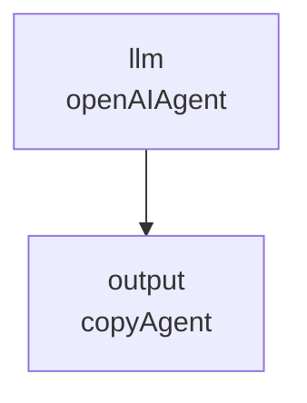

LLMを使ったアプリケーションは、ひとつの呼び出しで完結しないことが多い。検索結果を整形してからLLMに渡す、複数のLLM呼び出しの結果を合成する、条件によって次の処理を分岐する。こうした依存関係を素直にコードで書くと、非同期処理と分岐とエラーハンドリングが絡み合い、見通しが悪くなりやすい。

[GraphAI](https://github.com/receptron/graphai)は、こうしたエージェントワークフローを「コード」ではなく「データ」として記述するために作られたツールだ。Receptronという組織がOSS（MIT License）で開発しており、npm上の`graphai`パッケージは2026年6月時点でv2系が公開されている。

この記事では、公式リポジトリとドキュメントをもとに、GraphAIの基本的な考え方と最小構成のサンプルを整理する。

---

## 結論を先に

GraphAIは、エージェントの処理単位を「ノード」、ノード間のデータの受け渡しを「グラフ」として、YAMLまたはJSONで宣言的に定義する非同期データフロー実行エンジンである。

| 要素 | GraphAIでの役割 |
| :--- | :--- |
| Node | 入力を受け取り、エージェント関数で処理し、結果を出力する単位 |
| Computed Node | エージェントに紐づき、実際に計算や呼び出しを行うノード |
| Static Node | 値を保持するだけのプレースホルダー |
| Agent | OpenAI・Anthropic・Geminiなどへの呼び出しを実装した関数 |
| Graph | ノードと依存関係（inputs）の集合。グラフ全体がワークフローになる |

ワークフローをコードで組み立てるフレームワークでは、分岐や並行実行をプログラムのロジックとして書く。GraphAIでは、それらをYAML/JSONの構造としてファイルに書き出す。グラフ定義とエージェントの実装が分かれているため、ワークフローの見直しが、実装コードを読まなくても定義ファイルの差分だけで把握できる。

---

## 最小構成のサンプル

公式チュートリアルに掲載されている最小サンプルは次のようになっている。

```yaml
version: 0.5
nodes:
  llm:
    agent: openAIAgent
    params:
      model: gpt-4o
    inputs:
      prompt: Explain ML's transformer in 100 words.
  output:
    agent: copyAgent
    params:
      namedKey: text
    console:
      after: true
    inputs:
      text: :llm.text
```

`llm`ノードは`openAIAgent`を使ってプロンプトを送り、結果を返す。`output`ノードは`:llm.text`という記法で`llm`ノードの出力を参照し、コンソールへ表示する。`:`で始まる文字列は「他のノードの出力を参照する」という意味になる。

この依存関係をグラフとして見ると、次のような単純な流れになる。



ノードが増えるほど、この依存関係は枝分かれや合流を持つようになるが、書き方自体は変わらない。`inputs`に書いた`:nodeId.property`がエッジになる。

### Static NodeとComputed Node

値を保持するだけのノードは`value`プロパティで定義する。

```yaml
nodes:
  prompt:
    value: Explain ML's transformer in 100 words.
```

このようなノードはStatic Nodeと呼ばれ、エージェントを持たない。一方、`agent`プロパティを持つノードはComputed Nodeで、実行時に値を計算する。プロンプト文字列のような固定値はStatic Nodeに、LLM呼び出しのような処理はComputed Nodeに分けて書く。

---

## 依存関係のない処理は自動で並行実行される

GraphAIの実行エンジンは、ノード間の依存関係を解析し、依存のないノードを自動的に並行実行する。複数のAPI呼び出しを手作業で`Promise.all`にまとめる必要はなく、グラフの構造そのものが並行実行の単位になる。

並行実行できるタスクの上限は、グラフのトップレベルにある`concurrency`プロパティで指定する。既定値は8で、必要に応じて増減できる。

```yaml
version: 0.5
concurrency: 16
nodes:
  # ...
```

ノードに`priority`を指定すると、並行実行の待ち行列の中で優先的に実行される。多数の外部API呼び出しを束ねるワークフローでは、この優先度づけがレイテンシの調整に使える。

---

## 条件分岐とループ

GraphAIは、コード上のif文やfor文に相当する仕組みを、グラフの宣言の中に持っている。

### if / unless / anyInput

ノードに`if`を指定すると、参照先の値が真と評価されたときだけそのノードが実行される。`unless`は逆で、偽のときに実行される。たとえばLLMがツール呼び出しを要求した場合だけ次のノードを動かす、といった分岐に使う。

`anyInput`を有効にしたノードは、複数の入力のうちどれか1つでもデータが届いた時点で実行される。複数の経路を1つのノードへ合流させたいときに使う。

### loop

グラフ全体を繰り返し実行する仕組みとして`loop`がある。`count`で固定回数を指定するか、`while`で継続条件を指定する。繰り返しのたびにStatic Nodeの値を`update`で更新できるため、集計や反復的な改善といった処理を表現できる。

このあたりの設計は、Claude CodeやCodex CLIのようなコーディングエージェントが内部で行っている「ツール呼び出し→結果評価→次の呼び出し」のループを、グラフの形に外部化したものと捉えると理解しやすい。ワークフローを実行ロジックの外に置くという考え方自体は、[ハーネスエンジニアリングとは何か]()で扱った「ルールをモデルの外側に置く」発想に近い。

---

## 用意されているエージェント

GraphAI本体はグラフの実行エンジンであり、実際の処理は「エージェント」という関数が担う。公式リポジトリの`llm_agents`パッケージには、主要なLLMプロバイダー向けのエージェントがまとまっている。

| エージェント | 用途 |
| :--- | :--- |
| `openAIAgent` | OpenAIのchat completion APIを呼び出す |
| `anthropicAgent` | Anthropic APIを呼び出す |
| `geminiAgent` | Google Generative AI（Gemini）を呼び出す |
| `groqAgent` | Groq APIを呼び出す |
| `openAIImageAgent` | OpenAIの画像生成APIを呼び出す |
| `replicateAgent` | Replicate API経由でモデルを呼び出す |

これに加えて`@graphai/vanilla`パッケージには、データの整形やコピー、フィルタリングなど、LLMを使わない汎用エージェントが用意されている。サンプルの`copyAgent`もここに含まれる。

エージェントはTypeScriptの関数として実装されているため、既存のエージェントで足りない処理は自前で追加できる。グラフ定義から見れば、自作エージェントも公式エージェントも同じ`agent`プロパティで呼び出すだけの存在になる。

---

## CLIとGUI

GraphAIにはCLIツール`@receptron/graphai_cli`が用意されており、グラフ定義ファイルを直接実行できる。

```bash
npm i -g @receptron/graphai_cli
graphai sample.yaml
```

利用可能なエージェントの一覧は`graphai -l`で確認できる。コードを書かずにYAMLファイルだけで動作を確認できるため、グラフ定義を試行錯誤する段階ではCLIが扱いやすい。

GUIでグラフを編集するツールとして、同じReceptron配下で`Grapys`が公開されている。ノードを画面上に配置しながらワークフローを組み立てたい場合の選択肢になる。

---

## 実際の利用例

Receptronのリポジトリ群には、GraphAIを使って構築されたアプリケーションの例として`mulmocast`がある。これはポッドキャストや動画のスクリプトをLLMで生成し、音声・画像生成エージェントと組み合わせて1本のメディアファイルに仕立てるCLIツールだ。

台本生成、画像生成、音声合成、合成処理といった複数ステップは依存関係が明確で、かつ一部は並行実行できる。GraphAIのようなデータフロー型のエンジンは、こうした「複数のAPIを順序と並行性を持って呼び出すパイプライン」に向いている。

---

## コードでグラフを組むフレームワークとの違い

LangGraphをはじめ、グラフ構造でエージェントを組むフレームワークの多くは、グラフそのものをプログラミング言語のコードで構築する。ノードの追加やエッジの接続を関数呼び出しとして書き、実行時にグラフが組み立てられる。

GraphAIは、グラフの定義自体をYAML/JSONという「データ」として外部に持つ。実行エンジンはそのデータを読み込んで解釈するだけで、グラフの構造を変えるためにアプリケーションコードを再ビルドする必要はない。

どちらが優れているかは一概には言えない。コードでグラフを組む方式は、型チェックや複雑な条件分岐をプログラミング言語の機能で素直に表現できる。GraphAIの方式は、ワークフローをエンジニア以外も読める形式で残せる点と、定義ファイルだけを差し替えて挙動を変えられる点に強みがある。

---

## GraphAIが向いているケース

| 向いている | 向いていない |
| :--- | :--- |
| 複数のLLM・API呼び出しを依存関係込みで管理したい | 単発のLLM呼び出しだけで十分 |
| ワークフローをコードと分離して管理したい | グラフの構造を頻繁に動的生成する必要がある |
| 並行実行を自前で制御したくない | プログラミング言語側の型安全性を最優先したい |
| TypeScriptのエコシステムでエージェントを拡張したい | TypeScript以外の言語で完結させたい |

---

## まとめ

| 項目 | 内容 |
| :--- | :--- |
| GraphAIの正体 | YAML/JSONでエージェントワークフローを宣言的に書く非同期データフロー実行エンジン |
| 中心概念 | Static Node・Computed Node・依存関係に基づくグラフ |
| 並行実行 | 依存のないノードを自動検出し、`concurrency`で上限を制御 |
| 制御構造 | `if`・`unless`・`anyInput`による分岐、`loop`による繰り返し |
| 拡張方法 | LLMエージェント、vanillaエージェント、自作エージェント |
| ツール | CLI（`@receptron/graphai_cli`）、GUI（Grapys） |

GraphAIは、エージェントワークフローを「コードの中の手続き」から「読める定義ファイル」へ移す試みのひとつだ。複数のAPI呼び出しを依存関係込みで扱う場面が増えるほど、こうした宣言的な記述の利点は大きくなる。

---

## 参考

- [receptron/graphai - GitHub](https://github.com/receptron/graphai)
- [GraphAI Tutorial](https://github.com/receptron/graphai/blob/main/docs/guide/tutorial.md)
- [graphai (core package) README](https://github.com/receptron/graphai/blob/main/packages/graphai/README.md)
- [llm_agents README](https://github.com/receptron/graphai/blob/main/agents/llm_agents/README.md)
- [GraphAI CLI README](https://github.com/receptron/graphai/blob/main/packages/cli/README.md)
- [GraphAI API Documentation](https://receptron.github.io/graphai/apiDoc/)
- [graphai - npm](https://www.npmjs.com/package/graphai)
- [receptron/graphai_samples - GitHub](https://github.com/receptron/graphai_samples)
