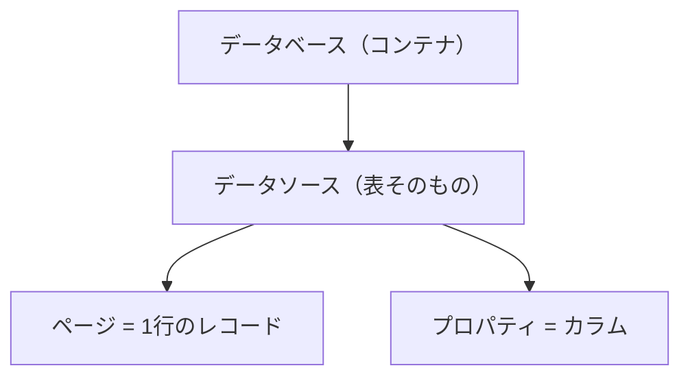
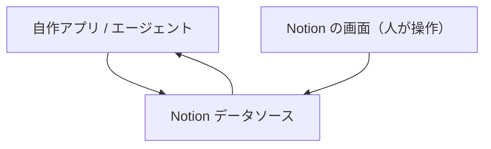

AIエージェントに任せて小さなアプリを作っていると、毎回ぶつかるのが「データをどこに置くか」だ。

コードはエージェントが書いてくれる。だが、永続化したデータの置き場と、その中身を後から人が見て直す手段は別に用意しないといけない。個人用途の小さなアプリほど、ここのコストが本体機能に対して重くなる。

最近はこの置き場として Notion のデータベースを使うことが増えた。エンジニア寄りの自分でも素直に便利だと感じていて、個人利用の範囲では今のところデータベースの最適解に近いと思っている。大規模データや高頻度アクセスでどうなるかは別の話だが、その手前の「自分専用の小さなアプリ」では相性がいい。この記事では、なぜそう感じるのかと、実際に使うときのコツをまとめる。

---

## バイブコーディングで詰まるのは「データの置き場」

エージェントにアプリを書かせる流れ自体は、もうそれほど詰まらない。詰まるのはその外側だ。

データを永続化するなら、だいたい次のどれかを選ぶことになる。

| 選択肢 | 立ち上げの手間 | 中身を見る手段 |
| :--- | :--- | :--- |
| SQLite | 軽い | 別途ツールが要る |
| PostgreSQL（Supabase / Railway / Neon など） | 中〜重 | 管理画面を別に用意する |
| スプレッドシート | 軽い | 表として見られるが型が緩い |

個人の小さなアプリでは、この「立ち上げ」と「中身を見る手段」の二つが地味に効いてくる。PostgreSQL 系をちゃんと立てると、今度はデータを確認したり手で直したりするための画面が欲しくなる。その画面を作り込むのは、アプリ本体より面倒なことすらある。スプレッドシートは手軽だが、型や入力チェックを自分で守る必要が出てくる。

やりたいのは「データを置いて、必要なら人が見て直せる」だけなのに、そのために用意するものが多い。ここを軽くしたい、というのが出発点だった。

---

## Notion をデータベースとして見る

Notion のデータベースは、見た目こそ表計算に近いが、API を持った構造化データの入れ物として扱える。

2025 年 9 月の API バージョン（2025-09-03）でデータモデルの呼び方が整理され、いまは次の関係になっている。



「データベース」は箱で、その中に実際の表である「データソース」が入る。データソースの 1 行が 1 ページ、列がプロパティにあたる。リレーショナルデータベースの感覚でいえば、データソースがテーブル、ページが行、プロパティがカラムだ。

API は無料で使える。インテグレーション用のトークンを発行し、自作アプリやエージェントからそのトークンでデータソースを読み書きする。1 つのデータベースに 1 つのデータソースだけを置く構成なら、従来どおりの「データベース＝1 つの表」という感覚のまま扱える。

---

## 相性がいいと感じる理由

### GUI がそのまま管理画面になる

いちばん大きいのはこれだ。

自作アプリは API 経由でデータを読み書きし、人は Notion の画面から同じデータを見る。両者は同じデータソースを別の入口から触っているだけなので、管理画面を自分で作る必要がない。



データの確認、手作業での修正、絞り込み、並び替え、メモの追記。管理画面に欲しくなる機能はだいたい最初から付いてくる。スマートフォンの Notion アプリからも同じデータを触れるので、外出先で中身を直すといったことも自然にできる。バックエンドなのに、運用面の入口が GUI で完結するのは個人開発だとかなり効く。

### 無料で始められる

個人利用なら、Notion のフリープランでページとブロックは実質無制限に使える。API 側も呼び出し回数による課金はない。

小さなアプリのために有料のデータベースを契約するか迷う、という段階を飛ばせる。ここで止まらずに作り始められること自体が、個人開発では価値になる。

### スキーマが自己文書化される

各プロパティには `description` を設定できる。「このカラムは何か」を列の定義そのものに書いておける。

これは後から自分が見直すときにも効くが、エージェントに渡すときに特に効く。スキーマと一緒に説明文も読めるので、「この列は何を入れる場所か」をプロンプトで毎回補足しなくても、ある程度コンテキストが伝わる。データの意味をコードのコメントではなくデータ側に持たせられる、という感覚に近い。

### 型と入力 UI が最初から付いてくる

プロパティには型がある。テキスト、数値、日付、チェックボックス、セレクト、リレーションなど、用途に応じて選べる。

型を決めると、それに対応した入力 UI とゆるいバリデーションが GUI 側に付いてくる。セレクトなら選択肢から選ぶ形になり、日付なら日付ピッカーが出る。入力フォームやチェック処理を自分で書かずに、ある程度整ったデータが集まる状態を作れる。

フロントエンド側を [なぜフロントエンドに Vercel を選ぶのか]() のような構成で軽く済ませているなら、データの置き場と運用画面まで軽くできると、個人開発の全体がかなり身軽になる。

---

## 実際に効くコツ

ここからは、実際に使っていて効いた具体的なやり方をいくつか挙げる。

### description にカラムの意味を書く

プロパティの `description` は、空のままにしがちだが埋めておく価値がある。

カラム名だけだと、しばらく経つと「これ何を入れる列だったか」を忘れる。説明を書いておけば、人が見ても、エージェントにスキーマを渡しても文脈が残る。データの仕様をデータ自身に持たせておく、と考えると埋める習慣がつく。

### 列の表示順と可視性はビューの API で整える

プログラムからプロパティを足していくと、画面上の列の並びが意図しない順（アルファベット順など）になってしまうことがある。そのままだと、人が見たときに重要な列が右の方に埋もれて読みにくい。

列の表示は、2025-09-03 以降で使える Views API で制御する。データベースには既定で Table 形式のビューがあるので、そのビューを `PATCH /v1/views/{view_id}` で更新する。`configuration.properties` の配列がそのまま列の表示順になり、各要素で表示・非表示や幅を指定する。

```json
{
  "configuration": {
    "type": "table",
    "properties": [
      { "property_id": "title", "visible": true, "width": 400 },
      { "property_id": "abc1", "visible": true },
      { "property_id": "def2", "visible": false }
    ]
  }
}
```

`property_id` にはプロパティ ID か名前を指定する。配列に並べた順が表示順になり、`visible` で内部 ID 的な列や使っていない列を隠せる。注意したいのは、列の表示設定が `table.visible_properties` のようなトップレベルの形ではなく、`configuration.properties` の配列で渡す点だ。ここを取り違えやすい。API のためのデータソースと、人が見るためのビューを分けて考えると、両方を読みやすく保てる。

### データソースのモデルを理解しておく

2025-09-03 以降の API では、`database_id` だけでなく `data_source_id` を指定する場面がある。1 つのデータベースに複数のデータソースを持てるようになったためだ。

個人用途では「1 データベース＝1 データソース」で素直に組むのがおすすめだ。複数データソースを使わなければ、旧来のデータベース操作に近い形のまま扱える。エージェントに API を叩かせる場合も、構成がシンプルなほど指示がぶれない。

### リレーションを盛り込みすぎない

Notion はページ同士をリレーションでつなげられるが、個人用途では素直なテーブルに寄せておく方が扱いやすい。

リレーションやロールアップを多用すると、API から読んだときのデータ構造が入れ子になって複雑になる。正規化を効かせたい規模になっているなら、それはもう Notion ではなく本格的なデータベースの出番だと考えた方がいい。

---

## 向き・不向きははっきりしている

便利だと感じる一方で、ここは Notion でやるべきではない、という線も見えてきた。

最大の制約はレート制限だ。API の上限はインテグレーションあたり平均で 1 秒に約 3 リクエスト（15 分あたり約 2,700 回）で、これはプランによらず共通になっている。多人数が同時に高頻度でアクセスするサービスや、大量のデータを一気に同期する処理には向かない。`429` や `529` が返ったら `Retry-After` に従って待つ、という前提で組むことになる。

データそのものの規模や複雑さでも線がある。

| 観点 | Notion が向く | 向かない |
| :--- | :--- | :--- |
| データ量 | 個人規模・数千件程度まで | 大量データ・高速集計 |
| アクセス頻度 | 低〜中頻度 | 高頻度・多人数同時 |
| クエリ | 単純な絞り込み・並び替え | 複雑な結合や集計 |
| 整合性 | ゆるくてよい | 厳密なトランザクション |
| ファイル | 小さい添付（1 ファイル 5MB まで） | 大きなファイルの保管 |

無料プランのバージョン履歴は 7 日分なので、長期の変更履歴を厳密に追いたい用途にも向かない。大きなファイルは外部ストレージに置き、Notion には URL や参照だけを持たせる形になる。

つまり Notion をデータベースとして使うのは、汎用リレーショナルデータベースの置き換えではない。あくまで「個人利用・小規模で、GUI 込みで軽く済ませたい」ときの選択肢だ。本格的なバックエンドが必要なら、[Supabase vs Railway vs Neon バックエンド選定 (2026年版)]() で比較したような選択肢に移る方がいい。この線引きさえ持っておけば、個人開発の最初の置き場としては扱いやすい。

---

## まとめ

| 項目 | 内容 |
| :--- | :--- |
| 一番の利点 | GUI がそのまま管理画面になり、運用画面を作らなくていい |
| コスト | 個人利用は実質無料で始められる |
| スキーマ | プロパティの `description` で自己文書化できる |
| 表示 | ビューの API（`configuration.properties`）で列順・可視性を整える |
| 制約 | 約 3 req/s のレート制限、大規模・複雑クエリには不向き |
| 位置づけ | 個人・小規模の最適解。汎用 DB の置き換えではない |

エージェントにコードを書かせる前提だと、データの置き場と運用画面を軽くできるかどうかが、個人開発全体の身軽さを左右する。Notion のデータベースは、その「軽さ」をまとめて引き受けてくれる選択肢として、いまのところ自分の中で定番になっている。Node.js 周辺の前提知識を整理した [バイブコーディングする人が知っておきたい Node.js 周辺の基礎知識]() とあわせて、置き場と動かし方の両方を軽くしておくと、小さく作り始めるハードルがかなり下がる。

---

## 参考

- [Data source - Notion Docs](https://developers.notion.com/reference/data-source) ── データソースの構造とプロパティ定義
- [Data source properties - Notion Docs](https://developers.notion.com/reference/property-object) ── プロパティの `description` などのフィールド
- [Working with views - Notion Docs](https://developers.notion.com/guides/data-apis/working-with-views) ── ビューでの表示プロパティと列順の制御
- [Update a view - Notion Docs](https://developers.notion.com/reference/update-a-view) ── `PATCH /v1/views/{view_id}` の `configuration.properties`
- [Upgrade guide 2025-09-03 - Notion Docs](https://developers.notion.com/guides/get-started/upgrade-guide-2025-09-03) ── データベースとデータソースの新しいモデル
- [Request limits - Notion Docs](https://developers.notion.com/reference/request-limits) ── レート制限と `429` / `529` の扱い
- [Notion Pricing](https://www.notion.com/pricing) ── 無料プランで使える範囲
