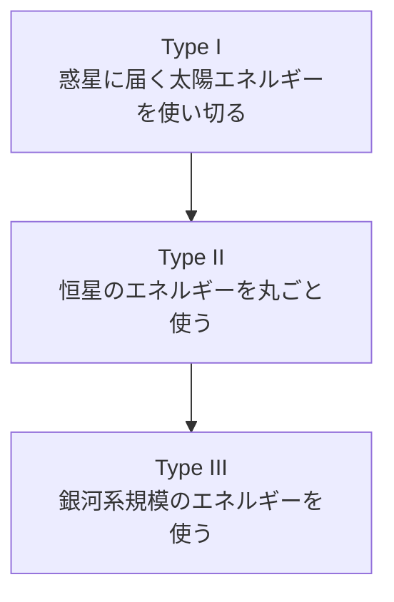

2026年6月12日、SpaceXがNasdaqに上場した。ティッカーはSPCX、株価135ドルで555,555,555株を発行し、調達額は750億ドル。史上最大のIPOとなり、初値は150ドル、時価総額は2兆ドルを超えた。この上場でイーロン・マスクは世界初の「兆ドル富豪」になったと報じられている。

このニュースを見ていて気になったのは、調達額や時価総額そのものより、マスクが以前から繰り返している「カルダシェフ・スケール」という話だ。太陽エネルギーをどれだけ活用できるかが文明のレベルを測る指標になる、という主張を彼は何度もしている。SpaceXのIPOというタイムリーな出来事を手がかりに、このカルダシェフ・スケールとマスクのビジョンの関係を整理してみる。

---

## カルダシェフ・スケールとは何か

カルダシェフ・スケールは、1964年にソビエトの天体物理学者ニコライ・カルダシェフが提唱した指標で、文明がどれだけのエネルギーを利用できるかによって発展段階を分類する。

| タイプ | 利用できるエネルギーの目安 | 内容 |
| :--- | :--- | :--- |
| Type I | 約10^16W | 母星（地球）に届く太陽エネルギーの全体を利用できる文明 |
| Type II | 約10^26W | 恒星（太陽）そのものが放出するエネルギーの全体を利用できる文明 |
| Type III | 約10^36W | 銀河系規模のエネルギーを利用できる文明 |

現在の人類は、Carl Saganによる修正版の計算ではType Iにすら達していない（0.7前後とされる）。Type IIに到達するには、恒星のエネルギーをほぼ丸ごと回収する技術、いわゆるダイソン球的な発想が必要になり、現実的には数百年単位の時間軸の話になる。

---

## マスクがカルダシェフ・スケールを持ち出す理由

マスクはX（旧Twitter）上で次のように述べている。

> As we progress along the Kardashev Scale, energy harnessed on Earth will increase a hundredfold and will mostly be solar aka fusion aka starlight.

カルダシェフ・スケールを理解すると、エネルギー生成の大半が最終的に太陽由来になるのは自明だ、という趣旨の発言も繰り返している。化石燃料も、太陽光によって過去の生物が固定したエネルギーの蓄積に過ぎない。風力も太陽光が大気を動かす結果だ。そう考えると、現在使われているエネルギーのほとんどは間接的な太陽エネルギーであり、それを直接太陽光発電に置き換えていく流れは自然な帰結だという理屈になる。

マスクは「テキサスかニューメキシコの一角だけで、アメリカ全土の電力を供給できる」とも発言している。1平方マイルの土地が受け取る太陽エネルギーは約2.5ギガワットに達するという見積もりも紹介しており、太陽光パネルがあれば1日あたり3ギガワット時程度の発電が可能になる計算だ。Teslaのソーラー事業、そして衛星全体を太陽光とバッテリーだけで稼働させているStarlinkは、この理屈を事業として体現したものと言える。

つまりマスクにとってカルダシェフ・スケールは、単なる思考実験ではなく、太陽光発電・蓄電池・宇宙インフラへの投資を正当化するための枠組みになっている。

---

## SpaceXのIPOはこの構想とどう繋がるか

SpaceXのS-1（上場申請書類）では、2025年の売上高が186.7億ドルで、収益化できている事業はStarlinkのみだと開示されている。Falcon打ち上げ事業やStarshipの開発は依然として投資フェーズにある。

それでも市場はSPCXに対して、売上高の約95倍という、トップクラスのテック企業に匹敵する評価を与えた。750億ドルという調達規模は、Starshipの開発加速、Starlinkの衛星網拡大、そして将来の火星移住計画に向けた資金として位置づけられている。

マスクの語る文明スケールの議論にあてはめると、Starlinkは「地球規模で太陽エネルギーを効率的に利用するネットワーク」であり、Starshipは「地球の外にエネルギー利用と居住の範囲を広げる手段」にあたる。IPOによる大型資金調達は、この両方を同時に進めるための原資という位置づけになる。SpaceXという一企業の上場が、カルダシェフ・スケールという文明論的な話と地続きで語られるのは、マスク自身がそう発言してきたからだ。

---

## ビジョンと実態を分けて見る

ここまでの話はマスク自身の発言とSpaceXの事業内容を整理したものであり、カルダシェフ・スケールの達成が近いことを意味するわけではない。人類は依然としてType Iにすら届いておらず、Type IIに必要な恒星規模のエネルギー回収技術は、現時点では工学的な実現可能性すら見通せていない。

SpaceXのIPO評価額も、Starlinkの収益性とFalcon・Starshipの実行リスクという、地に足のついた事業評価の結果であって、文明スケールの議論が株価を直接後押ししたわけではない。マスクの発言は、自社の長期投資（太陽光、蓄電、宇宙開発）に一貫したストーリーを与えるためのフレーミングとして機能している面が大きい。

ビジョンとしての言説と、現在の事業の実態は分けて見る必要がある。それでも、史上最大のIPOという出来事の裏に、こうした長期的な文明観が語られているのは、技術と資本市場の関係を考える上で興味深い材料だ。

---

## 参考

- [SpaceX IPO sticks the landing. Here's what investors are saying about its epic first trading day](https://www.cnbc.com/2026/06/13/spacex-ipo-sticks-the-landing-heres-what-investors-are-saying-about-its-epic-first-trading-day.html) ── SPCXの初日の取引結果と市場の反応
- [SpaceX targets $135 IPO price at valuation of $1.77 trillion](https://www.cnbc.com/2026/06/03/spacex-ipo-stock-price-roadshow-musk.html) ── IPO価格・調達規模の詳細
- [SpaceX blasts off with a record-breaking $75 billion IPO](https://www.npr.org/2026/06/11/nx-s1-5853199/spacex-ipo-price-elon-musk) ── 調達額・上場の位置づけ
- [Elon Musk on X: "As we progress along the Kardashev Scale..."](https://x.com/elonmusk/status/1921848768208453887) ── カルダシェフ・スケールに関するマスクの発言
- [Elon Musk eyes Kardashev II-level civilization for Earth. What is it?](https://cybernews.com/science/elon-musk-spacex-kardashev-scale/) ── カルダシェフ・スケールの説明とマスクの構想
- [Elon Musk Explains Why Solar Will Dominate Future Energy Generation, Citing the Kardashev Scale](https://www.energy-box.com/post/elon-musk-explains-why-solar-will-dominate-future-energy-generation-citing-the-kardashev-scale) ── 太陽光発電とカルダシェフ・スケールの関係についてのマスクの発言
