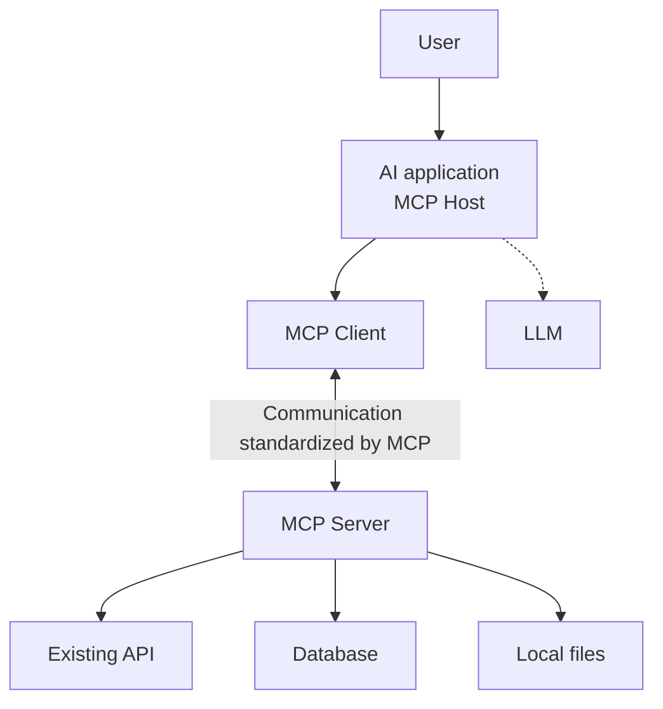
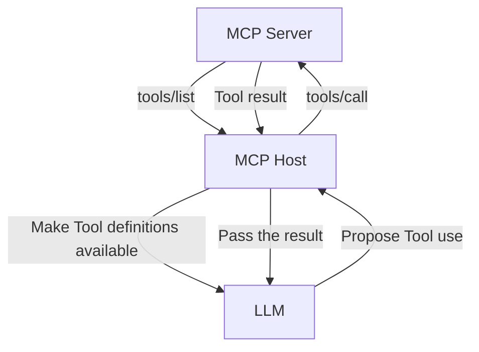

Read about MCP (Model Context Protocol) and you'll often see it described as "USB for AI" or "a common standard that connects LLMs and tools." That's an easy entry point, but the metaphor alone leaves it unclear how MCP differs from an API or from Function Calling, and who executes what once you add an MCP server.

To understand MCP, you need to grasp which boundary it standardizes before you look at a feature list. What MCP deals with is the communication between an AI application and the programs that provide external data and capabilities. It is neither a specification for the LLM itself nor a mechanism that replaces the APIs of external services.

This seven-part series breaks MCP down in the order of concepts, communication, implementation, remote operation, and security. This first part organizes MCP's scope of responsibility by comparing it with APIs, Function Calling, and plugins.



---

## The Short Answer

MCP is a protocol that standardizes the following kinds of exchanges between an AI application and external capabilities.

- On connection, confirming each side's protocol version and supported features
- Discovering the Tools, Resources, and Prompts a server provides
- Calling a Tool by name with structured arguments and receiving the result
- Referencing a Resource by URI and retrieving a Prompt template
- When needed, using the AI application's own features from the server side

These are exchanged as JSON-RPC 2.0 messages. For connections to a local process there is the stdio standard transport, and for connections to a remote service there is the Streamable HTTP standard transport.

On the other hand, MCP does not uniformly decide which LLM to use, what to pass to the LLM, which Tool to let it choose, or what kind of approval screen to show before execution. That is the design scope of the MCP Host — that is, the AI application.

The boundary between the Client and Server at the center of the diagram is MCP's main subject. The Client lives inside the Host and handles communication with the Server it connects to. The connection to the LLM, and the API, DB, and file operations beyond the Server, run under separate contracts and implementations.

---

## Why a Common Protocol Is Needed

Even without MCP, you can use external services from an AI application. You can write code to call the GitHub API, install a database driver, and prepare functions for file operations.

The problem is that you have to build the connecting part for every combination of AI application and external service. With three AI applications and five connection targets, you end up maintaining up to fifteen integrations in the simple case. When each one has its own Tool definitions, configuration methods, and error representations, the Host-side implementation grows every time you add a target.

With a common protocol, the Host only needs to implement "how to communicate with an MCP Server," and the Server only needs to implement "how to expose capabilities to an MCP Client." Actual compatibility still depends on the supported protocol version, optional features, authentication, Tool quality, and more, so MCP support alone does not guarantee an unconditional connection. Even so, it moves you from building a bespoke spec per connection to using a common discovery and invocation procedure.

This structure also does not require rebuilding the connection target specifically for AI. For example, an MCP Server that uses an existing GitHub API does not retire the API; it becomes an adapter that exposes operations as MCP Tools in front of it.

---

## What MCP Standardizes

The MCP specification is not just a single Tool-call format. Broadly, it covers the following layers.

| Layer | What is standardized |
| :--- | :--- |
| Base Protocol | Request, Response, and Notification using JSON-RPC 2.0 |
| Lifecycle | Initialization, protocol version agreement, Capability Negotiation, and shutdown |
| Transport | How messages are carried over stdio and Streamable HTTP |
| Server Features | Capabilities the Server provides, such as Tools, Resources, and Prompts |
| Client Features | Capabilities the Client can provide, such as Sampling, Roots, and Elicitation |
| Utilities | Cross-cutting features such as Logging, Completion, progress notifications, and cancellation |
| Authorization | The authorization framework used for HTTP-based connections |

Not every implementation has every feature. Base Protocol and Lifecycle form the foundation, while Tools, Resources, and the like are implemented as needed. On connection, the Client and Server exchange Capabilities and confirm which features are available for that session.

As of early July 2026, the Current protocol version on the official site is `2025-11-25`. On July 3, 2026, a release candidate (RC) of the `2026-07-28` version was published. It is expected to include changes such as a stateless core design, an Extensions framework, Tasks, and MCP Apps, with the official release projected for July 28, 2026. MCP versions denote the date a backward-incompatible change was introduced, in `YYYY-MM-DD` format. The design does not assume that Client and Server both implement the same latest version; instead they agree on a single version at initialization.

### "Context" Is Not Just Text

Because the name contains "Context," thinking of MCP as "a standard for passing documents to an LLM" captures its scope too narrowly.

The basic elements a Server exposes include not only Resources for reading data, but also Tools for executing processes and Prompts for providing reusable instructions. In the reverse direction there is also Sampling, where the Server asks the Client for an LLM generation, and Elicitation, where it requests additional input from the user.

MCP messages are not one-way from Client to Server. Requests can be sent in both directions, and Notifications can be used as well. This point is easy to miss under the simple understanding of "a standard that just lists functions and calls them."

The differences among Tools, Resources, and Prompts are covered in detail in [Part 3, "Choosing Between MCP's Tools, Resources, and Prompts"]().

---

## The Difference from an API

An API is a broad term for a point at which one piece of software's capabilities are used from another. REST APIs, GraphQL APIs, library APIs — they vary in both form and purpose.

MCP is, in a broad sense, a kind of API too, but its purpose and users are narrowed. It is a protocol for an AI application to discover external capabilities and context and use them through a common procedure.

| Aspect | General Web API | MCP |
| :--- | :--- | :--- |
| Main purpose | Expose service-specific data and operations | Expose capabilities and context for AI applications |
| Operation discovery | May use a separate spec such as OpenAPI | Includes listing Tools, Resources, and Prompts in the protocol |
| Starting a connection | Follows each API's own scheme | Performs initialization and Capability Negotiation |
| Communication | Diverse, not limited to HTTP | Carries JSON-RPC messages over stdio or Streamable HTTP, etc. |
| Relationship | Can be the target's actual API | Can be an adapter that calls an existing API internally |

For example, a weather service's REST API might take a region code and return a forecast JSON. An MCP Server that uses that API exposes the name, description, and input schema of a `get_forecast` Tool to the Client, and when called, converts it internally to the REST API and returns the result.

Adopting MCP does not make API keys, rate limits, or the external API's specific error handling disappear. The Server side has to handle those and return them to the Client as MCP results.

---

## The Difference from Function Calling

Function Calling, or Tool Calling, generally refers to the mechanism of passing an LLM the names, descriptions, and argument schemas of available functions, and having the model generate structured output of the form "I want to call this function with these arguments."

MCP's Tools also have a name, description, and input schema, so they look quite similar. But the boundaries each one is responsible for are different.

Function Calling mainly concerns the part between the application and model inference where the model outputs a structured Tool call. MCP concerns the part between the Client inside the Host and the MCP Server where Tools are discovered and execution results are exchanged.

An actual Host may convert the Tool definitions obtained from the MCP Server into the Tool format that the LLM in use can understand. However, that conversion method, the filtering of which Tools to show the model, and the control of Tool selection are the Host's implementation, not the MCP specification itself. The benefit is a separation in which the MCP Server does not need to handle each LLM vendor's Function Calling format directly.

Another thing to be careful about is the phrase "the model calls a Tool." What the model generates is usually the intent to use a Tool and its arguments. What actually sends `tools/call` and runs the external process is the software side, including the Host and Server. With a Host that inserts an approval screen, the user can reject a call even when the model proposes it.

---

## The Difference from a Plugin

A plugin often refers to a distribution and extension mechanism that adds features to an existing application. Which files to place, which APIs to implement, and which permissions to declare are decided by each product that accepts the plugin.

MCP is not a plugin format for a specific product. It is a communication protocol that makes it possible for the same MCP Server to be used from multiple Hosts. How you install, register in a settings screen, and update a Server depends on the Host or the distribution channel.

For that reason, even if "the operation of adding an MCP Server" looks like installing a plugin, it is better to keep the concepts separate. A plugin is mainly about how something is embedded into an application; MCP is mainly about the runtime conversation between Client and Server. Since you can also build a plugin that bundles an MCP Server, or a package that distributes an MCP Server's configuration, the two are not mutually exclusive.

---

## What MCP Does Not Decide

It is dangerous to assume, from a label of "MCP support," that intelligence and safety are standardized too. The official architecture explanation also states that MCP focuses on the protocol for exchanging context, and does not prescribe how an AI application uses the LLM or the provided context.

Specifically, judgments like the following remain outside MCP.

### The LLM and How It Reasons

Which model to use, which prompt to include the Tool definitions in, and how many results or characters of a Tool result to return to the conversation are decided by the Host. Even when connecting to the same Server, a different Host or model can produce different Tool selections and answers.

### User Experience and Approval Policy

Policies such as whether to auto-execute a Tool, whether to auto-allow read-only operations, or whether to confirm each time are also the Host side's responsibility. MCP's Tools specification recommends a design in which a human can reject a Tool call and confirm before execution, but it does not fix a single concrete UI.

### The Permission Design of External Services

If a Server connects to GitHub or a database, what those credentials permit depends on the external service's own settings. Even with MCP's authorization spec, the permissions beyond the Server are not automatically minimized.

### Tool Quality and Safety

Even if the Tool name and input schema use a common format, whether its description is accurate, whether input validation is sufficient, whether the process is idempotent, and whether it keeps sensitive information out of the result depend on the Server implementation. MCP support is not a mark of quality assurance.

### Business Meaning

You can standardize how a `delete_issue` Tool is called, but the protocol cannot decide the business rule of which Issue is acceptable to delete. In real operation, you have to layer the Host's approval, the Server-side authorization, and the external API's permissions together.

---

## A Checklist for Understanding MCP

When looking at a new MCP Server or Host, it is easier to grasp the structure if you look not just at "what it can do" but in the following order.

1. Which application is the Host
2. Which Server it connects to, and whether locally or remotely
3. What the Server exposes among Tools, Resources, and Prompts
4. Which files, APIs, and databases it accesses inside the Server
5. Who controls the proposal, approval, and execution of a Tool
6. Where the credentials and execution permissions live
7. What range of the Tool result enters the LLM's context

With this checklist in hand, you can avoid misunderstandings such as "because it's MCP, the LLM connects directly to the database" or "the MCP Server reads the whole conversation and acts autonomously."

The next installment, [Part 2, "Organizing MCP's Host, Client, and Server"](), follows which participants a single Tool execution passes through, including the Client that lives inside the Host.

---

## References

- [Architecture overview - Model Context Protocol](https://modelcontextprotocol.io/docs/learn/architecture) ── MCP's scope, Host, Client, and Server, and the basic data layer
- [Overview - Model Context Protocol Specification](https://modelcontextprotocol.io/specification/2025-11-25/basic) ── Base Protocol, JSON-RPC messages, and the main components
- [Lifecycle - Model Context Protocol Specification](https://modelcontextprotocol.io/specification/2025-11-25/basic/lifecycle) ── Initialization and the agreement of version and Capability
- [Versioning - Model Context Protocol Specification](https://modelcontextprotocol.io/specification/versioning) ── The Current version and the rules for version identifiers
- [Tools - Model Context Protocol Specification](https://modelcontextprotocol.io/specification/2025-11-25/server/tools) ── Principles for Tool discovery, invocation, and user interaction
</content>
</invoke>
