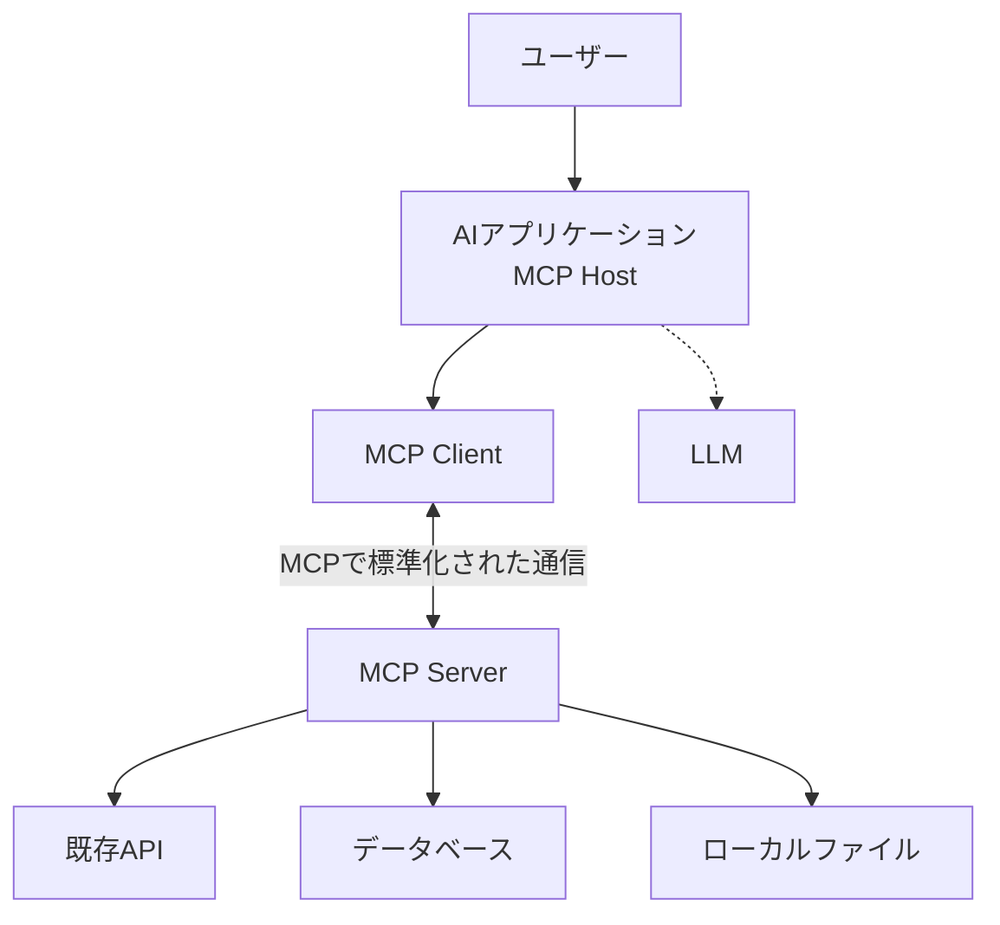
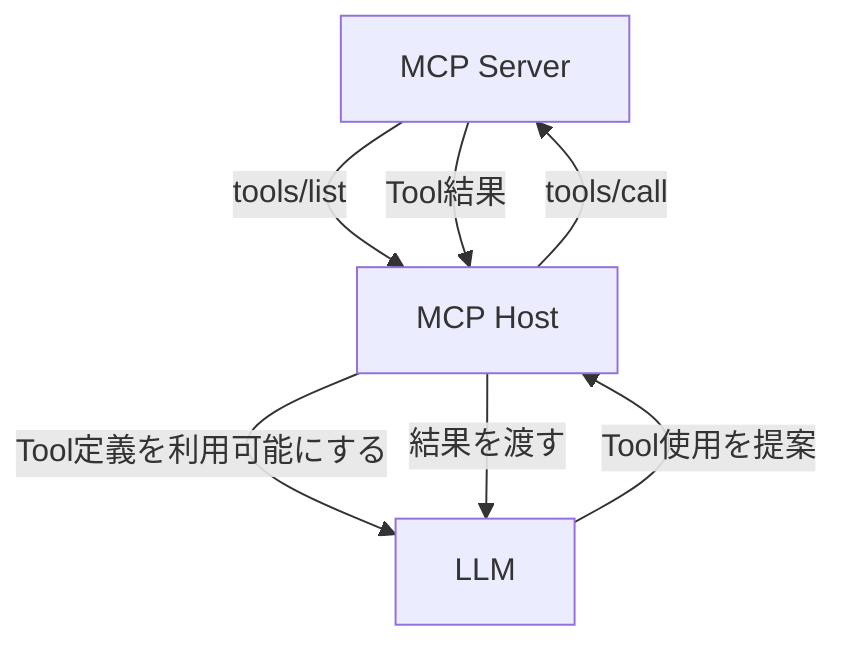

MCP（Model Context Protocol）について調べると、「AI向けのUSB」「LLMとツールをつなぐ共通規格」といった説明をよく見かける。入口としては分かりやすいが、その比喩だけでは、APIやFunction Callingと何が違うのか、MCPサーバーを入れると誰が何を実行するのかが曖昧なまま残る。

MCPを理解するには、機能の一覧より先に「どの境界を標準化しているか」を押さえる必要がある。MCPが扱うのは、AIアプリケーションと外部のデータ・機能を提供するプログラムとの通信だ。LLMそのものの仕様でも、外部サービスのAPIを置き換える仕組みでもない。

全7回の連載では、概念、通信、実装、リモート運用、セキュリティの順にMCPを分解する。第1回では、MCPの責任範囲をAPI、Function Calling、プラグインと比較しながら整理する。



---

## 結論を先に

MCPは、AIアプリケーションと外部機能の間で、次のようなやり取りを共通化するプロトコルである。

- 接続時に、互いのプロトコルバージョンと対応機能を確認する
- サーバーが提供するTool、Resource、Promptを発見する
- Toolを名前と構造化された引数で呼び出し、結果を受け取る
- ResourceをURIで参照し、Promptのテンプレートを取得する
- 必要に応じて、サーバーからAIアプリケーション側の機能を利用する

これらは、JSON-RPC 2.0のメッセージとしてやり取りされる。ローカルプロセスとの接続にはstdio、リモートサービスとの接続にはStreamable HTTPという標準トランスポートが用意されている。

一方で、どのLLMを使うか、LLMに何を渡すか、どのToolを選ばせるか、実行前にどのような承認画面を出すかまではMCPが一律に決めない。そこはMCP Host、つまりAIアプリケーションの設計範囲である。

図の中央にあるClientとServerの境界がMCPの主な対象だ。ClientはHost内部にあり、接続先Serverとの通信を担当する。LLMとの接続や、Serverから先にあるAPI・DB・ファイル操作は、別の契約と実装で動いている。

---

## なぜ共通プロトコルが必要なのか

MCPがない場合でも、AIアプリケーションから外部サービスを使うことはできる。GitHub APIを呼ぶコードを書き、データベース用のドライバーを入れ、ファイル操作用の関数を用意すればよい。

問題は、AIアプリケーションと外部サービスの組み合わせごとに接続部分を作る必要があることだ。AIアプリケーションが3種類、接続先が5種類あれば、単純には最大15通りの統合を保守することになる。それぞれが独自のTool定義、設定方法、エラー表現を持つと、接続先を追加するたびにHost側の実装も増えていく。

共通プロトコルがあれば、Hostは「MCP Serverと通信する方法」を実装し、Serverは「MCP Clientへ機能を公開する方法」を実装すればよい。実際の互換性は、対応するプロトコル版、任意機能、認証、Toolの品質などにも左右されるため、MCP対応だけで無条件に接続できるわけではない。それでも、接続ごとに独自仕様を作る状態から、共通の発見・呼び出し手順を使う状態へ移せる。

この構造は、接続先をAI専用に作り直すことも要求しない。たとえば既存のGitHub APIを利用するMCP Serverは、APIを廃止するのではなく、その手前でMCPのToolとして操作を公開するアダプターになる。

---

## MCPが標準化するもの

MCPの仕様は、一枚のTool呼び出し形式だけではない。大きく分けると、次の層を扱っている。

| 層 | 標準化される内容 |
| :--- | :--- |
| Base Protocol | JSON-RPC 2.0を使ったRequest、Response、Notification |
| Lifecycle | 初期化、プロトコルバージョンの合意、Capability Negotiation、終了 |
| Transport | stdio、Streamable HTTPでメッセージを運ぶ方法 |
| Server Features | Tools、Resources、Promptsなど、Serverが提供する機能 |
| Client Features | Sampling、Roots、Elicitationなど、Client側が提供できる機能 |
| Utilities | Logging、Completion、進捗通知、キャンセルなどの横断的な機能 |
| Authorization | HTTPベースの接続で使う認可の枠組み |

すべての実装が全機能を持つわけではない。Base ProtocolとLifecycleは土台になるが、ToolsやResourcesなどは必要に応じて実装される。接続時にはClientとServerがCapabilityを交換し、そのセッションで利用できる機能を確認する。

2026年7月初旬時点で公式サイトのCurrentプロトコル版は`2025-11-25`である。2026年7月3日には`2026-07-28`版のリリース候補（RC）が公開された。ステートレスコア設計、Extensionsフレームワーク、Tasks、MCP Appsなどの変更を含む予定で、正式公開は2026年7月28日の見込みとされている。MCPの版は、後方互換性のない変更が入った日を`YYYY-MM-DD`形式で表す。ClientとServerが同じ最新版を実装している前提ではなく、初期化時に1つの版へ合意する設計になっている。

### 「Context」は文章だけではない

名前にContextとあるため、MCPを「LLMへ文書を渡す規格」と考えると範囲を狭く捉えすぎる。

Serverが公開する基本要素には、データを読むResourcesだけでなく、処理を実行するTools、再利用可能な指示を提供するPromptsがある。反対方向には、ServerがClientへLLM生成を依頼するSamplingや、ユーザーへの追加情報入力を求めるElicitationなどもある。

MCPのメッセージはClientからServerへの一方通行ではない。Requestは両方向に送ることができ、Notificationも使える。この点は、単純な「関数の一覧を取得して呼ぶだけの規格」という理解では抜けやすい。

Tools、Resources、Promptsの違いは[第3回「MCPのTools・Resources・Promptsを使い分ける」]()で詳しく扱う。

---

## APIとの違い

APIは、あるソフトウェアの機能を別のソフトウェアから利用するための接点を指す広い言葉だ。REST API、GraphQL API、ライブラリのAPIなど、形も用途もさまざまである。

MCPも広い意味ではAPIの一種といえるが、目的と利用者が絞られている。AIアプリケーションが外部の機能やコンテキストを発見し、共通の手順で利用するためのプロトコルである。

| 観点 | 一般的なWeb API | MCP |
| :--- | :--- | :--- |
| 主な目的 | サービス固有のデータ・操作を公開する | AIアプリケーション向けに機能・コンテキストを公開する |
| 操作の発見 | OpenAPIなど別仕様を使う場合がある | Tools、Resources、Promptsの一覧取得をプロトコルに含む |
| 接続開始 | APIごとの方式に従う | 初期化とCapability Negotiationを行う |
| 通信 | HTTPに限らず多様 | JSON-RPCメッセージをstdioまたはStreamable HTTPなどで運ぶ |
| 関係 | 接続先の本来のAPIになり得る | 既存APIを内側で呼ぶアダプターになり得る |

たとえば天気サービスのREST APIは、地域コードを受け取って予報JSONを返すかもしれない。そのAPIを利用するMCP Serverは、`get_forecast`というToolの名前、説明、入力スキーマをClientへ公開し、呼び出されたら内部でREST APIへ変換して結果を返す。

MCPを導入しても、APIキー、レート制限、外部API固有のエラー処理は消えない。Server側でそれらを扱い、MCPの結果としてClientへ返す必要がある。

---

## Function Callingとの違い

Function CallingやTool Callingは一般に、LLMへ利用可能な関数の名前・説明・引数スキーマを渡し、モデルに「この関数をこの引数で呼びたい」という構造化出力を生成させる仕組みを指す。

MCPのToolにも名前、説明、入力スキーマがあるため、見た目はよく似ている。しかし、両者が受け持つ境界は異なる。

Function Callingは、主にアプリケーションとモデル推論の間で、モデルが構造化されたTool呼び出しを出力する部分に関係する。MCPは、Host内のClientとMCP Serverの間で、Toolを発見して実行結果を交換する部分に関係する。

実際のHostは、MCP Serverから取得したTool定義を、利用中のLLMが理解できるTool形式へ変換することがある。ただし、その変換方法、モデルへ見せるToolの絞り込み、Tool選択の制御はHostの実装であり、MCP仕様そのものではない。MCP ServerがLLMベンダーごとのFunction Calling形式を直接扱う必要はない、という分離が利点になる。

もう一つ注意したいのは、「モデルがToolを呼び出す」という表現だ。モデルが生成するのは通常、Toolを使う意図と引数である。実際に`tools/call`を送り、外部処理を動かすのはHostとServerを含むソフトウェア側だ。承認画面を挟むHostであれば、モデルが提案してもユーザーが拒否できる。

---

## プラグインとの違い

プラグインは、既存アプリケーションへ機能を追加する配布・拡張の仕組みを指すことが多い。どのファイルを配置するか、どのAPIを実装するか、どの権限を宣言するかは、プラグインを受け入れる製品ごとに決まる。

MCPは特定製品向けのプラグイン形式ではない。同じMCP Serverを複数のHostから利用できる可能性を作る通信プロトコルである。Serverをどのようにインストールし、設定画面へ登録し、更新するかはHostや配布手段に依存する。

そのため、「MCP Serverを追加する操作」が見た目上プラグインのインストールに似ていても、概念は分けた方がよい。プラグインはアプリケーションへの組み込み方、MCPは実行時のClientとServerの会話を主に扱う。MCP Serverを内包したプラグインや、MCP Serverの設定を配布するパッケージも作れるため、両者は排他的ではない。

---

## MCPが決めないもの

MCP対応という表示から、賢さや安全性まで共通化されていると考えるのは危険である。公式のアーキテクチャ解説も、MCPはコンテキスト交換のプロトコルに焦点を当て、AIアプリケーションがLLMや提供されたコンテキストをどう使うかは規定しないとしている。

具体的には、次のような判断はMCPの外側に残る。

### LLMと推論方法

どのモデルを利用するか、Tool定義をどのプロンプトへ含めるか、Tool結果を何件・何文字まで会話へ戻すかはHostが決める。同じServerへ接続しても、Hostやモデルが違えばToolの選択結果や回答は変わり得る。

### ユーザー体験と承認方針

Toolを自動実行するか、読み取りだけ自動許可するか、毎回確認するかといった方針もHost側の責任である。MCPのTools仕様は、人間がTool呼び出しを拒否でき、実行前に確認できる設計を推奨しているが、具体的なUIを一つに固定してはいない。

### 外部サービスの権限設計

ServerがGitHubやデータベースへ接続するなら、その認証情報が何を許可するかは外部サービス側の設定に依存する。MCPの認可仕様があっても、Serverから先の権限が自動的に最小化されるわけではない。

### Toolの品質と安全性

Tool名や入力スキーマが共通形式でも、その説明が正確か、入力検証が十分か、処理が冪等か、機密情報を結果へ含めないかはServer実装次第だ。MCP対応は品質保証の印ではない。

### 業務上の意味

`delete_issue`というToolの呼び出し方は標準化できても、どのIssueを削除してよいかという業務ルールまではプロトコルから決められない。実運用では、Hostの承認、Server側の認可、外部APIの権限を重ねて考える必要がある。

---

## MCPを理解するときの確認軸

新しいMCP ServerやHostを見るときは、単に「何ができるか」だけでなく、次の順番で見ると構造を把握しやすい。

1. どのアプリケーションがHostなのか
2. どのServerへ、ローカルとリモートのどちらで接続するのか
3. ServerはTools、Resources、Promptsの何を公開するのか
4. Serverの内側で、どのファイル、API、データベースへアクセスするのか
5. Toolの提案、承認、実行を誰が制御するのか
6. 認証情報と実行権限をどこが持つのか
7. Tool結果がどの範囲でLLMのコンテキストへ入るのか

この軸を持つと、「MCPだからLLMがデータベースへ直接つながる」「MCP Serverが会話全体を読んで自律的に動く」といった誤解を避けられる。

次の[第2回「MCPのHost・Client・Serverを整理する」]()では、Host内部にあるClientを含め、1回のTool実行がどの参加者を通るのかを追う。

---

## 参考

- [Architecture overview - Model Context Protocol](https://modelcontextprotocol.io/docs/learn/architecture) ── MCPの対象範囲、Host・Client・Server、基本的なデータ層
- [Overview - Model Context Protocol Specification](https://modelcontextprotocol.io/specification/2025-11-25/basic) ── Base Protocol、JSON-RPCメッセージ、主要コンポーネント
- [Lifecycle - Model Context Protocol Specification](https://modelcontextprotocol.io/specification/2025-11-25/basic/lifecycle) ── 初期化、バージョンとCapabilityの合意
- [Versioning - Model Context Protocol Specification](https://modelcontextprotocol.io/specification/versioning) ── Current版とバージョン識別子の規則
- [Tools - Model Context Protocol Specification](https://modelcontextprotocol.io/specification/2025-11-25/server/tools) ── Toolの発見、呼び出し、ユーザー操作に関する原則
