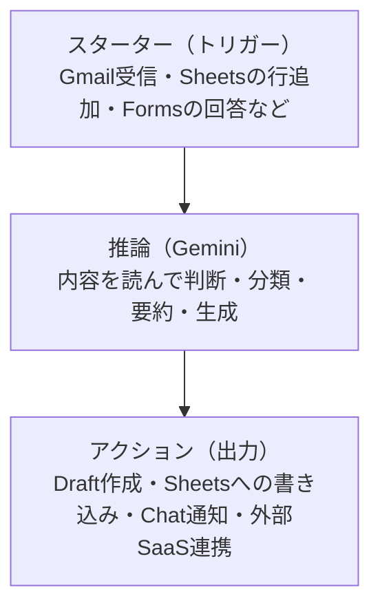

会社でGoogle Workspace Studio の利用が解禁されたはいいが、「何ができるのかよくわからない」という状態になりやすいツールだと思う。Google Docs や Gmail のような既存ツールとどう違うのか、どこから手を付ければいいか、最初は見当がつきにくい。

この記事ではGoogle Workspace Studio の仕組みを整理したうえで、ITコンサルタントや技術職が優先的に試すべきユースケースを具体的に提案する。2026年7月初旬時点の情報をもとにしている。

---

## Google Workspace Studio とは

Google Workspace Studio は、Gemini を使ったノーコードのワークフロー（エージェント）を設計・管理・共有するためのツールだ。2025年12月に正式リリースされ、現在はすべての Business・Enterprise プランで基本機能は追加費用なしで利用できる。ただし高い使用上限が必要な場合は、2026年3月1日より提供が始まったAI Expanded Accessアドオン（有償）が別途必要になる。

「ノーコード」「AI自動化」という言葉が並ぶと、既存のRPA（Zapier、Make など）と何が違うのか疑問に思うかもしれない。大きな違いは **Gemini が判断を担う**点だ。

従来のRPAは「条件A→アクションB」という固定ルールで動く。Workspace Studio では Gemini がメールの内容を読んで優先度を判断したり、議事録から要点を抽出してアクション候補を提案したりする。単なるトリガー・アクションの連鎖ではなく、推論のステップが間に入る。

---

## 仕組みの概要

ワークフローは3つのパートで構成される。

**スターター**は Gmail の受信・Sheets の行追加・Forms の回答・Google Chat のメッセージなどが選べる。

**推論ステップ**では Gemini がデータを読んで判断する。「このメールは緊急か」「この議事録のアクションアイテムは何か」「このフォーム回答はどのカテゴリか」といった判断をGeminiが行う。

**アクション**には Gmail でのドラフト作成・Sheets への書き込み・Google Chat への通知・外部SaaS（Salesforce、Asana、Jira など50以上のコネクタ）への連携がある。

---

## ITコンサルタントが優先して試すべきユースケース

### 1. ミーティング後処理の自動化

コンサルタントは1日に複数の打ち合わせが入ることが多い。議事録作成・アクション整理・メール共有という一連の作業は、Workspace Studio で自動化しやすい代表例だ。

**フロー例:**
- Google Meet の録音/文字起こしデータを受け取る（またはDocs上の議事録を入力にする）
- Gemini がアクションアイテムを抽出し、担当者・期日とセットで整理する
- 参加者に Gmail でドラフトを自動送信する（送信前に確認できる）

英語の会議録を日本語要約してチームに共有する、あるいはその逆も簡単に組める。

### 2. クライアント対応メールの分類と優先付け

問い合わせメールが多いとき、Workspace Studio でGmailをトリガーにすれば次のようなフローを作れる。

- 受信メールをGeminiが「緊急/通常/FYI」に分類し、ラベルを付ける
- 緊急と判定されたメールはGoogle Chatにアラートを送る
- 定型的な質問（FAQ系）には自動でドラフト返信を生成してドラフトに保存する

プロジェクトごとに専用のワークフローを作って共有できるため、チーム全員が同じ基準でメールを処理できる。

### 3. フォーム回答からのデータ集計とSlack/Chat通知

アンケートや情報収集フォームを運用している場合、Workspace Studio でGoogle Forms → Sheets → Chat/外部SaaSへの通知を繋げられる。

- フォーム回答をGeminiが自動分類・タグ付けしてSheetsに記録する
- 特定の条件（スコアが一定以下・特定キーワードを含む）に合致した回答をリアルタイムでChat通知する
- 週次でSheetsの集計結果をまとめてメール送信する

BIツールや複雑なデータパイプラインを組むまでもない、軽量な情報収集と集約に向いている。

### 4. 外部SaaSとのデータ同期

50以上のコネクタが提供されており、Salesforce・Asana・Jira・HubSpotなどの主要ツールと連携できる。

**具体例:**
- Gmail で受注メールを受け取ったとき、Gemini が内容を解析してSalesforceに商談を自動登録する
- Google Sheetsのタスクリストの新規行をAsanaのタスクとして同期する
- Jiraのチケットステータスが変わったときにGmailまたはChatに通知する

GASやZapierでやっていたことと似ているが、「メール本文を読んでSalesforceのどのフィールドに何を入れるか判断する」という部分でGeminiが補完するため、より複雑な条件分岐を自然言語で記述できる。

---

## 技術職として見た場合の可能性

ITコンサルタントやエンジニアの視点でもう一点触れておきたい。

Workspace Studio は「AIエージェントのプロトタイプ場」としても使える。トリガー・推論・アクションという3ステップのアーキテクチャは、本格的なエージェント開発と構造が一致している。

コードを書かずに「Geminiが判断してツールを呼ぶ」フローを試せるため、以下のような用途に使える。

- 実装前のユースケース検証（「このフローは本当に価値があるか」を素早く確認する）
- クライアントへの提案デモ（コードなしで動くエージェントを見せる）
- 社内での自動化文化の醸成（非エンジニアが自分でフローを作れる環境を整備する）

本格的なカスタマイズが必要になったら、Google Cloud側のGemini Enterprise Agent Platform（旧Vertex AI）に移行するパスもある。

---

## 始め方

[workspace.google.com/studio/](https://workspace.google.com/studio/) にアクセスし、Workspace アカウントでログインする。

「新しいフローを作成」からスタート地点を選び、自然言語でやりたいことを入力すると Gemini がフロー構成を提案してくれる。最初は既存のテンプレートを選ぶのが早い。

スキル（再利用可能な部品）を作成しておくと、チームで共有して使い回せる。社内で「標準化した議事録フロー」や「問い合わせ対応フロー」を共有するのが実用的な第一歩だ。

---

## 注意点

**データのプライバシー:** フローで処理されたデータはGoogleの広告配信に使われず、一般的なモデルトレーニングにも使われない（Workspace のデータ保護コミットメントに準拠）。ただし機密プロジェクト情報をGeminiに渡す設計にする場合は、社内のデータガバナンスポリシーとの整合を確認する。

**外部コネクタの認証:** Salesforce や Jira などとの接続には OAuth 認証が必要になる場合がある。IT部門の承認フローが必要なケースも想定しておく。

**企業管理者向け機能:** 管理コンソールから「AIコントロールセンター」でエージェントのアクセス権・共有範囲・監査ログを管理できる。組織展開前に管理者との連携を確認しておく。

---

## 参考

- [Google Workspace Studio 公式](https://workspace.google.com/studio/)
- [Google Workspace Studio でできること（Google サポート）](https://support.google.com/a/users/answer/16430812?hl=ja)
- [Google Workspace Studio のご紹介（Google Workspace Blog）](https://workspace.google.com/blog/product-announcements/introducing-google-workspace-studio-agents-for-everyday-work)
- [Google Cloud Next 2026 の Workspace 発表](https://workspace.google.com/blog/product-announcements/10-more-announcements-workspace-at-next-2026)
