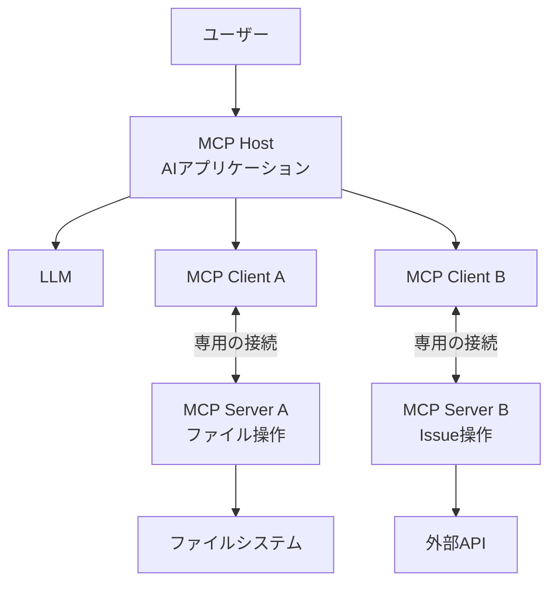
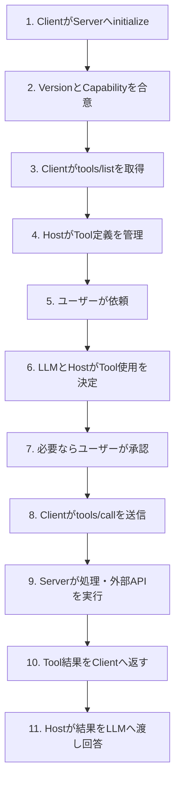

MCPの構成は「ClientとServerが通信する」と説明される。それ自体は正しいが、Claude CodeやIDEのようなアプリケーションをMCP Clientと呼んでしまうと、実際の接続構造が見えにくくなる。

ユーザーが操作するAIアプリケーションはMCP Hostであり、その内部にMCP Clientが作られる。Clientは接続先のServerごとに存在する。この区別が分かると、複数ServerのToolが一つの会話に見える理由や、会話履歴をServerへ丸ごと渡さずに済む理由を説明できる。

第1回の[MCPは何を標準化するプロトコルなのか]()では、MCPがAIアプリケーションと外部機能の接続境界を扱うことを整理した。第2回では、その境界にいる参加者を分解し、一つのToolが実行されて回答へ戻るまでを追う。

---

## 全体構造

MCPの中心にいる参加者はHost、Client、Serverの三つである。Serverから先にある外部API、データベース、ファイルシステムは実用上重要だが、MCPプロトコルの参加者ではない。



ユーザーから見ると、Hostの画面に複数Serverの機能がまとまって表示される。しかし、プロトコル上はClient AとServer A、Client BとServer Bが独立した接続を持つ。Hostがそれらを束ね、LLMやユーザーインターフェースと調整している。

---

## Hostは全体を調整するAIアプリケーション

Hostは、ユーザーが直接操作するアプリケーションである。IDE、デスクトップAIアプリケーション、コーディングエージェントなどがHostになり得る。

Hostの役割は、MCPメッセージを転送するだけではない。公式アーキテクチャでは、Hostは複数Clientの作成・管理、接続権限とライフサイクル、セキュリティポリシー、ユーザーの認可判断、LLMとの統合、複数接続から得たコンテキストの集約を担う。

たとえばユーザーが「このエラーを調べてIssueを作って」と依頼した場合、Hostは次のような調整を行える。

1. ファイルServerのResourceやToolからログを取得する
2. 取得結果をLLMへ渡して原因を整理させる
3. Issue Serverの作成ToolをLLMへ選択肢として示す
4. 書き込み操作の前にユーザーへ確認する
5. 承認後にIssue作成を実行する
6. Tool結果をLLMへ戻し、Issue URLを回答させる

この一連のオーケストレーションは、二つのServerが直接相談して行うのではない。Hostが各Clientから得た情報を管理し、次の処理を決める。

### Hostの実装とMCP仕様を分ける

実際のHostがどの操作で承認を求めるか、Toolを何個までLLMへ見せるか、結果を会話履歴へどのように保存するかは製品ごとに異なる。MCP仕様は、Toolの一覧取得や呼び出しのメッセージを定義するが、Hostの画面やエージェントループまでは定義しない。

したがって、あるHostで自動実行されたToolが、別のHostでは確認対象になることがある。これはMCP互換性の問題ではなく、Hostのポリシーや設定の違いである可能性が高い。

---

## ClientはServerごとの通信担当

MCP ClientはHost内部のプロトコルコンポーネントである。ユーザーがClientを直接操作するとは限らない。

Clientは特定のServerとの接続を確立し、その接続について次の処理を担当する。

- 初期化時のプロトコルバージョンとCapabilityの交換
- JSON-RPCメッセージの送受信
- Tools、Resources、Promptsの一覧取得
- RequestとResponseの対応づけ
- Serverから届くNotificationの処理
- 接続終了までのセッション管理

HostがファイルServerとGitHub Serverへ接続するなら、通常はそれぞれに対応するClientインスタンスを作る。この分離により、一方のServerから届いたメッセージを他方のServerとのセッションへ混ぜずに扱える。

### 「ClientとServerは1対1」の正確な意味

公式ドキュメントでは、各MCP Clientが対応するMCP Serverとの専用接続を維持すると説明されている。この1対1は、「世界にServerが一つしかない」「Serverプロセスが一つのClientからしか使えない」という意味ではない。

ローカルのstdio Serverは、Hostが子プロセスとして起動し、一つのClientへ接続する構成が一般的である。一方、Streamable HTTPで公開されたリモートServerは、複数ユーザー・複数HostからのClient接続を受け付けられる。

1対1なのはClientインスタンスと、そのClientが担当するServer接続の関係だ。一つのリモートServerサービスが多数のClientを処理することとは両立する。

### ClientはLLMそのものではない

ClientがToolを一覧取得しても、それだけでLLMがToolを選ぶわけではない。取得したToolをLLMへどう提示し、モデルの出力をどう`tools/call`へ変換するかは、Hostの統合処理にあたる。

ClientをLLMと同一視すると、「MCP ServerがLLMと直接会話している」という誤解につながる。Clientはプロトコル通信を担当し、LLMはHostが利用する推論コンポーネントである。

---

## Serverは機能とコンテキストを公開する

MCP Serverは、MCP Clientへ特定分野の機能やコンテキストを提供するプログラムである。ローカルで起動するプロセスでも、ネットワーク越しのサービスでもServerと呼ぶ。Serverという言葉は配置場所ではなく、MCPにおける役割を表している。

Serverは主に次の要素を公開できる。

| 要素 | Serverの役割 | 例 |
| :--- | :--- | :--- |
| Tools | 名前、説明、入力スキーマを公開し、呼び出しを処理する | Issue作成、SQL実行 |
| Resources | URIで識別できるデータを公開する | ファイル内容、DBスキーマ |
| Prompts | 引数を持つ再利用可能なプロンプトを公開する | コードレビュー手順 |

ServerはCapability Negotiationで、自分がどの機能に対応しているかを宣言する。Clientは宣言されていない機能を利用する前提にしてはならない。Tool一覧の変更通知など、機能内の追加Capabilityもある。

Serverの責務はMCPの外にも及ぶ。外部APIを呼ぶServerなら、入力検証、API認証、レート制限、エラー変換、監査ログなどを実装する必要がある。MCP SDKがTool登録やメッセージ処理を支援しても、接続先固有の業務ロジックまでは代行しない。

### Serverは会話全体を自動的に見られない

公式アーキテクチャの設計原則では、Serverが会話全体や他Serverの内部を読めないようにし、必要なコンテキストだけを受け取ることが示されている。

Tool呼び出しでServerが受け取るのは、基本的にはTool名、引数、プロトコル上のメタデータなど、そのRequestに含まれた情報である。ユーザーとの全会話が暗黙に転送されるわけではない。会話の一部をTool引数へ含めたり、Resourceの結果を別の処理へ渡したりするのはHost側の調整である。

ただし、Serverへ送信した引数やデータが安全になるという意味ではない。必要以上の会話や機密情報をTool引数へ含めれば、そのServerには届く。Serverごとの分離と、Hostが何を送るかというデータ最小化の両方が必要になる。

---

## 外部APIとデータベースはServerの向こう側にある

GitHub、Slack、SaaS API、PostgreSQL、ローカルファイルなどは、MCPのHost・Client・Serverとは別の層にある。

たとえばIssue作成Serverは、MCP Clientから次のような呼び出しを受け取る。

```json
{
  "jsonrpc": "2.0",
  "id": 42,
  "method": "tools/call",
  "params": {
    "name": "create_issue",
    "arguments": {
      "title": "ログイン時に500エラーが発生する",
      "body": "再現手順と調査結果..."
    }
  }
}
```

Serverはこの引数を検証し、外部サービス固有のHTTPリクエストへ変換する。外部APIから返ったIssue番号やURLをMCPのTool結果に整形してClientへ返す。

このとき二つの契約が存在する。

1. ClientとServerの間にあるMCPの契約
2. ServerとGitHubなどの間にある外部APIの契約

MCPのプロトコル版が変わらなくても、外部APIの仕様変更でServerが壊れることはある。逆に、外部APIが正常でも、ClientとServerのプロトコル版が合意できず接続に失敗することもある。障害調査では、この境界を分けて考える必要がある。

認証情報も同様である。リモートMCP Serverへの接続を認可するトークンと、Serverが外部APIへアクセスする資格情報は、役割が異なる場合がある。どこでどのCredentialを保持するかは、Serverの配置と信頼境界を見て設計する。

---

## Tool実行が完了するまで

ここまでの参加者を、接続開始から一つのTool結果が回答へ戻るまでの流れに当てはめる。



### 1. Clientが初期化を始める

Clientは最初のやり取りとして`initialize` Requestを送り、対応するプロトコル版、Client Capability、実装情報を伝える。Serverは利用するプロトコル版、Server Capability、実装情報を返す。Clientが`notifications/initialized`を送ると、通常の操作へ進める。

### 2. Toolを発見する

Serverが`tools` Capabilityを宣言していれば、Clientは`tools/list`を送ってTool定義を取得できる。定義にはTool名、説明、`inputSchema`などが含まれる。

Hostはこの情報を保持し、利用するLLMに合わせてTool候補を提示する。Tool一覧をそのまますべて渡すか、権限や会話に応じて絞るかはHostの実装次第である。

### 3. Tool使用を決める

ユーザーの依頼を受けたLLMは、利用可能なToolの情報からTool名と引数を提案できる。ただし、MCP仕様はモデルの選択アルゴリズムを定義しない。ルールベースでToolを選ぶHostや、人が明示的にToolを選択するHostも構成上は可能である。

書き込みや外部送信を伴う場合、Hostは実行前に承認を求めることがある。承認の粒度や自動許可ルールはHost側のセキュリティ設計であり、Serverが勝手に決めるものではない。

### 4. Clientが`tools/call`を送る

承認後、ClientはTool名と引数を含む`tools/call` RequestをServerへ送る。Serverは入力を検証し、ローカル処理や外部API呼び出しを実行する。

Server側で起きたTool実行上の失敗は、Tool結果の`isError`で表現される場合がある。一方、未知のTool名やプロトコルとして不正なRequestはJSON-RPC Errorになる。すべての失敗が同じ層のエラーではない。

### 5. 結果を回答へ戻す

Serverはテキストや構造化コンテンツなどをTool結果としてClientへ返す。Hostはその結果をLLMへ渡し、ユーザー向けの回答を生成させる。

ToolがIssueを作った場合、LLMが作成を行ったというより、LLMが呼び出しを提案し、HostとClientがRequestを運び、Serverが外部APIを実行したと表現する方が実態に近い。

---

## 通信は常にClient起点とは限らない

Toolの基本フローだけを見ると、ClientがRequestを送り、Serverが返す一方向のAPIに見える。しかしMCPのBase Protocolでは、ClientとServerのどちらもRequestを送信できる。

たとえばServerは、Clientが対応Capabilityを宣言していれば、SamplingでLLM生成を依頼したり、Elicitationでユーザーから追加情報を得るよう求めたりできる。Server側がResourceやTool一覧の変更をNotificationで知らせる機能もある。

ServerからSamplingを要求した場合も、ServerがHost内のLLMを自由に操作するわけではない。ClientとHostがリクエストを確認し、モデル選択、権限制御、ユーザー承認などを管理する。双方向通信であっても、Hostが境界の管理者である点は変わらない。

これらのServer FeaturesとClient Featuresは、次の[第3回「MCPのTools・Resources・Promptsを使い分ける」]()で整理する。

---

## よくある混同を整理する

| 認識 | 実際の構造 |
| :--- | :--- |
| AIアプリケーションがMCP Clientである | アプリケーション全体はHostで、その内部にServerごとのClientがある |
| LLMがMCP Serverへ直接Requestを送る | HostとClientがモデル出力をMCP Requestへつなぐ |
| 一つのServerは一つのClient専用である | Clientは特定Serverとの専用接続を持つが、リモートServerは多数のClientを処理できる |
| MCP Serverは会話全体を読める | ServerはHostがRequestなどで渡した範囲を受け取る |
| Server同士が直接連携する | 複数Serverの情報や処理は通常Hostが各Clientを通じて調整する |
| MCPが外部APIを置き換える | Serverが既存APIを呼ぶ構成が多く、外部APIの契約は残る |
| MCP対応なら承認方法も同じである | 承認UIや自動実行ポリシーはHost実装に依存する |

Host・Client・Serverを分けて見ると、問題が起きた場所も切り分けやすくなる。接続できないならClientとServerの初期化、Toolが見えないならCapabilityと`tools/list`、外部操作だけ失敗するならServerから先のAPI、意図しないToolが選ばれるならHostとLLMの統合を調べる、といった具合だ。

---

## 参考

- [Architecture overview - Model Context Protocol](https://modelcontextprotocol.io/docs/learn/architecture) ── Host・Client・Serverの関係とTool実行例
- [Architecture - Model Context Protocol Specification](https://modelcontextprotocol.io/specification/2025-06-18/architecture) ── 各参加者の責務と1対1のClient・Server関係
- [Understanding MCP clients - Model Context Protocol](https://modelcontextprotocol.io/docs/learn/client-concepts) ── Clientの役割とClient Features
- [Understanding MCP servers - Model Context Protocol](https://modelcontextprotocol.io/docs/learn/server-concepts) ── Serverが公開するTools、Resources、Prompts
- [Lifecycle - Model Context Protocol Specification](https://modelcontextprotocol.io/specification/2025-11-25/basic/lifecycle) ── 初期化、Capability Negotiation、接続のライフサイクル
- [Tools - Model Context Protocol Specification](https://modelcontextprotocol.io/specification/2025-11-25/server/tools) ── `tools/list`と`tools/call`の仕様、エラーの扱い

