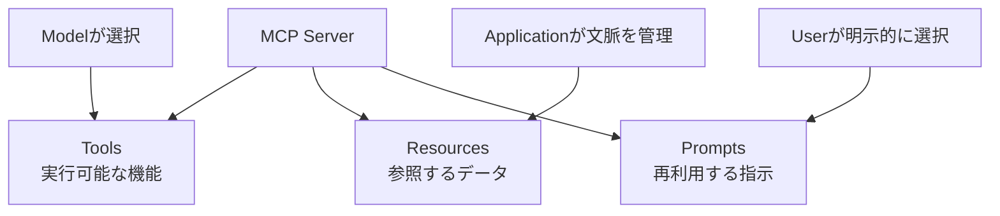
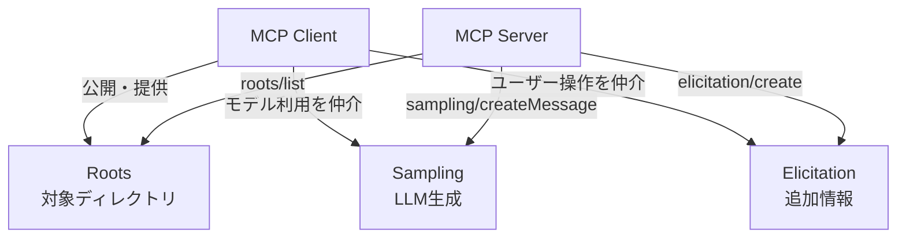
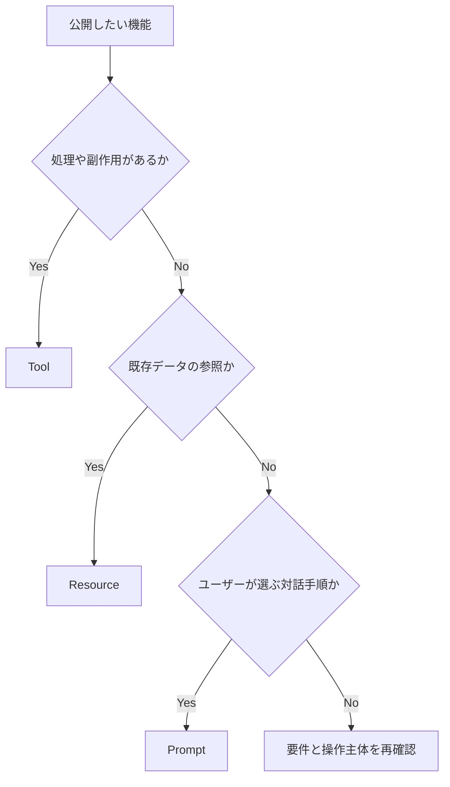

MCPサーバーというと、LLMから外部APIを呼ぶためのToolsがまず思い浮かぶ。実際には、MCPサーバーが公開する基本機能にはTools、Resources、Promptsの3種類がある。

この3つは、同じデータを返せることもある。たとえばノートを読む機能は、`read_note`というToolにも、`note://daily/2026-06-19`というResourceにもできる。コードレビューの指示は、Toolの説明文にもPromptにも書ける。そのため、通信できるかどうかだけで設計すると、ほとんどをToolに寄せてしまいがちだ。

違いはデータ形式よりも「誰が、どのタイミングで使うものか」にある。本連載の[前回はHost・Client・Serverの分担]()を整理した。今回はその上に、MCPが提供する機能を配置していく。なお、この記事はMCP仕様の`2025-11-25`版を基準にしている。



---

## 3つの違いは操作の主導権にある

MCP仕様は、サーバー側の3つのprimitiveを次のように整理している。

| Primitive | 標準的な主導者 | 主な用途 | 例 |
| :--- | :--- | :--- | :--- |
| Tools | Model-controlled | 処理の実行、外部システムの操作 | Issue作成、検索、計算 |
| Resources | Application-controlled | 文脈として使うデータの提供 | ファイル、DBスキーマ、Git履歴 |
| Prompts | User-controlled | ユーザーが選ぶ定型ワークフロー | コードレビュー、議事録の整理 |

ここでいう`model-controlled`は「モデルが無制限に実行してよい」という意味ではない。モデルが文脈に応じてToolの利用を提案・選択できる、というインタラクション上の分類だ。Hostは実行前に確認画面を出せるし、ユーザーは拒否できる。MCP仕様も、Tool実行を拒否できるhuman-in-the-loopを推奨している。

同様に、`application-controlled`はResourceをHostが必ず自動挿入するという意味ではない。ツリーからユーザーに選ばせてもよいし、検索やヒューリスティクス、モデルの選択を使ってもよい。`user-controlled`のPromptも、必ずスラッシュコマンドとして表示する決まりではない。仕様は代表的な操作モデルを示すが、具体的なUIまでは規定していない。



この整理は権限モデルそのものではない。安全性は、Server側のアクセス制御、Host側の承認、OSやコンテナの権限などで別に担保する必要がある。

---

## Toolsは「実行する機能」を公開する

Toolsは、モデルが外部システムへ働きかけたり、その場で計算や検索を行ったりするための機能だ。MCP Clientは`tools/list`で定義を取得し、`tools/call`で選んだToolを呼び出す。

Toolの定義には、名前、説明、引数を表す`inputSchema`などが含まれる。`outputSchema`を付ければ、構造化された結果の形も宣言できる。

```json
{
  "name": "search_notes",
  "description": "Search notes whose body contains the query",
  "inputSchema": {
    "type": "object",
    "properties": {
      "query": {
        "type": "string",
        "description": "Text to search for"
      }
    },
    "required": ["query"]
  }
}
```

この説明とスキーマは単なるAPIドキュメントではない。Hostからモデルへ渡され、モデルが「この場面で使うべきか」「どの引数を渡すか」を判断する材料になる。名前が曖昧だったり、説明が誇張されていたりすると、通信自体は成功しても選択を誤りやすい。

Toolsに向くのは、呼び出すたびに処理が走るものだ。

- Issueを作成する
- 指定条件でノートを検索する
- SQLを実行する
- 金額を換算する
- メール送信の下書きを保存する

読み取り処理もToolにできる。「書き込みならTool、読み取りならResource」という区分ではない。検索条件を受け取って動的に結果を作る、実行の成否をモデルが受けて次の行動を変える、といった処理は読み取りでもToolと相性がよい。

一方、Toolを公開しただけでは、承認、認可、リトライ、タイムアウトの方針は決まらない。たとえば`delete_note`を毎回確認するか、自動実行を許すかはHostの実装や設定である。Server側も「Hostで確認されるはず」と信用せず、入力検証とアクセス制御を持つ必要がある。

### Toolのエラーは2層ある

Toolでは、プロトコルエラーと実行エラーを分けて扱う。

存在しないTool名や壊れたリクエストは、JSON-RPCの`error`として返す。一方、外部APIのレート制限や業務ルール違反のように、Toolの呼び出し自体は成立したが処理に失敗した場合は、通常の`result`内で`isError: true`を返せる。

後者は「日付を未来日に直して再試行する」といった自己修正に利用できる。すべての失敗を同じ例外にまとめるより、モデルが次の行動を判断しやすい。

---

## Resourcesは「参照できるデータ」を公開する

Resourcesは、Serverが持つデータを文脈として利用できる形でClientへ公開する。各ResourceはURIで識別される。

```text
note://daily/2026-06-19
file:///workspace/README.md
git://repository/commits/main
```

Clientは`resources/list`で一覧を取得し、`resources/read`で内容を読む。固定URIの一覧だけでなく、`note://daily/{date}`のようなResource Templateを公開することもできる。Resourceの内容はテキストまたはbase64エンコードされたバイナリで表現できる。

Resourcesに向くのは、「呼び出して処理する」というより「存在する情報を参照する」と考えた方が自然なものだ。

- プロジェクトのREADME
- データベースのスキーマ
- アプリケーションの設定情報
- Gitの履歴
- 日付やIDで識別できるノート

Resourceは、モデルのコンテキストへ必ず自動投入されるわけではない。Hostが一覧をUIに表示してユーザーに選ばせることも、必要なものだけ取得することもできる。MCPが標準化するのは、発見と読み出しの方法である。どのResourceをいつモデルへ見せるか、長い内容を要約するか、キャッシュするかはHost側の判断になる。

### Resourceは変更通知を扱える

Serverが`resources.subscribe` capabilityを宣言している場合、Clientは個別Resourceを購読できる。内容が変わったときは、Serverが`notifications/resources/updated`を送る。また、公開されているResourceの一覧自体が変わった場合は、`notifications/resources/list_changed`を利用できる。

ここにも境界がある。通知は「変わった」という合図であり、Hostが即座に再取得してモデルへ差し込むことまでは規定しない。更新頻度の高いResourceを毎回読み直すかどうかは、通信量と鮮度を考えてHostが決める。

### Toolで読むかResourceで読むか

ノートの例で考えると区別しやすい。

| 要件 | 適した候補 | 理由 |
| :--- | :--- | :--- |
| URIが分かっているノート本文を読む | Resource | 既存データの参照として表現できる |
| キーワードと期間を指定して検索する | Tool | 引数を受けて検索処理を実行する |
| 検索結果から本文へ移動する | Tool + Resource | 検索結果でResource Linkを返せる |
| ノートを更新する | Tool | 副作用のある操作として明示できる |

すべてを片方に寄せる必要はない。Toolの結果からResourceへのリンクを返す設計にすると、検索という操作と、見つかったデータの参照を分離できる。

---

## Promptsは「選んで使う対話の型」を公開する

Promptsは、Serverが再利用可能なメッセージや指示のテンプレートをClientへ公開する機能だ。Clientは`prompts/list`で候補を取得し、ユーザーが選んだPromptを`prompts/get`で展開する。Promptは引数を受け取れる。

```json
{
  "name": "review_note",
  "description": "Review a note for unclear claims and missing evidence",
  "arguments": [
    {
      "name": "note_uri",
      "description": "URI of the note to review",
      "required": true
    }
  ]
}
```

取得結果は単なる文字列ではなく、`user`または`assistant`のroleを持つメッセージ列だ。テキストのほか、画像、音声、埋め込みResourceを含められる。たとえば「指定ノートを読み、根拠がない断定を列挙する」というレビュー手順と対象Resourceを一緒に返せる。

Promptsが向くのは、ユーザーが目的を理解したうえで明示的に開始するワークフローだ。

- コードレビューを始める
- 障害報告を所定の形式で作る
- 会議メモから決定事項を抽出する
- 特定の観点で設計案を比較する

Promptはモデルのsystem promptをServerが自由に上書きする仕組みではない。Serverがテンプレートを返し、Hostが対話へどう組み込むかを決める。Promptをスラッシュコマンド、メニュー、フォームのどれで見せるかもHost次第だ。

また、PromptがServerから来る以上、その内容を無条件に信頼してよいわけではない。外部データの送信や権限の拡大を指示に含める可能性もある。Hostは出所を示し、ユーザーが内容を確認できるようにする必要がある。

---

## Roots・Sampling・Elicitationは向きが逆になる

Tools、Resources、PromptsはServerがClientへ公開するServer Featuresである。MCPには反対方向、つまりServerがClientの機能を利用するClient Featuresもある。`2025-11-25`版で主要なものはRoots、Sampling、Elicitationだ。



### Rootsは作業対象をServerへ伝える

RootsをサポートするClientは、作業対象となるファイルシステムのルートをServerへ公開できる。Serverは`roots/list`を送り、`file://` URIの一覧を受け取る。ワークスペースが変わった場合はClientから変更通知を送れる。

ただし、Rootsの一覧を受け取ることと、OSレベルでアクセスを封じることは同じではない。Serverが実際に読める範囲は、プロセス権限やコンテナ、ファイルシステムのマウントなどにも依存する。Rootsをセキュリティ境界の唯一の実装にしない方がよい。

### SamplingはServerからClientのLLM利用を依頼する

Samplingでは、Serverが`sampling/createMessage`をClientへ送り、LLMによる生成を依頼する。モデルのAPIキーやモデル選択をClient側に残したまま、Server内部の処理からLLMを利用できる。

Serverは希望するモデル特性や最大トークン数などを渡せるが、実際にどのモデルを使うか、どの情報を追加コンテキストとして含めるかはClientが制御する。仕様はユーザーがSampling要求と生成結果を確認し、拒否できる設計を推奨している。

### Elicitationは処理途中でユーザーへ情報を求める

Elicitationは、ServerがClientを通じてユーザーへ追加情報を求める仕組みだ。`2025-11-25`版には、構造化フォームを表示するform modeと、外部URLで操作してもらうurl modeがある。

たとえば「保存先のプロジェクトを選んでほしい」はform modeで聞ける。一方、APIキーやパスワードなどの秘密情報をform modeで要求してはならず、そのような操作にはurl modeを使う。Serverがユーザーへ直接UIを出すのではなく、Clientが表示と同意を仲介する点が重要だ。

---

## どの機能を選ぶか

設計時は「何を返すか」だけでなく、「誰が開始し、何が起きるか」を順番に確認するとよい。

| 判断したいこと | Yesなら第一候補 |
| :--- | :--- |
| 外部システムを操作する、または計算・検索を実行するか | Tool |
| URIで識別できる既存データを文脈として読ませたいか | Resource |
| ユーザーが明示的に選ぶ再利用可能な対話手順か | Prompt |
| Serverが作業対象ディレクトリを知る必要があるか | Roots |
| Server内部の処理からClientのLLMを使いたいか | Sampling |
| Serverの処理途中でユーザー入力や外部操作が必要か | Elicitation |

複数に該当する場合は組み合わせる。ノート管理Serverなら、検索と更新をTools、各ノート本文をResources、定型レビューをPromptとして公開できる。レビュー中に評価基準を選ばせるならElicitation、Server側で下書きを生成するならSamplingが加わる。



SDKのデコレーターや登録APIは、この設計をコードに落とすための手段である。どのSDKを使っても、Toolへ寄せすぎた設計が自動的に直るわけではない。先に操作主体と責任範囲を決め、それからSDKのAPIへ対応づける方が理解しやすい。

---

## まとめ

| 機能 | 覚えておく役割 | MCPが決めないこと |
| :--- | :--- | :--- |
| Tools | モデルが選択できる実行機能 | 承認UI、認可、再試行方針 |
| Resources | Hostが文脈として扱える参照データ | 自動挿入、キャッシュ、要約方法 |
| Prompts | ユーザーが選ぶ対話テンプレート | コマンドやメニューなどの表示方法 |
| Roots | ClientがServerへ示す作業対象 | OSレベルのsandboxそのもの |
| Sampling | ServerからClientへ依頼するLLM生成 | 実モデルの選択、最終承認 |
| Elicitation | Serverからユーザーへ求める追加情報 | 具体的な入力UI |

MCPの機能は「Serverが提供するもの」だけではない。Server FeaturesとClient Featuresを分け、メッセージがどちら向きに流れるかを見ると、Host・Client・Serverの責任分担も見えやすくなる。

次回は、これらの機能が接続後にどう発見され、呼び出されるのかを[JSON-RPCとMCPのライフサイクル]()から追う。

---

## 参考

- [Server Features Overview - Model Context Protocol](https://modelcontextprotocol.io/specification/2025-11-25/server) ── 3つのprimitiveと操作主体の整理
- [Tools - Model Context Protocol](https://modelcontextprotocol.io/specification/2025-11-25/server/tools) ── Toolの発見、呼び出し、結果とエラー
- [Resources - Model Context Protocol](https://modelcontextprotocol.io/specification/2025-11-25/server/resources) ── ResourceのURI、読み出し、購読
- [Prompts - Model Context Protocol](https://modelcontextprotocol.io/specification/2025-11-25/server/prompts) ── Promptの一覧取得と展開
- [Roots - Model Context Protocol](https://modelcontextprotocol.io/specification/2025-11-25/client/roots) ── Clientが公開するファイルシステムのルート
- [Sampling - Model Context Protocol](https://modelcontextprotocol.io/specification/2025-11-25/client/sampling) ── ServerからClientへのLLM生成依頼
- [Elicitation - Model Context Protocol](https://modelcontextprotocol.io/specification/2025-11-25/client/elicitation) ── form modeとurl modeによる追加入力
