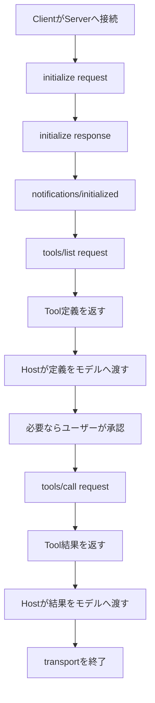
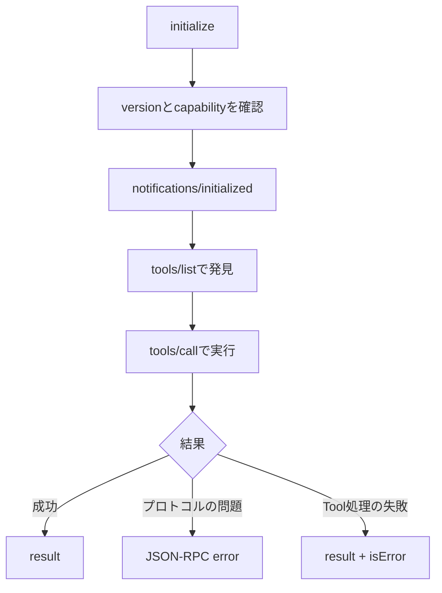

MCP対応アプリでToolを使うと、画面上では「モデルがToolを選び、結果を受け取った」ように見える。その裏では、ClientとServerが接続を初期化し、互いに対応機能を宣言し、Tool一覧を取得してから、引数付きの呼び出しを行っている。

この流れを知らなくてもSDKでMCPサーバーは作れる。ただし、接続直後に落ちる、Toolが一覧へ出ない、呼び出しが終わらないといった問題が起きたとき、SDKのログだけでは原因を切り分けにくい。JSON-RPCメッセージを読めると、問題が初期化、機能の発見、実行のどこにあるかを追えるようになる。

[前回はTools・Resources・Promptsの使い分け]()を整理した。今回はノートを読む`read_note` Toolを例に、接続から実行までをメッセージ単位で追う。この記事はMCP仕様の`2025-11-25`版を基準にしている。



---

## 全体は初期化・通常処理・終了の3段階

MCPの接続ライフサイクルは、大きく3段階に分かれる。

1. Initialization: protocol versionとcapabilityを交換する
2. Operation: 合意した範囲で通常のリクエストを処理する
3. Shutdown: 下位のtransportを終了する

Toolを1回呼ぶ場合、代表的な流れは次のようになる。



この図のうち、MCPが規定するのはClientとServer間のメッセージである。「Tool定義をどのモデルへ渡すか」「いつ承認を求めるか」「結果を会話へどう入れるか」はHostの実装であり、JSON-RPCメッセージには現れない。

---

## MCPの土台はJSON-RPC 2.0

MCPのClientとServerは、JSON-RPC 2.0形式でメッセージを交換する。基本形はRequest、成功Response、Error Response、Notificationの4つだ。

### Request

Requestは相手に処理を求めるメッセージで、`id`、`method`、必要に応じて`params`を持つ。

```json
{
  "jsonrpc": "2.0",
  "id": 10,
  "method": "tools/list",
  "params": {}
}
```

MCPでは`id`に文字列または整数を使う。`null`は使えず、同じ送信者が同一session内で過去に使ったRequest IDを再利用してはならない。

### 成功Response

処理が成功すると、相手は同じ`id`と`result`を返す。

```json
{
  "jsonrpc": "2.0",
  "id": 10,
  "result": {
    "tools": []
  }
}
```

複数のRequestが並行していても、`id`を照合すればどのResponseか分かる。Responseの到着順がRequestの送信順と同じだと仮定してはいけない。

### Error Response

リクエストの形式や処理に問題がある場合は、`result`ではなく`error`を返す。

```json
{
  "jsonrpc": "2.0",
  "id": 10,
  "error": {
    "code": -32601,
    "message": "Method not found"
  }
}
```

`error`には整数の`code`と文字列の`message`が必要で、補足情報を`data`へ入れられる。読み取り可能なRequestに対するError Responseなら、元と同じ`id`を返す。

### Notification

Notificationは一方向の通知であり、`id`を持たない。受信側はResponseを返さない。

```json
{
  "jsonrpc": "2.0",
  "method": "notifications/initialized"
}
```

`id`がないことは省略ミスではなく、「返答を待たない」という意味である。NotificationへResponseを返したり、Requestから`id`を落としたりすると、通信の対応関係が崩れる。

---

## 最初のRequestはinitializeで固定されている

接続後、Clientが最初に送る通常Requestは`initialize`である。この段階で3つの情報をServerへ伝える。

- Clientが希望するprotocol version
- Clientが提供できるcapability
- Client実装の名前やversion

ノート管理Clientの例を、必要な部分に絞ると次のようになる。

```json
{
  "jsonrpc": "2.0",
  "id": 1,
  "method": "initialize",
  "params": {
    "protocolVersion": "2025-11-25",
    "capabilities": {
      "roots": {
        "listChanged": true
      },
      "sampling": {},
      "elicitation": {
        "form": {},
        "url": {}
      }
    },
    "clientInfo": {
      "name": "notes-host",
      "version": "1.0.0"
    }
  }
}
```

ここで宣言されている`roots`、`sampling`、`elicitation`は、ServerからClientへ利用を依頼できるClient Featuresだ。空オブジェクトの`sampling: {}`も「何もない」のではなく、基本的なSamplingをサポートするというcapability宣言になる。

Serverは、採用するprotocol version、自分が提供するcapability、Server実装情報をResponseで返す。

```json
{
  "jsonrpc": "2.0",
  "id": 1,
  "result": {
    "protocolVersion": "2025-11-25",
    "capabilities": {
      "tools": {
        "listChanged": true
      },
      "resources": {
        "subscribe": true,
        "listChanged": true
      }
    },
    "serverInfo": {
      "name": "notes-server",
      "version": "1.0.0"
    },
    "instructions": "Provides read-only access to Markdown notes."
  }
}
```

RequestとResponseで`id: 1`が一致していること、Client FeaturesとServer Featuresの宣言方向が異なることに注目したい。`instructions`はServerからClientへの補足で、省略可能である。

### version negotiationは文字列の一致だけではない

Clientは、自分がサポートする中で通常は最新のversionを`initialize`に指定する。Serverがそのversionをサポートしていれば、同じversionを返す。サポートしていなければ、Serverは自分がサポートする別のversionを返す。

返されたversionをClientがサポートしていない場合、Clientは接続を切るべきとされている。Serverが返したversionへClientが無条件に合わせるわけではない。

HTTP transportでは、初期化後のリクエストに`MCP-Protocol-Version`ヘッダーを付ける必要がある。これはJSON-RPCの`params`ではなくHTTP層の要件である。stdio transportにはHTTPヘッダー自体がない。この違いは、後続のローカルMCPとリモートMCPを扱う回で詳しく扱う。

### capabilityは使ってよい機能の宣言になる

Serverが`tools` capabilityを返していなければ、Clientは`tools/list`や`tools/call`を送るべきではない。`resources.subscribe`がないのにResource購読を始めることもできない。

capabilityは「このServerならたぶん対応している」という推測をなくす仕組みだ。ClientとServerは、初期化で示されたprotocol versionを守り、正常にnegotiationされた機能だけを使う。

---

## initialized通知で通常処理へ移る

Serverから正常な`initialize` Responseを受け取ったら、Clientは`notifications/initialized`を送る。

```json
{
  "jsonrpc": "2.0",
  "method": "notifications/initialized"
}
```

このNotificationを境にOperationフェーズへ移る。Clientは`initialize`のResponseを受け取る前に、ping以外のRequestを送るべきではない。Serverも`initialized`を受け取る前は、pingとlogging以外のRequestを送るべきではない。

初期化が失敗するとTool一覧まで進まない。接続直後の不具合を調べるときは、まず次の順序を確認するとよい。

```text
initialize request
→ 同じidのinitialize response
→ notifications/initialized
→ 通常のrequest
```

SDKがこの処理を隠していても、wire logでこの3メッセージを見つけられれば、初期化のどこまで進んだかを判断できる。

---

## tools/listでToolの定義を発見する

初期化後、Clientは`tools/list`でServerが公開するToolを取得する。

```json
{
  "jsonrpc": "2.0",
  "id": 2,
  "method": "tools/list",
  "params": {}
}
```

ServerはTool名、説明、入力スキーマなどを返す。

```json
{
  "jsonrpc": "2.0",
  "id": 2,
  "result": {
    "tools": [
      {
        "name": "read_note",
        "title": "Read Note",
        "description": "Read one Markdown note by its relative path",
        "inputSchema": {
          "type": "object",
          "properties": {
            "path": {
              "type": "string",
              "description": "Relative path under the notes directory"
            }
          },
          "required": ["path"],
          "additionalProperties": false
        }
      }
    ]
  }
}
```

この時点ではToolは実行されていない。Clientが定義を発見しただけだ。Hostはこの定義をモデルへ提示し、モデルが会話の文脈から利用候補を選ぶ。ToolをUIへ表示する方法や、モデルへ一度に渡すTool数はMCPの範囲外である。

Tool一覧が多い場合、`tools/list`はpaginationに対応する。Responseに`nextCursor`があれば、Clientは次のRequestの`params.cursor`へ渡す。1回のResponseだけを見て「Serverにはこれしかない」と決めつけない方がよい。

ServerがTool一覧を動的に変更し、初期化で`tools.listChanged`を宣言している場合は、次のNotificationを送れる。

```json
{
  "jsonrpc": "2.0",
  "method": "notifications/tools/list_changed"
}
```

これは新しい一覧そのものではない。Clientが必要に応じて`tools/list`を再実行するための合図である。

---

## tools/callでToolを実行する

ユーザーが「`daily/2026-06-19.md`を読んで」と依頼し、モデルが`read_note`を選んだとする。Hostが必要な承認を処理した後、Clientは`tools/call`を送る。

```json
{
  "jsonrpc": "2.0",
  "id": 3,
  "method": "tools/call",
  "params": {
    "name": "read_note",
    "arguments": {
      "path": "daily/2026-06-19.md"
    }
  }
}
```

Serverは`name`に対応する処理を選び、`arguments`を検証して実行する。成功すればTool Resultを返す。

```json
{
  "jsonrpc": "2.0",
  "id": 3,
  "result": {
    "content": [
      {
        "type": "text",
        "text": "# 2026-06-19\n\nMCPのprimitiveを整理した。"
      }
    ],
    "isError": false
  }
}
```

MCPの処理はここで完了する。その後、HostがTool Resultをモデルへ渡し、モデルが人間向けの文章を生成する。Serverが最終回答を作っているわけではない。

Tool Resultはテキストだけでなく、画像、音声、Resource Link、埋め込みResource、`structuredContent`なども返せる。`outputSchema`をTool定義に付けた場合、Serverはそれに適合する`structuredContent`を返す必要があり、Clientも検証すべきとされている。

---

## エラーは「通信の失敗」と「Tool処理の失敗」を分ける

`tools/call`の失敗には2種類ある。

### Protocol Error

存在しないTool名、壊れたRequest、Server内部のプロトコル処理失敗などはJSON-RPC Error Responseで返す。

```json
{
  "jsonrpc": "2.0",
  "id": 3,
  "error": {
    "code": -32602,
    "message": "Unknown tool: read_notes"
  }
}
```

この場合、`result`は存在しない。Requestの構造やmethodの扱いに問題があるため、ClientやServer実装の不整合を疑う。

### Tool Execution Error

Toolは見つかり引数の受け渡しも成立したが、ファイルが存在しない、外部APIが制限された、業務ルールに反した、といった失敗はTool Resultの`isError: true`で表現する。

```json
{
  "jsonrpc": "2.0",
  "id": 3,
  "result": {
    "content": [
      {
        "type": "text",
        "text": "Note not found: daily/2026-06-19.md"
      }
    ],
    "isError": true
  }
}
```

こちらはJSON-RPC上では成功Responseである。モデルへ内容を返せば、別のパスを確認するなどの自己修正に使える。監視で`error`フィールドだけを数えていると、Tool Execution Errorを見落とすので注意が必要だ。

---

## 長い処理にはprogress・timeout・cancellationが関わる

Toolがすぐ終わるとは限らない。大量検索や外部API待ちを扱うなら、進捗、時間切れ、キャンセルを分けて考える必要がある。

### progressはRequest側から希望する

進捗を受け取りたい送信者は、Requestの`params._meta.progressToken`に一意なtokenを付ける。

```json
{
  "jsonrpc": "2.0",
  "id": 4,
  "method": "tools/call",
  "params": {
    "name": "index_notes",
    "arguments": {},
    "_meta": {
      "progressToken": "index-20260620"
    }
  }
}
```

受信側は、同じtokenを使った`notifications/progress`を送れる。

```json
{
  "jsonrpc": "2.0",
  "method": "notifications/progress",
  "params": {
    "progressToken": "index-20260620",
    "progress": 40,
    "total": 100,
    "message": "40 notes indexed"
  }
}
```

進捗通知は任意であり、Requestを受けた側が必ず送るわけではない。また、進捗が届いていることを理由に無制限に待つべきでもない。

### timeoutは実装が設定する

MCP仕様は、送信するすべてのRequestにtimeoutを設けることを推奨している。しかし「Toolは30秒」といった固定値は仕様で決められていない。SDKやHostがRequestごとに設定可能にする領域だ。

timeoutまでに成功ResponseもError Responseも来なければ、送信者はcancellation Notificationを送り、Responseを待つのをやめるべきとされている。進捗を受けるたびにtimeoutを延長する実装も可能だが、最大timeoutは別に持つべきである。

### cancellationは完了を保証するResponseではない

通常の処理をキャンセルするときは、元のRequest IDを指定した`notifications/cancelled`を送る。

```json
{
  "jsonrpc": "2.0",
  "method": "notifications/cancelled",
  "params": {
    "requestId": 4,
    "reason": "User stopped the operation"
  }
}
```

受信側は処理を止め、リソースを解放し、元RequestへのResponseを送らないことが推奨される。ただし、処理がすでに完了していた、止められない処理だった、といった理由でNotificationが無視されることもある。

キャンセルとResponseがネットワーク上ですれ違うrace conditionも起こる。送信側はキャンセル後に届いたResponseを無視し、受信側は未知または完了済みのRequest IDを指すキャンセルを無視する。Notificationなので「キャンセル完了Response」は返ってこない。

なお、`initialize`をClientからキャンセルしてはならない。また、`2025-11-25`版で追加されたtask-augmented requestには、Notificationではなく`tasks/cancel`という別の仕組みがある。

---

## shutdown専用のJSON-RPC methodはない

MCPのライフサイクルにはShutdownフェーズがあるが、共通の`shutdown` Requestは定義されていない。終了はtransportで表現する。

stdioでは、ClientがServerプロセスへの入力streamを閉じ、終了を待つ。必要なら`SIGTERM`、さらに終了しなければ`SIGKILL`という順で停止する。HTTPでは関連するHTTP接続を閉じる。

この違いからも、JSON-RPCとtransportは別の層だと分かる。JSON-RPCはメッセージの形と対応関係を定め、stdioやStreamable HTTPはそのメッセージをどう運ぶかを定める。

---

## ログを見るときの切り分け順

MCP接続の調査では、いきなりSDKコードを追うより、最後に成立したメッセージを見つける方が早い。

| 最後に確認できたもの | 次に疑う箇所 |
| :--- | :--- |
| Serverプロセス起動だけ | transport、標準入出力、接続先URL |
| `initialize` Request | Serverのversion対応、JSONの形式、例外 |
| `initialize` Response | Clientのversion判定、`initialized`送信 |
| `notifications/initialized` | Server capability、`tools/list`送信 |
| `tools/list` Response | HostへのTool登録、モデルへの定義提示 |
| `tools/call` Request | 引数検証、外部API、ファイル権限 |
| progressだけ継続 | timeout、最大処理時間、停止処理 |

stdioでは標準出力がJSON-RPCの通信路になるため、Serverの通常ログをstdoutへ混ぜるとメッセージのparseに失敗する。ログはstderrへ出す必要がある。これはSDKの書き方ではなく、transport上の制約として理解しておくと原因を見つけやすい。

また、秘密情報を含む引数や結果をwire logへそのまま残すと、調査用ログが新しい漏洩経路になる。Request ID、method、所要時間、エラー種別を残し、本文は必要に応じてredactする方がよい。

---

## まとめ



MCP通信を読むときは、次の点を押さえればよい。

- Requestには`id`があり、Responseは同じ`id`を返す
- Notificationには`id`がなく、Responseも返さない
- `initialize`でversionとcapabilityを確認してから通常処理へ進む
- `tools/list`は機能の発見、`tools/call`は機能の実行である
- JSON-RPC ErrorとTool Execution Errorは別の層にある
- timeout値、承認UI、モデルへの渡し方はHostやSDKの実装領域である

次回はこのメッセージ列をSDKに対応づけ、[Pythonで小さなMCPサーバーを作る]()。

---

## 参考

- [Base Protocol Overview - Model Context Protocol](https://modelcontextprotocol.io/specification/2025-11-25/basic) ── JSON-RPCのRequest、Response、Notification
- [Lifecycle - Model Context Protocol](https://modelcontextprotocol.io/specification/2025-11-25/basic/lifecycle) ── 初期化、version・capability negotiation、終了とtimeout
- [Tools - Model Context Protocol](https://modelcontextprotocol.io/specification/2025-11-25/server/tools) ── `tools/list`、`tools/call`、2種類のエラー
- [Progress - Model Context Protocol](https://modelcontextprotocol.io/specification/2025-11-25/basic/utilities/progress) ── progress tokenと進捗通知
- [Cancellation - Model Context Protocol](https://modelcontextprotocol.io/specification/2025-11-25/basic/utilities/cancellation) ── キャンセル通知とrace condition
- [JSON-RPC 2.0 Specification](https://www.jsonrpc.org/specification) ── MCPの基礎となるメッセージ仕様
