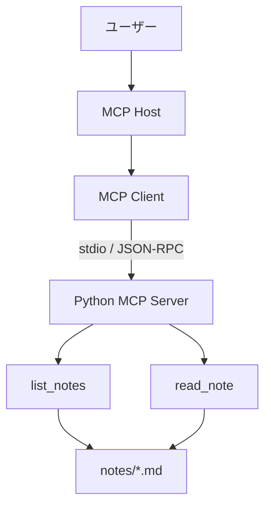
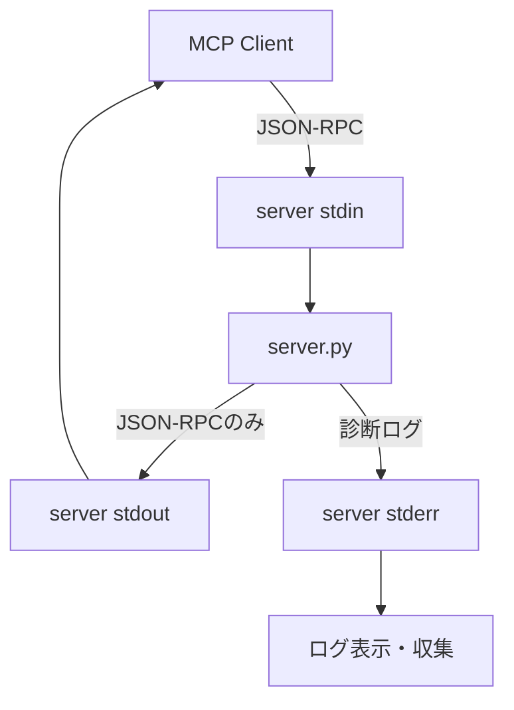

MCPのHost・Client・ServerやJSON-RPCの流れを理解しても、自分でServerを動かすまでは抽象的に見える部分が残る。そこで連載第5回では、ローカルのMarkdownノートを一覧・読み取りできる小さなMCP Serverを作る。

公開するToolは`list_notes`と`read_note`の2つだけである。ファイルを書き換えるToolも、任意のパスを読む機能も持たせない。この程度のServerでも、Toolの名前と説明、入力・出力スキーマ、stdio、エラー、ログという実装の要点を一通り観察できる。

前回の[「MCPの接続と通信をJSON-RPCから理解する」]()では、初期化から`tools/call`までをプロトコル側から追った。今回は同じ流れをServer実装の側から見る。

本稿のコードは公式のMCP Python SDKに含まれる`FastMCP`を使う。MCP仕様が定めるメッセージと、Python SDKが提供するデコレーターや型変換は別の層である。この区別も実装しながら確認していく。

---

## 今回作るもの

構成は次のようになる。



`list_notes`は読み取り可能なノート名とサイズを返す。`read_note`は一覧に出たファイル名を受け取り、その内容を返す。どちらも読み取り専用で、アクセス範囲はServerと同じディレクトリにある`notes/`以下へ限定する。

この制約は説明用の飾りではない。LLMが生成する引数は、一般のWeb APIへ届く入力と同じく検証対象である。`read_note("../../.ssh/config")`のような入力を通せば、「ノートを読む」というToolの説明に反して任意のファイルを読めてしまう。

## プロジェクトを用意する

公式Python SDKのREADMEは`uv`を使った依存関係管理を案内している。ここでも同じ構成にする。

```bash
uv init notes-mcp
cd notes-mcp
uv add "mcp[cli]"
mkdir notes
touch notes/first.md
```

`notes/first.md`には、動作確認用の短い文章を書いておく。

```markdown
# 最初のノート

MCP Serverから読み取るためのテストデータ。
```

SDKのバージョン番号は記事中で固定しない。実際のプロジェクトでは、依存関係を追加した時点の`uv.lock`をリポジトリへ保存し、更新時に差分とテスト結果を確認する方が再現しやすい。記事に書いた特定バージョンを長期間コピーし続けることと、プロジェクトで検証済みの依存関係を固定することは別である。

## Serverを実装する

プロジェクト直下に`server.py`を作り、次のコードを置く。

```python
import logging
import sys
from pathlib import Path

from mcp.server.fastmcp import FastMCP
from pydantic import BaseModel, Field


BASE_DIR = Path(__file__).resolve().parent
NOTES_DIR = BASE_DIR / "notes"
MAX_NOTE_BYTES = 64 * 1024

logging.basicConfig(
    level=logging.INFO,
    format="%(levelname)s %(message)s",
    stream=sys.stderr,
)
logger = logging.getLogger(__name__)

mcp = FastMCP(
    "local-notes",
    instructions="Read Markdown notes stored in the local notes directory.",
)


class NoteSummary(BaseModel):
    name: str = Field(description="Markdown file name")
    size_bytes: int = Field(description="File size in bytes")


class NoteContent(BaseModel):
    name: str = Field(description="Markdown file name")
    content: str = Field(description="UTF-8 Markdown content")


def safe_note_path(name: str) -> Path:
    """Resolve one file name inside NOTES_DIR or reject it."""
    if Path(name).name != name or not name.endswith(".md"):
        raise ValueError("name must be a Markdown file name without directories")

    notes_root = NOTES_DIR.resolve()
    original_path = notes_root / name
    resolved_path = original_path.resolve()

    if not resolved_path.is_relative_to(notes_root):
        raise ValueError("note path is outside the notes directory")
    if original_path.is_symlink():
        raise ValueError("symbolic links are not supported")
    if not resolved_path.is_file():
        raise ValueError("note does not exist")
    if resolved_path.stat().st_size > MAX_NOTE_BYTES:
        raise ValueError("note is too large")

    return resolved_path


@mcp.tool()
def list_notes() -> list[NoteSummary]:
    """List readable Markdown notes. Use this before read_note."""
    notes: list[NoteSummary] = []

    for path in sorted(NOTES_DIR.glob("*.md")):
        if path.is_file() and not path.is_symlink():
            notes.append(
                NoteSummary(name=path.name, size_bytes=path.stat().st_size)
            )

    logger.info("listed %d notes", len(notes))
    return notes


@mcp.tool()
def read_note(name: str) -> NoteContent:
    """Read one Markdown note returned by list_notes.

    Args:
        name: File name such as first.md. Directory paths are not accepted.
    """
    path = safe_note_path(name)
    logger.info("reading note %s", path.name)
    return NoteContent(name=path.name, content=path.read_text(encoding="utf-8"))


if __name__ == "__main__":
    NOTES_DIR.mkdir(exist_ok=True)
    mcp.run(transport="stdio")
```

Serverのコードとして書いたのは、普通のPython関数と入力検証が大半である。`FastMCP`が担当するのは、それらの関数をMCPのToolとして公開し、stdio上のJSON-RPCメッセージと関数呼び出しを仲介する部分だ。

## Tool定義は型とdocstringから作られる

`@mcp.tool()`を付けると、FastMCPは関数名、docstring、型注釈をもとにTool定義を生成する。

`read_note`の場合、概念的には次の情報が`tools/list`の結果へ現れる。

| Python側 | Tool定義での役割 |
| :--- | :--- |
| 関数名`read_note` | Toolの名前 |
| docstring | Toolの説明 |
| 引数`name: str` | 入力スキーマ |
| 戻り値`NoteContent` | 構造化された出力スキーマ |

MCP仕様はToolが`name`、`description`、`inputSchema`などを持つことを定めている。一方、「Python関数の型注釈からJSON Schemaを生成する」のはSDKの支援機能である。他言語のSDKや低水準APIでは、同じMCP Toolを別の方法で定義できる。

型が合えば十分というわけでもない。`name`が文字列であることはスキーマで検証できるが、その文字列が`notes/`の外を指さないことまでは分からない。型検証の後に、アプリケーション固有の境界検証が必要になる。

### 説明文もインターフェースの一部になる

Toolの説明は人間向けのコメントに見えるが、HostはTool定義をモデルへ渡し、モデルは名前・説明・スキーマを手掛かりに呼び出すToolを選ぶ。

`list_notes`に「`read_note`より先に使う」と書いたのは、存在しないファイル名をモデルが推測するより、一覧から選ばせる方が安定するためである。ただし、説明文はアクセス制御ではない。モデルが説明に従うことを期待して、`safe_note_path`を省略してはいけない。

## 読み取り範囲をコードで閉じる

`safe_note_path`では複数の検査を行っている。

| 検査 | 防ぎたい入力・状態 |
| :--- | :--- |
| `Path(name).name == name` | `../secret.md`やサブディレクトリ指定 |
| `.md`サフィックス | 想定外の形式の読み取り |
| `resolve()`後の包含確認 | パストラバーサル |
| シンボリックリンク拒否 | `notes/`外へのリンク |
| `is_file()` | 存在しないパスやディレクトリ |
| サイズ上限 | 巨大な内容をコンテキストへ返すこと |

この例では分かりやすさを優先してファイル名だけを受け取っている。サブディレクトリも扱うなら、単純にスラッシュを許可するだけでは足りない。正規化後のパスが許可されたroot内にあるかを検証し、リンクやOSごとの差もテストする必要がある。

また、64 KiBという上限はMCP仕様の制限ではなく、このServerが決めた運用上の制約である。実際の上限は、ノートの用途、Hostが結果をどうコンテキストへ入れるか、応答時間などを見て決める。

## stdioではstdoutを通信専用にする

stdio transportでは、ClientがServerを子プロセスとして起動する。Serverは`stdin`からJSON-RPCメッセージを読み、`stdout`へJSON-RPCメッセージを返す。



そのため、`print("Server started")`を何気なく追加すると、Clientから見ればJSON-RPCではない文字列が通信路へ混ざる。公式仕様は、stdio Serverが有効なMCPメッセージ以外を`stdout`へ書くことを禁止している。

サンプルでは`logging.basicConfig(..., stream=sys.stderr)`を明示した。`stderr`のログはClientが取得・転送・無視できる。なお、`stderr`に出たこと自体は必ずしもエラーを意味しないため、ログレベルを併記している。

## InspectorでServerを観察する

会話型のHostへ登録する前に、MCP InspectorでTool定義と実行結果を確認すると切り分けやすい。InspectorはServerへ接続し、Resources、Prompts、Tools、通知などを画面から調べられる公式の開発ツールである。

プロジェクトの絶対パスを確認して、次のように起動する。

```bash
pwd
npx -y @modelcontextprotocol/inspector \
  uv \
  --directory /absolute/path/to/notes-mcp \
  run \
  server.py
```

`npx -y`は必要なInspectorパッケージを取得して実行するため、外部コードのダウンロードを伴う。組織の端末では、利用を許可されたパッケージとバージョン管理方針に従う必要がある。

Inspectorが開いたら、次の順に確認する。

1. TransportがSTDIOになっていることを確認して接続する
2. Toolsタブで`list_notes`と`read_note`が表示されることを確認する
3. `read_note`の説明と入力スキーマに`name`があることを確認する
4. `list_notes`を実行し、`first.md`が返ることを確認する
5. `read_note`へ`first.md`を渡し、本文が返ることを確認する
6. 通知・ログ表示で`listed 1 notes`や`reading note first.md`を確認する

Inspectorでは、モデルのTool選択を挟まずに直接呼び出せる。ここで失敗するならServerまたは接続設定の問題であり、ここでは成功するのに会話から呼ばれないなら、Toolの説明、Hostの設定、モデルの判断などを次に疑える。

## 失敗する入力も試す

成功ケースだけでは入力境界を確認できない。`read_note`へ次の値を渡し、拒否されることを確かめる。

```text
missing.md
../secret.md
subdir/note.md
note.txt
```

さらに、`notes/link.md`を`notes/`外のファイルへのシンボリックリンクとして作った場合も拒否される。巨大ファイルは64 KiBを超えた時点で読み取りを拒否する。

このとき大切なのは、プロセス全体を終了させず、対象のTool呼び出しをエラーとして返せることだ。入力ミス一つでServerが落ちれば、Clientは再接続や再初期化からやり直すことになる。

## Hostへ登録するときに渡しているもの

stdio ServerをHostへ登録する設定は、製品ごとにファイル名やUIが異なる。ただし、基本的に必要なのはServerを起動するコマンド、引数、必要なら環境変数である。

概念的な設定は次の形になる。

```json
{
  "mcpServers": {
    "local-notes": {
      "command": "uv",
      "args": [
        "--directory",
        "/absolute/path/to/notes-mcp",
        "run",
        "server.py"
      ]
    }
  }
}
```

Hostはこのコマンドを実行して子プロセスを作り、標準入出力へ接続する。`server.py`を事前に別ターミナルで常駐させ、そのポートへ接続しているわけではない。

相対パスはHostの起動ディレクトリに左右されるため、設定ではプロジェクトの絶対パスを使う方がよい。`uv`自体がHostから見つからない場合は、`command`に実行ファイルの絶対パスが必要になる。

APIキーを使うServerでは環境変数を設定へ渡すこともある。ただし、設定ファイルへ秘密情報を直書きする設計は避け、Hostの秘密情報管理やOSの資格情報ストアを使う。今回のServerはローカルファイルの読み取りだけなので、外部サービスの資格情報を必要としない。

## この実装から見える責任分界

小さなServerでも、MCP仕様、SDK、Server実装、Hostの責任は分かれている。

| 層 | この例で担当すること |
| :--- | :--- |
| MCP仕様 | 初期化、`tools/list`、`tools/call`、メッセージ形式、stdioの規則 |
| Python SDK | デコレーター、型からのスキーマ生成、stdioループ、エラーの変換 |
| `server.py` | Toolの意味、アクセス可能なファイル、サイズ上限、ログ内容 |
| Host | Serverプロセスの起動、Tool定義をモデルへ渡すこと、承認と表示 |
| モデル | ユーザーの依頼からToolと引数を提案すること |

`FastMCP`を使うとJSON-RPCを直接組み立てずに済むが、Serverの安全性までSDKが自動で決めるわけではない。どのデータへアクセスできるか、どこまで返すか、書き込みを許すかはServer側の設計である。

## 実運用へ広げる前に足すもの

今回のServerは理解用としては十分だが、そのまま複数ユーザー向けサービスへ公開する設計ではない。用途を広げるなら、少なくとも次を検討する。

- Tool単位・利用者単位の認可
- タイムアウト、同時実行数、出力サイズの制限
- 機密値を除外した監査ログ
- ファイル更新中の整合性と文字コードエラー
- Toolの契約に対する自動テスト
- SDK更新時のInspector・対応Hostでの互換性確認
- 書き込みToolを追加する場合の明示的な承認と再確認

外部へ公開するなら、transportもstdioからStreamable HTTPへ変わることが多い。ただし`mcp.run()`の引数だけを変えれば運用設計まで完了するわけではない。認証、セッション、ネットワーク、複数Client、再接続を考える必要がある。

## まとめ

今回の2 Toolから確認できる要点は次の通りである。

| 観察点 | 押さえる内容 |
| :--- | :--- |
| Tool定義 | 名前、説明、型注釈からSDKがスキーマを生成する |
| 入力検証 | JSON Schemaとは別にパスやサイズの境界を検証する |
| 出力 | 型付きモデルで構造化された結果を返せる |
| stdio | `stdin`と`stdout`はMCP通信、ログは`stderr`へ出す |
| Inspector | モデルを介さずTool一覧・スキーマ・結果・ログを確認する |
| 責任分界 | 仕様、SDK、Server、Host、モデルの責任を混ぜない |

自作してみると、MCP Serverは「AIそのもの」ではなく、既存の処理やデータを決められた契約で公開するアダプターに近いことが分かる。そのアダプターにどの権限を持たせるかは、実装者が決めなければならない。

次回の[「ローカルMCPとリモートMCPの違い」]()では、今回使ったstdioとStreamable HTTPを、プロセス、セッション、認証、配置の違いから比較する。

## 参考

- [MCP Python SDK（公式GitHub）](https://github.com/modelcontextprotocol/python-sdk)
- [Build an MCP server（MCP公式ドキュメント）](https://modelcontextprotocol.io/docs/develop/build-server)
- [MCP Inspector（MCP公式ドキュメント）](https://modelcontextprotocol.io/docs/tools/inspector)
- [Transports（MCP仕様 2025-11-25）](https://modelcontextprotocol.io/specification/2025-11-25/basic/transports)

