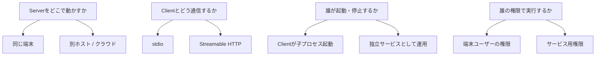
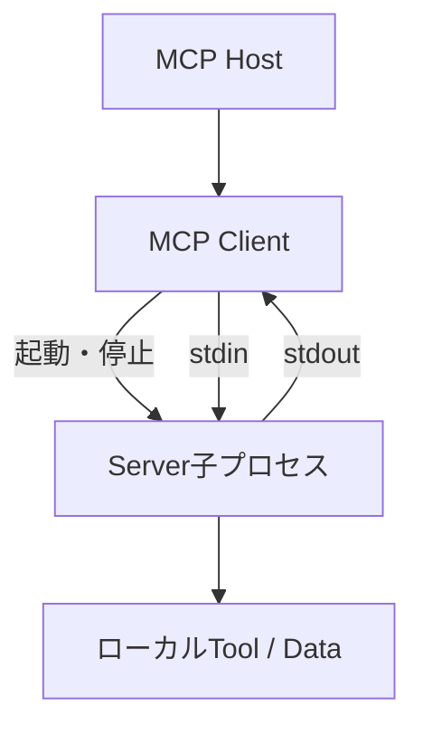
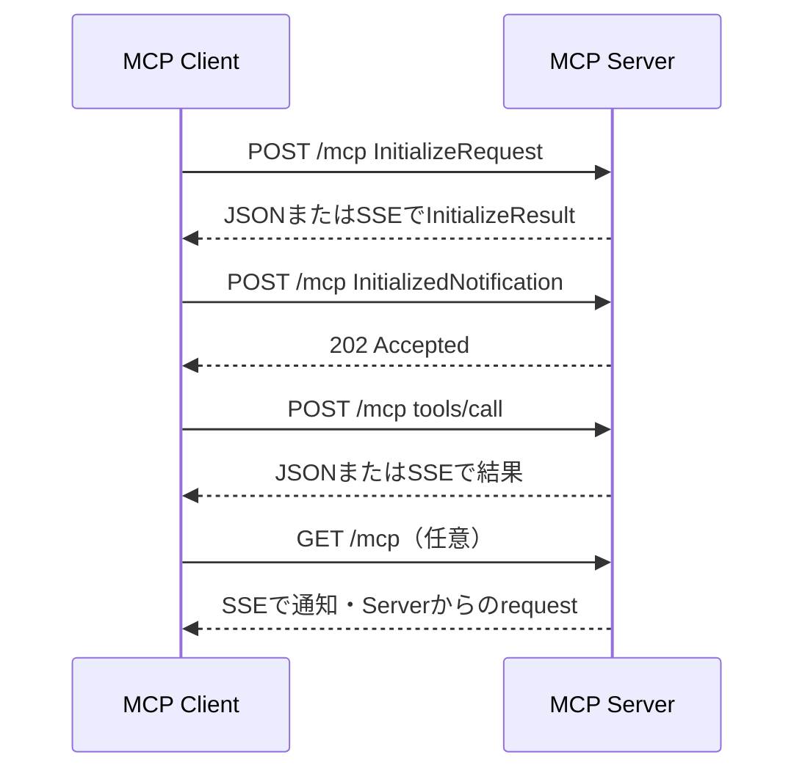
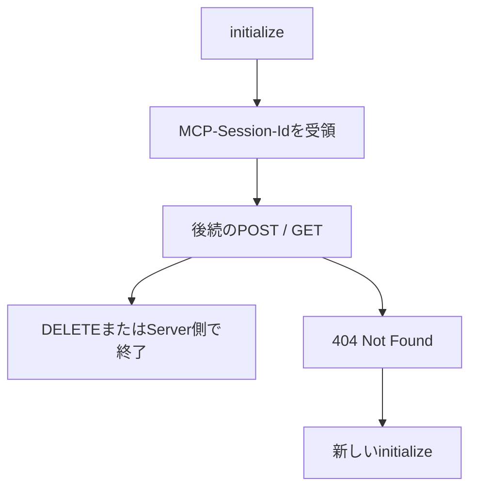
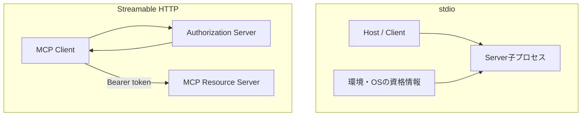

MCP Serverを導入するとき、「ローカルMCPかリモートMCPか」という言い方をよくする。実際の設計では、Serverをどこで動かすかと、Clientがどう接続するかを分けて考えた方がよい。

MCP仕様が標準transportとして定めるのは`stdio`と`Streamable HTTP`である。stdioではClientがServerを子プロセスとして起動し、標準入出力で通信する。Streamable HTTPでは独立したServerへHTTPで接続する。この実行モデルの差が、プロセス寿命、状態管理、認証、障害、デプロイ方法の違いにつながる。

連載第5回の[「Pythonで小さなMCPサーバーを作る」]()では、ローカルノートを読むstdio Serverを作った。今回は同じServerを共有サービスへ広げる場面を想定し、transport選定で何が変わるかを整理する。

本稿はMCP仕様2025-11-25版を基準にする。特定SDKの設定値ではなく仕様上の動作を中心に扱い、SDK固有の例はその旨を分けて記載する。

---

## 結論を先に

個人の端末にあるファイルや開発ツールへ、その端末のHostからアクセスするなら、まずstdioが候補になる。組織で一つのサービスを共有する、Serverを集中管理する、複数端末から同じ機能を使うならStreamable HTTPが候補になる。

| 観点 | stdio | Streamable HTTP |
| :--- | :--- | :--- |
| 典型的な配置 | Hostと同じ端末 | 独立したローカルプロセスまたはリモート環境 |
| 起動 | Clientが子プロセスとして起動 | Serverを別途起動・運用 |
| 通信 | `stdin` / `stdout` | HTTP POST / GET、必要に応じてSSE |
| 利用者 | 起動したClientが中心 | 複数Clientを扱える |
| 認証 | 通常は環境やOSの境界 | HTTP向けMCP認可仕様を適用可能 |
| 状態 | 子プロセス内に持ちやすい | statelessとstatefulを選ぶ |
| 障害範囲 | 一つのHost接続に閉じやすい | 共有利用者へ波及し得る |
| 主な運用対象 | コマンド、パス、環境変数 | TLS、認証、Origin、負荷分散、監視 |

ただし、stdioなら安全、HTTPなら危険という単純な分類ではない。stdio Serverはユーザー権限でローカルファイルを読めることがある。Streamable HTTPは認証とネットワーク境界を適切に設計すれば、Server側へ権限を集約できる。選ぶ基準は「近いか遠いか」より、誰がプロセスと資格情報と状態を管理するかである。

## 「ローカル・リモート」と「transport」は同じ軸ではない

stdioは通常、同じ端末上の子プロセスとの通信に使う。Streamable HTTPは通常、ネットワーク越しの共有Serverに使う。そのため便宜上、stdioをローカルMCP、Streamable HTTPをリモートMCPと呼ぶことが多い。

しかし、仕様上の概念は次のように分かれている。

たとえば、同じ端末の`127.0.0.1`でStreamable HTTP Serverを動かす構成もある。この場合は配置がローカルでも、ServerはHostの子プロセスとは限らず、独立したサービスになる。

反対に、SSHなど独自のラッパーで遠隔プロセスの標準入出力へつなぐことも技術的には可能だが、MCPの標準的なリモート構成として認証・再接続・共有運用を解決してくれるわけではない。

## stdioはClientがServerプロセスを所有する

stdio transportでは、ClientがMCP Serverをサブプロセスとして起動する。Serverは改行で区切られたUTF-8のJSON-RPCメッセージを`stdin`から読み、`stdout`へ返す。

この構成では接続とプロセス寿命が近い。Hostを終了した、設定を無効にした、Clientが子プロセスを停止した、といった操作でServerも終了する設計にしやすい。Server内のメモリ状態も、そのプロセスとともに消える。

設定で渡す主な情報は、実行コマンド、引数、作業ディレクトリ、環境変数である。Serverを配布する側は、利用者のOS、ランタイム、依存関係、実行ファイルのパスを考慮する必要がある。

### stdioが扱いやすい場面

ローカルのリポジトリ、ファイル、開発用DB、CLIを、その端末の利用者だけが扱う場合に向いている。第5回のノートServerもこの例である。

ネットワークの待受ポートを開けず、別途TLSやHTTP Serverを用意しなくてよい。HostごとにServerプロセスが分かれるので、利用者ごとの状態も自然に分離しやすい。

### stdioで残る運用課題

ネットワーク公開しないことは、権限が小さいことを意味しない。ServerはHostを動かしているOSユーザーの権限や、設定から渡された資格情報を使える場合がある。

また、利用端末ごとにランタイムとServerを配布・更新する必要がある。100人が同じToolを使うなら、100台の依存関係と設定を揃える運用になる。Serverの修正を一カ所へデプロイすれば終わるリモートサービスとは更新モデルが異なる。

標準出力が通信路なので、ログを`stdout`へ混ぜられない点もstdio固有の注意事項である。ログは`stderr`へ出す。

## Streamable HTTPは独立したServerへ接続する

Streamable HTTPでは、ServerはClientから独立したプロセスとして動き、複数のClient接続を扱える。Serverは一つのMCP endpointを提供し、ClientはJSON-RPCメッセージごとにHTTP POSTを送る。

Serverはリクエストに`application/json`で一つの応答を返すことも、`text/event-stream`でSSEストリームを開いて複数のメッセージを返すこともできる。Clientからの先行リクエストなしにServer側の通知やリクエストを送る必要があれば、Clientは同じendpointへHTTP GETを行い、SSEストリームを開ける。

SSEはStreamable HTTPとは別の第三の標準transportではない。Streamable HTTPが応答やServer発のメッセージをストリーミングするときに利用できる仕組みである。単純なServerはJSON応答だけを使い、GETに`405 Method Not Allowed`を返すことも仕様上可能だ。

### 独立サービスになることで増えるもの

Serverを一カ所で更新し、複数のHostから同じ機能を利用できる。データや外部APIの資格情報をServer側へ置き、利用端末へ直接配布しない構成も取れる。

その代わり、一般のWebサービスと同様の運用が必要になる。

- HTTPSと証明書
- 認証・認可とトークン管理
- DNS、ロードバランサー、タイムアウト
- 複数Clientの同時実行制御
- メトリクス、ログ、トレース
- Server更新時の互換性と段階的リリース
- 障害時の再接続、重複実行、部分失敗への対応

MCPがHTTPメッセージ形式を標準化しても、これらの運用を自動で肩代わりするわけではない。

## セッションとプロセスを混同しない

stdioでは、一つのClient接続と一つの子プロセスを対応させやすい。Streamable HTTPでは、複数のHTTPリクエストが一つの論理的なMCP sessionを構成する場合がある。

Serverがstateful sessionを使う場合、初期化応答の`MCP-Session-Id`ヘッダーでsession IDを発行できる。Clientは以降のHTTPリクエストに同じヘッダーを付ける。Serverがsessionを終了し、そのIDに対して`404 Not Found`を返した場合、Clientはsession IDなしで再度初期化する。

ここでいうsessionはTCP接続そのものではない。POSTごとにHTTP接続が変わっても、session IDによって論理的な状態を関連付けられる。

### stateless Serverも選べる

すべてのStreamable HTTP Serverがsession IDを発行する必要はない。各リクエストを独立して処理できるなら、Serverをstatelessにすると水平スケールしやすくなる。

一方、ServerがClientごとの購読状態、長時間処理、Serverからの通知などを扱うなら、stateful sessionが必要になることがある。その場合は、session状態を一つのプロセスのメモリだけに置くのか、共有ストアへ置くのか、ロードバランサーで同じinstanceへ固定するのかを決める。

Python SDKなどがstateful・statelessの実装支援を提供していても、どの状態を保持し、いつ破棄するかはアプリケーション設計である。

## 再開は「Toolを安全に再実行する仕組み」ではない

Streamable HTTPは、SSE eventにIDを付け、切断後のGETに`Last-Event-ID`を付けることで、Serverが未達メッセージを再送する仕組みを定義している。これはストリームの再開とメッセージ欠落の軽減に使える。

ただし、ClientがTool呼び出しの結果を受け取る前に切断した場合、Toolの副作用が実行済みかどうかは別問題である。再接続したからといって、同じ`tools/call`を無条件に送り直してよいとは限らない。

たとえば「Issueを作成する」Toolを再実行すれば、Issueが二重に作られる可能性がある。書き込みToolでは、冪等性キー、操作ID、実行状態の照会、重複排除などをServer側のAPI設計として用意する必要がある。

| 問題 | Streamable HTTPの再開で扱えるか |
| :--- | :--- |
| SSE切断後の未達メッセージ再送 | event IDと`Last-Event-ID`で支援できる |
| MCP sessionの識別 | `MCP-Session-Id`で支援できる |
| Toolの副作用が実行済みかの判定 | Tool・業務API側で設計が必要 |
| 同じ書き込みの重複防止 | 冪等性設計が必要 |

transportの信頼性と、業務操作のexactly-once実行を同一視しない方がよい。

## 旧HTTP+SSEとStreamable HTTPの違い

検索すると、MCP Serverに`/sse` endpointと別のPOST endpointを用意する記事やコードが見つかる。これはプロトコル2024-11-05版のHTTP+SSE transportである。

Streamable HTTPはこの旧方式を置き換えた。大きな違いは、ClientからServerへのPOSTと、ServerからClientへのストリームを一つのMCP endpointへまとめた点にある。

| 観点 | 旧HTTP+SSE | Streamable HTTP |
| :--- | :--- | :--- |
| 仕様上の位置づけ | 旧transport | 現行の標準transport |
| endpoint | SSE接続とPOST送信が分かれる | 一つのMCP endpointがGET/POSTを扱う |
| 応答 | SSE中心 | JSON応答またはSSEを選べる |
| 後方互換 | 古いClient・Server向け | まずPOST initializeを試す |

現行仕様は、後方互換が必要なServerに旧endpointを新endpointと並べて提供する方法を示している。Client側はまず指定URLへPOSTで初期化を試し、特定の4xx応答なら旧SSE接続へフォールバックできる。

ここで「SSEは廃止された」と表現すると誤解を招く。廃止方向なのは二つのendpointを使う旧HTTP+SSE transportであり、SSE自体はStreamable HTTPのストリーミングにも使われている。

## 認証の違い

MCPの認可仕様はHTTP-based transportを対象にしている。認可を実装する場合、保護されたMCP ServerはOAuthのresource serverとしてaccess tokenを検証し、Clientはresource ownerに代わってtokenを取得・送信する。

一方、仕様はstdio transportにこのHTTP向け認可フローを適用せず、資格情報を環境から取得するよう示している。stdioだから資格情報が不要なのではなく、渡し方と信頼境界が異なる。

リモートServerでは、session IDを認証情報の代わりにしてはいけない。`MCP-Session-Id`は論理sessionを関連付ける識別子であり、HTTPリクエストごとのBearer token検証を省略する根拠にはならない。現行の認可仕様も、同じsessionに属する場合を含め、すべてのHTTPリクエストに認可情報を含めるよう定めている。

認証・認可の詳細は次回のセキュリティ回で扱う。

## Streamable HTTPで必要なネットワーク防御

HTTP endpointを公開すると、MCPを理解していない一般のWebクライアントからも到達可能になる。現行のtransport仕様は、Serverに`Origin`ヘッダーの検証を求めている。ローカルでHTTP Serverを動かす場合も、`0.0.0.0`ではなく`127.0.0.1`へbindすることを推奨している。

これはDNS rebindingによって、悪意あるWebページからローカルMCP Serverへ到達される可能性があるためだ。CORSの設定だけを追加して完了とはならず、Origin検証、認証、bind先を組み合わせる。

外部公開ではHTTPSを前提にし、reverse proxyで認証を済ませたつもりでも、MCP Serverが信頼するヘッダーとproxyからの到達経路を確認する。Serverへ直接到達できれば、proxyの制御を迂回される。

## デプロイとスケールで変わる判断

stdio Serverは、Hostの設定が実質的なデプロイ先になる。利用者の端末で起動でき、必要なローカルデータへ到達できることが重要である。

Streamable HTTP ServerはWebサービスとしてデプロイする。複数instanceへ増やす場合、statelessならリクエストを分散しやすい。statefulならsession stateとSSEの再開方法が制約になる。

| 設計項目 | stateless HTTP | stateful HTTP |
| :--- | :--- | :--- |
| Client固有状態 | 原則保持しない | sessionに関連付けて保持 |
| 水平スケール | 比較的容易 | 共有stateまたはsession affinityが必要 |
| 再起動の影響 | 小さくしやすい | session消失・復元を設計する |
| Server発通知 | 単純構成では限定的 | SSEとsession管理を使いやすい |
| 適する例 | 独立した検索・変換Tool | 購読、長時間処理、進捗通知 |

どちらでも、Toolが接続する下流APIやDBの負荷は残る。MCP Serverだけを水平スケールしても、同じDBへ過剰な同時実行を流せば全体は安定しない。

## transport選定の判断手順

最初に「新しいからStreamable HTTP」と決めるのではなく、利用者と権限の置き場所から判断する。

### 1. データはどこにあるか

利用者の端末にしかないファイルやGit worktreeを読むならstdioが自然である。社内DBやSaaS APIを一元管理するなら、リモートServerへ集約する価値がある。

### 2. 誰がServerを使うか

一人・一端末なら、共有サービスの認証・監視を持ち込む必要は薄い。複数ユーザー・複数端末で使うなら、端末ごとの配布よりリモートServerの方が更新しやすい場合がある。

### 3. 資格情報をどこへ置くか

利用者自身の資格情報でローカル操作するのか、組織のサービスアカウントをServer側で使うのかを決める。後者では、利用者ごとの認可と監査が必要になる。

### 4. 状態と通知が必要か

一回のTool呼び出しで完結するならstatelessに寄せられる。長時間処理、購読、Serverからの通知が必要なら、sessionと再開を設計する。

### 5. どの障害を引き受けられるか

stdioは端末ごとの環境差と更新を引き受ける。Streamable HTTPはネットワーク、認証、共有障害、サービス運用を引き受ける。問題が消えるのではなく、管理場所が変わる。

## 典型的な選択例

| ユースケース | 第一候補 | 理由 |
| :--- | :--- | :--- |
| 開いているリポジトリの検索 | stdio | ローカルの作業treeへ直接アクセスする |
| 個人ノートの読み取り | stdio | 一人の端末内で完結しやすい |
| 社内ナレッジ検索 | Streamable HTTP | データ・認可・更新を集中管理しやすい |
| SaaS操作を組織で共有 | Streamable HTTP | token、scope、監査をServer側で統制しやすい |
| ローカルHTTPで重いモデルを常駐 | Streamable HTTP | 複数Hostから独立プロセスを再利用できる |
| オフライン環境のCLI連携 | stdio | ネットワークサービスを前提にしない |

複合構成もあり得る。たとえばローカルstdio Serverが端末内のGit情報を読み、組織のリモートMCP Serverがチケットシステムへ接続する。Hostは複数のServerへClient接続を持てるため、すべてを一つの万能Serverへまとめる必要はない。

## まとめ

stdioとStreamable HTTPの差は、単なる接続文字列の違いではない。

- stdioではClientがServerを子プロセスとして起動し、接続とプロセス寿命が近い
- Streamable HTTPではServerが独立し、複数Client、ネットワーク、認証、サービス運用を扱う
- HTTP sessionは接続そのものではなく、複数リクエストを関連付ける論理状態である
- SSEによる再開はメッセージ配送を助けるが、Toolの副作用を自動的に冪等にはしない
- 旧HTTP+SSE transportと、Streamable HTTP内で使われるSSEは区別する
- transportは、データ・資格情報・状態・運用責任をどこに置くかで選ぶ

リモート化は、ローカルServerをネットワークへ露出するだけの作業ではない。利用者の識別、最小権限、token、session、監査、障害時の扱いまで含めて初めて共有サービスになる。

次回の[「MCPサーバーを安全に運用する」]()では、MCPの権限境界、OAuth、prompt injection、情報流出、承認、監査をまとめる。

## 参考

- [Transports（MCP仕様 2025-11-25）](https://modelcontextprotocol.io/specification/2025-11-25/basic/transports)
- [Authorization（MCP仕様 2025-11-25）](https://modelcontextprotocol.io/specification/2025-11-25/basic/authorization)
- [MCP Python SDK（公式GitHub）](https://github.com/modelcontextprotocol/python-sdk)

