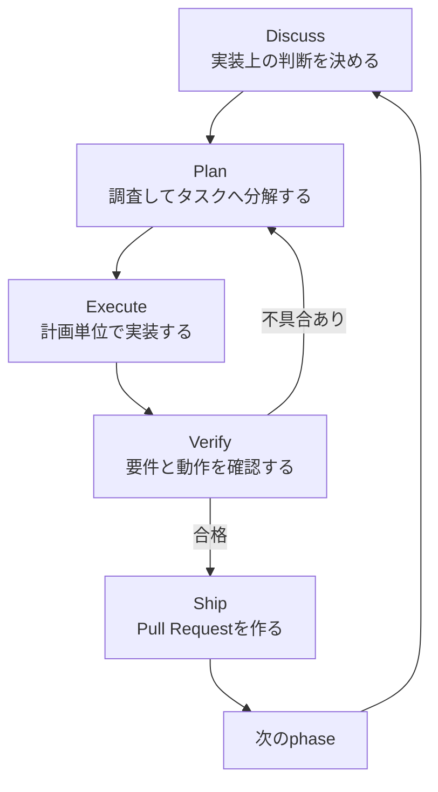
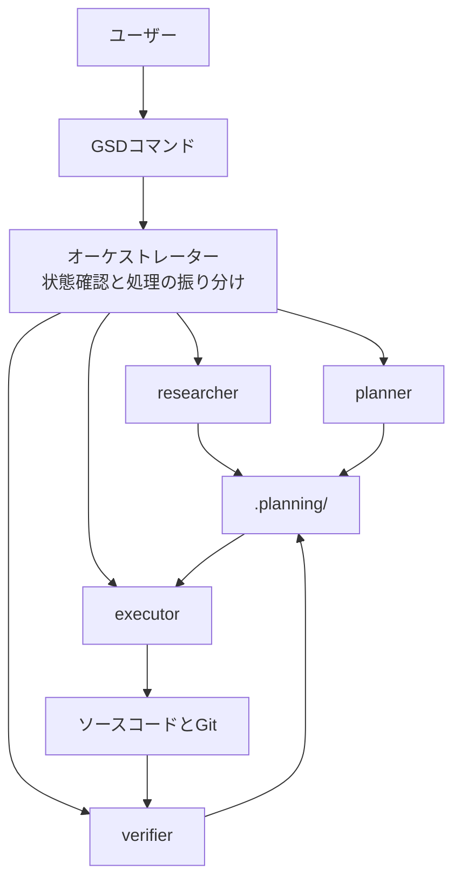

Claude CodeやCodexに機能実装を頼むと、短い変更は驚くほど速く終わる。一方で、数時間にわたる機能開発では様子が変わる。会話の序盤で決めた要件が抜け、途中のエラー対応が本来の目的を押し流し、最後には「コードはできたが、欲しかったものとは違う」という状態になりやすい。

GSD（旧称Get Shit Done、現在のプロジェクト名はGSD Core）は、この問題をモデルの賢さではなく開発工程の問題として扱う。要件の議論、調査と計画、実装、検証、Pull Request作成を分け、それぞれを必要な情報だけ持つサブエージェントへ渡す仕組みだ。

この記事では、GSD Coreが何をするツールなのか、通常のAIコーディングと何が違うのか、どのような案件に向くのかを整理する。

> GSDは更新が速く、旧リポジトリや旧パッケージ名を使った記事も検索結果に残っている。本記事のコマンドと構成は、2026年6月24日に`open-gsd/gsd-core`の公式ドキュメントで確認した。

---

## 結論を先に

GSD CoreはAIコーディングエージェントそのものではない。Claude Code、Codex、Gemini CLIなどの上に載せる、メタプロンプティングとコンテキスト管理のフレームワークである。

主な役割は次の3つに分けられる。

1. 作りたいものを要件、ロードマップ、実行可能なタスクへ分解する
2. 調査、計画、実装、検証を新しいコンテキストのサブエージェントへ任せる
3. 会話で決めた内容を`.planning/`以下のMarkdownとJSONへ保存する

普通のAIコーディングが「一つの長い会話の中で設計から実装まで進める」方式だとすれば、GSD Coreは「成果物をファイルで引き継ぎながら、工程ごとに担当を交代する」方式である。

この違いは、複数ファイルにまたがる機能、既存コードを踏まえた設計、数回のセッションをまたぐ開発で効いてくる。反対に、誤字修正や小さなリファクタリングにフルの工程を使うと、準備の方が重くなる。

---

## GSDが解こうとしている問題

### 長い会話では重要な情報が埋もれる

AIのコンテキストウィンドウには上限がある。ただし、問題は上限に達した瞬間だけに起きるわけではない。会話、ログ、コード、ツールの実行結果が増えるほど、序盤の制約と現在の作業に必要な情報が大量の履歴の中で競合する。

GSD Coreのドキュメントでは、この品質劣化をcontext rotと呼んでいる。以前に合意した設計と矛盾する、存在しないファイル名を使う、要件の一部を計画から落とす、といった形で現れる。

単にセッションをクリアすればノイズは消えるが、今度は経緯も消える。そこでGSD Coreは、会話の内容をそのまま保持する代わりに、決定事項と進捗を構造化したファイルへ移す。

[エージェントを長く自律動作させるためのコンテキスト設計]()で扱った「会話ではなく外部状態へ進捗を残す」という考え方を、開発ワークフローとして実装したものと捉えると分かりやすい。

### 実装開始が早すぎる

コーディングエージェントは、依頼を受けるとすぐにコードを書ける。これは小さな作業では長所だが、前提が曖昧な機能では手戻りの原因になる。

たとえば「ユーザー認証を追加する」という依頼だけでは、セッションの保存方法、失効条件、既存ユーザーの移行、エラー時の画面などが決まっていない。AIが妥当そうな案を選べばコードは完成しても、プロダクトとして正しいとは限らない。

GSD Coreは、何を作るかをロードマップへ分解した後、各フェーズで「どう作るか」をDiscuss工程で確認する。実装上の判断を計画より先に記録し、プランナーが勝手に補完する範囲を減らす設計だ。

設計上の曖昧さを質問で減らす点は[Claude Codeの/grill-me: 実装前に設計を問い詰める]()に近い。GSD Coreは、その後の計画、実行、検証、PR作成までを一つの工程にしている点が異なる。

---

## 5段階のフェーズループ

GSD Coreは開発をmilestone、phase、plan、taskの階層へ分ける。milestoneはリリース可能な一つの区切り、phaseはその中で一度に扱える作業単位である。

各phaseは、同じループを順番に通る。



### Discuss: 実装上の判断を確定する

Discussでは、phaseのゴールそのものではなく、実装方法に影響する選択を扱う。利用するライブラリ、エラー処理、UIの振る舞い、既存構成との整合などを質問し、結果をphaseディレクトリの`CONTEXT.md`へ保存する。

ここで重要なのは、会話を長く残すことではない。後続のエージェントが必要とする決定だけを、読み直せる形に変換することだ。

### Plan: 調査し、検証可能な単位へ分解する

Planでは、リサーチャー、プランナー、プランチェッカーが順に動く。公式ドキュメントの標準フローでは、対象領域の調査結果を`RESEARCH.md`へ書き、依存順に並んだ`PLAN.md`を作り、実行前に計画の品質を検査する。

計画には変更対象のファイル、実装手順、確認コマンド、完了条件が含まれる。抽象的なTODOリストではなく、別のエージェントがそのまま実行できる仕様書に近い。

### Execute: 独立した計画をwaveで実行する

Executeでは、依存関係のないplanを同じwaveとして並列実行する。それぞれのexecutorは新しいコンテキストで起動し、担当planと必要な成果物を読んで実装する。完了後は`SUMMARY.md`へ変更内容を残す。

一つの巨大なエージェントに全ファイルを触らせるのではなく、境界を付けた作業へ分割するため、途中の試行錯誤が別タスクの判断を埋めにくい。

### Verify: テスト成功だけで完了にしない

Verifyは、テストコマンドが成功したかだけを見る工程ではない。要求IDがすべて実装されたか、`CONTEXT.md`の決定が反映されたか、phaseのゴールを満たしたかを確認する。

さらに`/gsd-verify-work`では、人が実際の振る舞いを確認するUATを進める。失敗を報告すると、原因調査と修正planの作成へ戻る。実装がエラーなく終了したことと、欲しかった機能が完成したことを分けている。

### Ship: 証跡からPull Requestを作る

検証に合格したら、Shipがbranch、remote、GitHub CLIの認証などを事前確認し、pushとPull Request作成を行う。PR本文はphaseのゴール、実装サマリー、対応した要件、検証結果、主要な決定から組み立てられる。

`/gsd-ship`は外部へ変更を送るコマンドである。実行前に差分、コミット、対象branch、remoteを人が確認する運用は残した方がよい。

---

## `.planning/`がセッションをまたぐ記憶になる

GSD Coreの状態は、専用の外部データベースではなくリポジトリ内の`.planning/`へ保存される。代表的なファイルは次のとおりだ。

| ファイル | 役割 |
| :--- | :--- |
| `PROJECT.md` | プロジェクトの目的、前提、対象範囲 |
| `REQUIREMENTS.md` | 要求と要求ID |
| `ROADMAP.md` | milestoneとphaseの構成、進捗 |
| `STATE.md` | 現在位置、決定、ブロッカー |
| `config.json` | ワークフローとモデルの設定 |
| `CONTEXT.md` | Discussで確定した実装判断 |
| `RESEARCH.md` | phase固有の調査結果 |
| `PLAN.md` | 実行手順、対象ファイル、検証、完了条件 |
| `SUMMARY.md` | executorが行った変更の記録 |
| `VERIFICATION.md` / `UAT.md` | 要件検証と人による動作確認 |

この構成なら、セッションを終了しても次のエージェントが`STATE.md`と対象phaseの成果物を読んで再開できる。人間もMarkdownを直接確認し、間違っている計画を実装前に修正できる。

一方で、計画ファイルにもレビューは必要だ。誤った前提が`CONTEXT.md`や`PLAN.md`へ整理されると、後続のエージェントはその誤りを一貫して実行する。構造化されていることと、内容が正しいことは別である。

---

## GSD Coreの内部構造

GSD Coreの中心は、重い作業をしないオーケストレーターと、役割ごとに起動するサブエージェントの組み合わせである。



オーケストレーターは、現在の状態を読み、適切な担当を起動し、結果を次へ渡す。調査や実装を自分で抱えないため、メインセッションのコンテキスト増加を抑えられる。

この設計は[ハーネスエンジニアリングとは何か]()で説明した、モデルの外側にルール、権限、状態、検証を置く考え方の具体例でもある。GSD Coreがモデル自体を強化するわけではない。モデルが作業しやすく、逸脱を検出しやすい環境を作っている。

---

## 導入と基本的な使い方

現行の標準インストーラーにはNode.js 18以上が必要である。リポジトリのルートで次を実行すると、利用するランタイムとglobal/localのインストール先を選べる。

```bash
npx @opengsd/gsd-core@latest
```

インストーラーを使う理由は、ランタイムごとにコマンド名、front matter、ファイル配置が異なるためだ。公式ドキュメントは、リポジトリ内の`agents/`や`commands/`を手作業でコピーしないよう案内している。

Claude Codeで新規プロジェクトを始める基本形は次のようになる。

```text
/gsd-new-project
/clear
/gsd-discuss-phase 1
/gsd-plan-phase 1
/gsd-execute-phase 1
/gsd-verify-work 1
/gsd-ship 1 --draft
```

既存のコードベースへ導入する場合は、プロジェクト作成の前に`/gsd-map-codebase`を実行する。技術スタック、アーキテクチャ、ディレクトリ構成、規約、テスト、外部連携、懸念点を`.planning/codebase/`へ記録し、その後の質問とplanの材料にする。

```text
/gsd-map-codebase
/clear
/gsd-new-project
```

コマンドの表記はランタイムやインストール方式で変わる場合がある。たとえば公式ドキュメントでは、Claude Codeのネイティブプラグイン経由で入れた場合に`/gsd-core:<command>`というnamespaceを使う構成も説明されている。導入後に表示されるhelpと現行ドキュメントを正として確認したい。

また、公式チュートリアルにはClaude Codeを`--dangerously-skip-permissions`で起動する例があるが、これは確認プロンプトを省略する強い権限設定である。GSD Coreの利用に伴って無条件に採用する設定ではない。隔離したworktreeやコンテナ、許可範囲を限定した環境を用意し、対象リポジトリとコマンドの影響を理解した上で判断すべきだ。

---

## どのような開発に向くか

GSD Coreの工程が効果を出しやすいのは、次のような作業である。

- 複数の機能やphaseを持つ新規プロジェクト
- 複数ファイル、複数レイヤーへ影響する機能追加
- 調査や設計判断を挟む必要がある変更
- 数時間または複数セッションにまたがる作業
- 要件と実装の対応関係を後から確認したい開発
- 一人開発でも計画とレビューの証跡を残したい場合

特に、プロンプトへ毎回同じ背景を貼り直している、エージェントが途中で以前の判断を忘れる、実装後の確認が場当たり的になる、といった状況には合いやすい。

### フルのphase loopが重すぎる場合

変数名の変更、誤字修正、明確な一行のバグ修正に、DiscussからShipまでを適用する必要はない。公式ドキュメントも、短い作業向けに`/gsd-quick`や`/gsd-fast`を用意している。

一つの短い依頼で仕様を十分に表現でき、追加の調査や判断なしに一度で終わるなら、通常のエージェント操作か軽量コマンドで十分だ。GSD Coreの価値は儀式を増やすことではなく、複雑さに応じて工程を外部化することにある。

---

## 導入前に考えておくこと

### トークンと待ち時間は増える

リサーチャー、プランナー、チェッカー、executor、verifierを個別に動かすため、一つの会話だけで実装する場合より呼び出し回数は多くなる。並列化できる工程はあっても、調査と計画を順番に通す時間は必要だ。

失敗時の手戻りを減らす代わりに、着手前のコストを払う仕組みである。小さな変更へ常用すると割に合わない。

### 自動コミットとpushの境界を確認する

標準フローではExecuteがタスク単位のコミットを作り、ShipがbranchをpushしてPRを作る。既存のコミット規則、署名、branch protection、CI、PRテンプレートと整合するかを導入前に確認した方がよい。

`.planning/`をGitへ含めるかもチームの判断になる。計画をレビュー可能な証跡として残す利点がある一方、PRの差分量や社内情報の扱いには注意が必要だ。GSD Coreには計画関連のコミットを除いたPR用branchを作るコマンドもあるが、何を履歴へ残すかは先に決めておきたい。

### インストールするコードと権限を監査する

GSD Coreはコマンド、エージェント定義、hookなどをAIランタイムの設定先へ追加する。`npx ...@latest`は常にその時点の最新版を取得するため、再現性が必要な環境では採用するversionを固定し、更新差分を確認する運用が適している。

また、エージェントへシェル、Git、ネットワーク、本番環境の資格情報を広く渡せば、GSD Coreの計画工程があっても影響範囲は大きいままだ。自動化の深さと権限の広さを同じものとして扱わず、sandbox、worktree、CI、承認ゲートを組み合わせる必要がある。

---

## まとめ

| 観点 | 通常の長いAIコーディングセッション | GSD Core |
| :--- | :--- | :--- |
| 要件と判断 | 会話履歴に残る | Markdownの成果物へ保存する |
| コンテキスト | 一つのセッションへ蓄積する | 工程ごとに新しいサブエージェントを使う |
| 実装 | 依頼から直接始まりやすい | DiscussとPlanを先に通す |
| 進捗 | 会話とGit差分から読み取る | `STATE.md`と`ROADMAP.md`へ記録する |
| 完了判定 | テスト成功やエージェントの自己申告に寄りやすい | 要件検証とUATを分ける |
| 提出 | 人がPRを組み立てる | 計画と検証の成果物からPRを作る |

GSD Coreの中心にあるのは、優れた一発のプロンプトではない。決定をファイルへ残し、作業を小さく区切り、新しいコンテキストで実行し、要件へ戻って検証する工程である。

AIコーディングで短い変更は進むのに、長い開発になると完成度が安定しない場合、モデルを替える前にワークフローを見直す余地がある。GSD Coreはそのための選択肢だ。ただし、すべてを自動化する道具としてではなく、複雑な作業にだけ適用する開発ハーネスとして導入する方が扱いやすい。

---

## 参考

- [open-gsd/gsd-core - GitHub](https://github.com/open-gsd/gsd-core) ── 現在の開発リポジトリ、README、ソースコード
- [GSD Core: Your first project](https://github.com/open-gsd/gsd-core/blob/next/docs/tutorials/your-first-project.md) ── インストールからPR作成までの公式チュートリアル
- [GSD Core: Context engineering](https://github.com/open-gsd/gsd-core/blob/next/docs/explanation/context-engineering.md) ── context rotとfresh-context subagentの設計
- [GSD Core: The phase loop](https://github.com/open-gsd/gsd-core/blob/next/docs/explanation/the-phase-loop.md) ── Discuss・Plan・Execute・Verify・Shipの役割
- [GSD Core: Install on your runtime](https://github.com/open-gsd/gsd-core/blob/next/docs/how-to/install-on-your-runtime.md) ── ランタイム別の導入方法とコマンド表記
- [GSD Core: Onboarding an existing codebase](https://github.com/open-gsd/gsd-core/blob/next/docs/tutorials/onboarding-an-existing-codebase.md) ── 既存リポジトリのcodebase map作成手順
- [旧gsd-build/get-shit-doneリポジトリ](https://github.com/gsd-build/get-shit-done) ── 現在の開発先がGSD Coreへ移ったことを案内している
