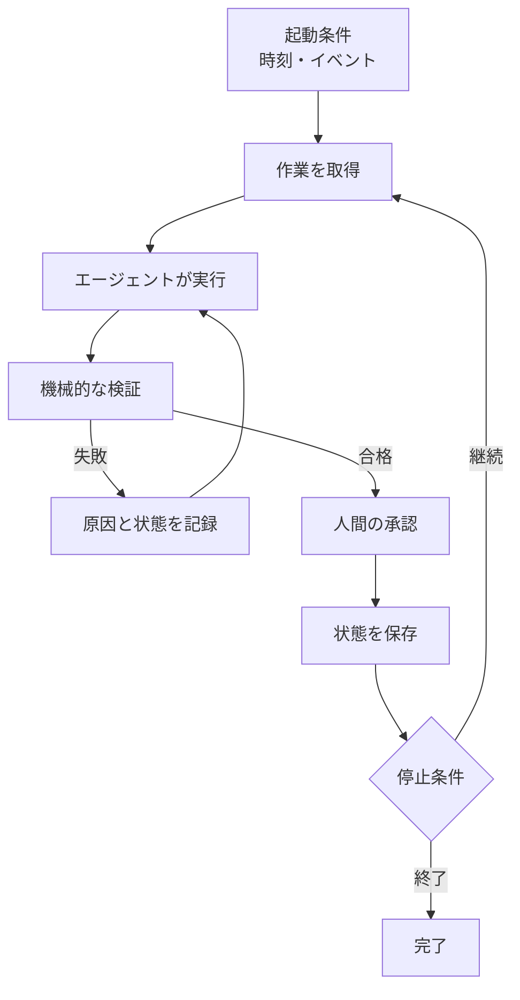

コーディングエージェントを使うとき、多くの作業はまだ手動で進む。プロンプトを書き、結果を待ち、差分を読み、問題を伝えて再実行する。AIがコードを書いていても、作業を前へ進める役は人間のままだ。

Codez（@0xCodez）が公開した「Loop engineering: the 14-step roadmap from prompter to loop designer」は、この操作を一段上の仕組みに置き換える考え方を整理している。人間が毎回プロンプトを書くのではなく、仕事を見つけ、エージェントへ渡し、結果を検証し、状態を保存して次の動きを決める小さなシステムを設計する。そのシステムがloopである。

ただし、元の投稿は「誰もがすぐに自律ループを作るべきだ」とは主張していない。むしろ重要なのは、ループを作らない方がよい仕事を先に見分けることだ。本記事では14段階を、導入判断、構成要素、運用上の注意という3つのまとまりで解説する。

> 元投稿は2026年6月17日に公開された。X上の本文に加え、Anthropic、OpenAI、MCPの公式資料を2026年7月22日に確認した。製品固有の機能は変更される可能性があるため、ここでは長く使える設計原則を中心に扱う。

---

## 結論を先に

Loop Engineeringとは、プロンプトを繰り返し送る技法ではない。モデルの外側に、起動条件、実行環境、検証、状態、停止条件、承認を配置する設計である。

最小構成は次の4つでよい。

1. 定期実行またはイベントで起動するautomation
2. プロジェクト固有の規則を持つinstructionまたはskill
3. 完了済みと次の作業を残すstate file
4. 悪い結果を自動的に拒否するgate

大規模なマルチエージェント構成から始める必要はない。まず一度、人間の操作で確実に成功する手順を作る。次に手順をファイルへ記録し、客観的な検証を追加してから定期実行へ移す。この順序を飛ばすと、どこで失敗したのか分からないまま実行回数とコストだけが増える。



## Part 1: その仕事にループは必要か

### 1. プロンプトを書く人を仕組みで置き換える

手動のAIコーディングでは、人間が次の一手を毎回判断する。Loop Engineeringでは、その判断のうち定型化できる部分を外部の仕組みへ移す。

たとえばCI失敗の一次対応なら、「失敗したworkflowを取得する」「環境問題、flaky test、コードの不具合へ分類する」「再現できるものだけ修正案を作る」「テストを通す」「draft PRとして人へ渡す」という流れを定義できる。モデルへの一回の指示ではなく、仕事の発見から引き渡しまでが設計対象になる。

これは[ハーネスエンジニアリングとは何か]()で扱った考え方と重なる。性能をモデルだけに求めず、モデルの外側に道具、権限、記録、検証を置くからだ。

### 2. 4条件を満たすか確認する

元投稿は、ループを作る前に四つの条件を確認するよう求めている。

| 条件 | 確認すること |
| :--- | :--- |
| 反復性 | 同じ種類の仕事が定期的に発生するか |
| 自動検証 | テスト、型検査、lint、buildなどで不合格を判定できるか |
| 予算 | 再読込、探索、失敗、再試行のコストを許容できるか |
| 実行環境 | エージェントがログを読み、コードを動かし、失敗を観測できるか |

一回限りの調査にループを作ると、仕組みの準備費用を回収できない。成功条件が「なんとなく良い」しかない仕事では、自動検証も成立しない。モデルがコードを書けても実行できない環境なら、失敗を見ずに推測を繰り返すだけになる。

この判定は、エージェントを導入できるかではなく、無人に近い状態で反復させられるかを見ている。

### 3. 効果が出る場所と出ない場所を分ける

最初の対象に向くのは、依存パッケージ更新のdraft PR、lint違反の修正、CI失敗の分類、強いテストがあるリポジトリの小さなissueなどである。いずれも作業が繰り返され、機械で判定でき、失敗時に元へ戻しやすい。

一方、アーキテクチャ刷新、認証や決済、曖昧なプロダクト判断、本番デプロイを最初のループにするのは危険だ。判断の質をテストだけで表現しにくく、誤った操作の影響も大きい。

また、チームのボトルネックが実装ではなくレビューにある場合、ループは未確認の差分を増やす。コード生成量が増えたことと、価値ある変更が増えたことは同じではない。

### 4. 個別タスクを30秒で判定する

具体的なタスクをループへ入れる前に、次を確認するとよい。

- 定期的に発生する
- 自動検証が悪い結果を拒否できる
- エージェントが変更後のコードを実行できる
- 時間、試行回数、費用の上限がある
- merge、deploy、外部送信などの前に人間の承認がある

一つでも欠けるなら、まずは手動プロンプトのまま手順を固める方がよい。自動化する時期を遅らせる判断もループ設計の一部である。

## Part 2: ループを構成する5つの要素

### 5. Automationはループの心拍になる

Automationは、時刻、周期、イベントなどをきっかけに処理を開始する。OpenAIのCodex Automationsも、定期的なissue整理、CI失敗の要約、週次レポートのような反復作業を想定している。

ここで、起動条件と完了条件は分けて考えたい。「30分ごとに確認する」は起動条件であり、「対象テストがすべて成功した」は完了条件である。前者だけでは、終わるべきタイミングを判断できない。

### 6. Worktreeで並行作業を隔離する

複数のエージェントが同じcheckoutを同時に変更すると、互いの未完成な差分を読み、ファイルを上書きする可能性がある。Git worktreeを使えば、履歴を共有しながら作業ディレクトリとbranchを分けられる。

ただし、worktreeが解決するのはファイル衝突である。二つの変更が設計上矛盾していないか、何本のPRを人間がレビューできるかまでは解決しない。並列数の上限は、モデル数ではなくレビュー能力から決める必要がある。

### 7. Skillや指示ファイルへ知識を蓄積する

ループのたびに同じ背景を説明すると、入力コストが増えるだけでなく、規則の伝え漏れも起きる。ビルド手順、触ってはいけない領域、過去に失敗した方法、完了時の報告形式を、エージェントが毎回読めるファイルへ置く。

重要なのは、会話の全文を保存することではない。次回の判断に必要な知識へ編集することだ。[エージェントを長く自律動作させるためのコンテキスト設計]()で説明した外部状態への退避が、ここでは再利用可能な作業手順になる。

### 8. Connectorで実際の仕事場へ接続する

ファイルしか読めないエージェントは、修正案を作れてもissueの取得、PR作成、通知までは進められない。MCPなどのconnectorを介してGitHub、issue tracker、エラー監視、チャットへ接続すると、ループは実際の業務フローへ入れる。

MCPが標準化するのは、AIアプリケーションが外部のデータやツールへ接続する方法である。接続した操作を無条件に許可する仕組みではない。読み取りと書き込みの権限を分け、外部へ影響する操作には承認を残す必要がある。

### 9. 作る役と検証する役を分ける

同じエージェントに「実装して、正しいか確認して」と頼むと、自分が選んだ方針を肯定しやすい。そこで、makerとcheckerを分ける。Anthropicが紹介するevaluator-optimizerも、一方が生成し、別のLLMが評価とフィードバックを返す構成である。

ただし、検証役をもう一つ置くだけでは十分ではない。「問題なさそう」と答えるエージェントが二つになる可能性があるからだ。最終的には、テスト結果、型検査、期待するファイルの存在、データベース上の状態など、観測可能な結果で判定する。

Anthropicのagent evalsの説明でも、エージェントが「予約した」と発言したかではなく、実際にデータベースへ予約が存在するかというoutcomeを確認する例が示されている。ループのgateも同じ発想で設計できる。

## Part 3: 小さく作り、正しく止める

### 10. State fileでセッションをまたぐ

長く動くループでは、会話そのものを記憶装置にしない。完了済み、進行中、次の作業、失敗理由、未解決事項をMarkdownやJSON、issue boardなどへ残す。

state fileは現在地を示す。別に`VISION.md`や`AGENTS.md`のような上位方針を置けば、目的地も毎回読み直せる。[GSD CoreでAIコーディングを仕様駆動の工程に変える]()の`.planning/`も、決定と進捗を会話の外へ保存する実例である。

### 11. 最小構成を手動実行から育てる

最初から多数のエージェント、connector、複雑なスケジュールを組み合わせると、失敗原因の切り分けが難しい。導入順は次のようになる。

1. 人間が起動する一回の手順を安定させる
2. 手順と制約をskillまたは指示ファイルへ書く
3. state fileと自動gateを加える
4. ループ化して、最後にscheduleを設定する

測るべき指標も、実行回数や生成コード量ではない。人間のレビューを通過した変更1件あたりの費用、手戻り率、レビュー時間、失敗後の復旧時間を見る。ループが大量の修正案を出しても、大半を人間が捨てているなら負担は減っていない。

### 12. 静かな失敗を検出する

ループで厄介なのは、エラーで停止する失敗だけではない。処理は正常終了し、費用も発生しているが、仕事は完了していないという状態がある。

原因になりやすいのは、曖昧な完了条件、自己評価だけのchecker、上限のない再試行である。「よい感じになったら終了」ではなく、「指定したテストが成功し、lintの終了コードが0で、対象外のファイルを変更していない」のように判定可能な条件へ変える。

### 13. 理解の負債を増やさない

ループが速く動くほど、人間が書いていないコードも速く増える。リポジトリの中身とチームの理解の差が広がると、障害時に誰も全体を説明できない。元投稿はこれをcomprehension debtと呼んでいる。

対策は派手ではない。差分を読む、自動gateが本当に失敗を捕捉するか抜き取り確認する、判断を伴う設計変更をループの対象外にする、といった運用を続ける。自動化はレビューを消すのではなく、レビューすべき場所を変える。

### 14. 無人運転の攻撃面を管理する

無人で動く時間が増えると、攻撃や誤操作も人に気付かれないまま継続する。特に注意したいのは次の点だ。

- 外部から取得したskillやissue本文に埋め込まれたprompt injection
- 実行ログへ混入するAPIキーや個人情報
- 便利さのために追加され、そのまま残る書き込み権限
- セキュリティ検査と人間の確認を通らないmergeやdeploy

ループには最小権限を与え、秘密情報をログへ出さず、依存関係監査やsecret scanningをgateへ含める。権限は導入時だけでなく定期的に見直す。外部入力を読むエージェント自身へ、最終的な認可判断まで任せない方がよい。

## 実務ではどこから始めるか

最初の題材としては、週次の依存関係チェックが扱いやすい。

```text
起動: 毎週月曜
入力: 現在の依存関係と更新候補
実行: 1件ずつworktreeで更新
gate: install、test、lint、build
状態: 成否、失敗理由、作成したbranchを記録
停止: 最大3件または60分
承認: draft PRまで。mergeは人間が行う
```

この例では、作業が反復し、成功条件を機械で確認でき、変更をPRで隔離できる。失敗しても本番へ直接影響しない。ここで安定してから、CI失敗の分類や小さな修正へ対象を広げればよい。

Loop Engineeringの中心は、エージェントを長時間走らせることではない。何を任せ、何を機械で拒否し、どこで止め、どの操作を人間へ戻すかを先に決めることである。プロンプトからループへ移るとしても、エンジニアの役割が消えるわけではない。作業そのものから、作業が安全に進む仕組みの設計へ重心が移る。

---

## 参考

- [Loop engineering: the 14-step roadmap from prompter to loop designer（X）](https://x.com/0xCodez/status/2064374643729773029)
- [Loop engineering: the 14-step roadmap from prompter to loop designer（Thread Navigator）](https://threadnavigator.com/thread/2064374643729773029/)
- [Building effective agents（Anthropic）](https://www.anthropic.com/engineering/building-effective-agents)
- [Demystifying evals for AI agents（Anthropic）](https://www.anthropic.com/engineering/demystifying-evals-for-ai-agents)
- [Introducing the Codex app（OpenAI）](https://openai.com/index/introducing-the-codex-app/)
- [Automations（OpenAI Academy）](https://openai.com/academy/codex-automations/)
- [What is the Model Context Protocol?（Model Context Protocol）](https://modelcontextprotocol.io/docs/getting-started/intro)
