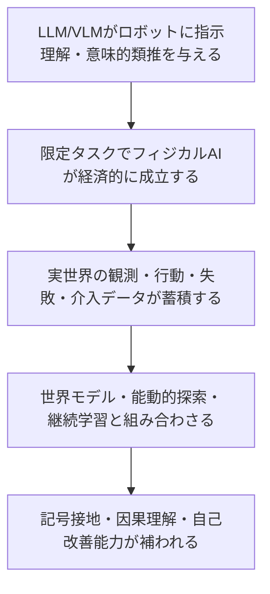

LLMはAGIに到達しなくても、実用的なフィジカルAIを普及させる程度には進化するかもしれない。倉庫のピッキング、工場の検品、清掃、棚卸し、配送や巡回のような限定タスクなら、完全な汎用知能は要らない。指示を理解し、タスクを分解し、人間とやり取りできれば十分だ。

その先に何が起きるかが、この記事の主題である。ロボットが現実世界で観測し、行動し、失敗し、修正する。この過程は、これまでのインターネット学習には存在しなかった種類のデータを生む。仮説として立てたいのは、このデータがLLMに欠けていた世界への接地や因果理解を補い、AGIへの最後のピースになるのではないか、という問いだ。

ただし先に断っておくと、鍵になるのは「画像や動画やセンサーデータが増える」ことそのものではない。AIが世界に働きかけ、結果を観測し、次に何を試すべきかを選び、自ら学習経験を生成する閉ループができることだ。

## 言語は知能そのものではない

人間の高度な思考の多くは、言葉にする前から成立している。職人が手の感覚で工程の異常に気づくとき、外科医が触診から次の一手を判断するとき、そこに自然言語は介在していない。言語は知能そのものではなく、人間の経験や思考を圧縮して他者へ渡すための媒体に近い。

LLMはこの圧縮された媒体を大量に学習することで、言語の背後にある世界構造をある程度まで逆算できるようになった。物理法則の記述、因果関係の説明、常識的な推論は、テキストだけからでもかなりの精度で再現できる。

一方でLLMには、直接的な知覚や行為、介入の経験がない。テキストは常に、誰かがすでに観測し、解釈し、言語化した後の結果である。センサーから届く生の信号、行動の結果として物理世界が変化する瞬間、予測が外れて修正する経験は、テキストの中には残っていない。この不足を、フィジカルAIが生成する行動条件付きのデータが埋めるのではないか、というのが本稿の出発点になる。

## 仮説を3段階に分解する

この仮説は、一つの大きな主張ではなく、つながった3つの段階として整理できる。それぞれ強度が違うので、分けて検証する価値がある。

### 1. AGIより先に、限定的なフィジカルAIが普及する

倉庫、工場、清掃、棚卸し、配送、巡回のようなタスクは、環境がある程度構造化されていて、失敗の許容度も比較的高い。ここでLLMやVLM(Vision-Language Model)が担うのは、汎用知能そのものではなく、指示理解・タスク分解・意味的類推・人間とのインターフェースである。

この段階はすでに事例で裏付けられている。Google DeepMindのRT-2は、Web由来の知識をロボットの行動へ転移するVision-Language-Action modelとして、見たことのない物体やカテゴリに対しても意味的な推論に基づいて行動できることを示した。Physical Intelligenceのπ0は、インターネット由来の意味理解と複数ロボットの低レベル行動データを統合するアプローチを取り、後継のπ0.5は未知のキッチンや寝室を片付けるようなオープンワールドの汎化を、2026年4月公開のπ0.7はさらに異なる文脈で学んだスキルを組み合わせて未学習タスクをこなす構成的汎化を検証段階まで進めている。NVIDIAのIsaac GR00Tやヒューマノイド参照機体、AGIBOTのような企業が2026年に相次いで商用フィジカルAI基盤モデルを発表していることも、この段階が投機ではなく実装フェーズに入りつつあることを示している。

### 2. 普及したロボットが実世界データのフライホイールを作る

ロボットが実環境で稼働し始めると、カメラ映像だけでなく、観測・行動・結果・失敗・人間介入を含む軌跡が蓄積されていく。ここで重要なのは、受動的に記録された動画ではなく、`P(next_state | state, action)` を学習できる、行動と結果が対になった介入データである。

DeepMindのRoboCatは、この段階を自己改善ループとして具体化した先行例といえる。新しいタスクや新しい腕について100〜1000件のデモンストレーションを人間が与え、それを使ってRoboCatを微調整した派生エージェントを作り、その派生エージェントに平均1万回練習させて自己生成データを作る。そのデータを元のRoboCatの学習データへ戻し、次のモデルを強くする。同じくDeepMindのAutoRTは、基盤モデルを使って複数の建物にまたがる50台以上のロボット群に何を試すかを自律的に選ばせ、7万7000件以上の実ロボットエピソードを収集した。ラボの外で集めたデータは、実験室で集めたデータより多様性が高く、それが方策の性能改善に直結することも報告されている。

Open X-EmbodimentとRT-Xは、複数のロボット・複数のタスクにまたがるデータを統合する取り組みで、単一のロボットでは得られない経験の幅を作り出した。2025年11月に発表された「Robot-Powered Data Flywheels」は、この考え方をさらに一般化し、ロボットを基盤モデルの消費者ではなくデータ生成者として位置づけている。大学図書館で2週間稼働させたScanfordというロボットが、棚をスキャンしながら在庫管理を手伝うと同時に、多言語で読み取りにくい書名を認識する精度を上げるためのデータを集めた事例は、経済的に意味のあるタスクとデータ収集が同時に成立することを示す小さな実証といえる。

### 3. その閉ループが、AGIに不足していた能力を補う

蓄積された経験がそのまま知能を作るわけではない。ここで動画や行動データを世界モデルへ変換し、能動的な探索や継続学習と組み合わせる段階が要る。

Metaが2025年に公開したV-JEPA 2は、100万時間を超えるインターネット動画から自己教師あり学習で世界モデルを構築し、わずか62時間ほどのラベルなしロボット映像で微調整するだけで、未経験の環境でもゼロショットに近い形で物体操作の計画を立てられることを示した。コップを持ち上げて移動させるタスクでは、比較対象のVideo-Language-Actionモデル(Octo)の成功率15%に対し、V-JEPA 2は平均80%を記録している。これは、行動条件付きの経験が少量でも、事前に構築された世界モデルと組み合わさることで大きな効果を生むことを示す例になる。

この段階で埋まりうるのは、記号接地、物理的因果理解、世界モデル、失敗検知と修正、能動的探索、そして「自分が何を知らないかを認識し、次に何を試すべきかを選ぶ」能力である。これらは、テキストの事前学習だけでは得にくい種類の知識に近い。

## フライホイールは本当に回るか

ここまでは仮説を後押しする事例だが、同じくらい重要なのは、まだ解決していない問題である。

商用ロボットのログは、成功した動作・同じ環境・同じ身体に偏りやすい。稼働時間を稼ぐことが優先されるビジネスの現場では、失敗や例外的な状況をあえて多く経験させるインセンティブが働きにくい。データ量が増えても、タスクや失敗の多様性が不足すれば、モデルは特定の環境に過適合するだけで終わる可能性がある。

ロボットごとに身体構造が異なる問題、いわゆるembodiment gapも軽視できない。2026年時点の研究でも、異なるロボット間でデータを共有したときに実際に何が転移しているのかは十分に解明されていない。潜在空間で行動表現を揃えるlatent alignmentのような手法は改善を示しているが、モデルが本当に形態やカメラ視点を超えた不変な構造を学んでいるのか、それとも単にスケールの副産物として見かけ上うまくいっているだけなのか、この区別はまだ明確ではない。

さらに根本的な指摘として、物理的な経験だけでは、社会的知能、価値判断、制度理解、メタ認知のような能力までは埋まらないという見方がある。行動と結果の閉ループが重要なのだとすれば、それは必ずしも物理身体を必要としない。デジタル環境の中でエージェントが試行錯誤し、結果を観測し、次の行動を選ぶ閉ループを作れるなら、同じ種類の学習効果が得られるかもしれない。逆に、身体化認知を強く支持する立場では、身体は単なるデータ収集装置ではなく、知能そのものを構成する一部だと考える。この立場に立つなら、閉ループをどんな媒体で作るかは本質的な違いを生むことになる。

## フィジカルAIは橋になり得るが、答えではない

ここまでの材料を踏まえると、「非言語データが最後のピースだ」と断定するのは早い。より正確な言い方は次のようになる。

LLMやVLMは、AGI以前に実用的なフィジカルエージェントを成立させる可能性がある。それらが社会に導入されると、観測・行動・結果・失敗・人間介入を含む実世界経験が継続的に生成される。この経験を世界モデル、シミュレーション、能動的探索、継続学習と組み合わせることで、インターネット事前学習に欠けていた因果的接地と自己改善能力が得られる。これはAGIへの主要な橋になり得るが、物理データだけでAGIが完成するとは限らない。データの偏り、身体構造の違い、物理経験では埋まらない領域が、橋の途中に残ったままになる可能性は十分にある。

それでも、この仮説にはもう一つ見ておくべき側面がある。フィジカルAIがAIを変えるとしたら、それは非言語データを大量に与えるからではない。AIを、世界について語る存在から、世界に問いを投げかける存在へ変えるからだ。

## 参考

- [RT-2: New model translates vision and language into action](https://deepmind.google/blog/rt-2-new-model-translates-vision-and-language-into-action/)
- [Open X-Embodiment / Scaling up learning across many different robot types](https://deepmind.google/blog/scaling-up-learning-across-many-different-robot-types/)
- [RoboCat: A self-improving robotic agent](https://deepmind.google/blog/robocat-a-self-improving-robotic-agent/)
- [AutoRT: Embodied Foundation Models for Large Scale Orchestration of Robotic Agents](https://deepmind.google/research/publications/48151/)
- [π0: A Vision-Language-Action Flow Model for General Robot Control](https://www.physicalintelligence.company/blog/pi0)
- [π0.5: a VLA with Open-World Generalization (arXiv)](https://arxiv.org/abs/2504.16054)
- [Introducing the V-JEPA 2 world model and new benchmarks for physical reasoning](https://ai.meta.com/blog/v-jepa-2-world-model-benchmarks/)
- [Experience Grounds Language](https://aclanthology.org/2020.emnlp-main.703/)
- [Robot-Powered Data Flywheels: Deploying Robots in the Wild for Continual Data Collection and Foundation Model Adaptation (arXiv 2511.19647)](https://arxiv.org/abs/2511.19647)
- [Scanford, a Robot-Powered Data Flywheel](https://scanford-robot.github.io/)
- [NVIDIA Isaac GR00T N1 — the World's First Open Humanoid Robot Foundation Model](https://nvidianews.nvidia.com/news/nvidia-isaac-gr00t-n1-open-humanoid-robot-foundation-model-simulation-frameworks)
