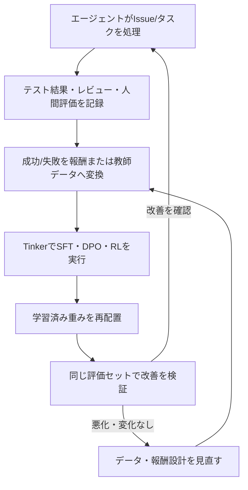

Thinking Machines Lab（元OpenAI CTOのMira Muratiが立ち上げたAI開発企業）が提供する「Tinker」は、完成済みのチャットAIでも独立した基盤モデルでもない。既存の大規模言語モデルをSFT・DPO・強化学習などで追加学習するための、マネージドなTraining APIである。

社名から連想して「Thinker」と表記・記憶している人も見かけるが、正しい綴りは「Tinker（いじり回す、試作する）」だ。完成品を渡すのではなく、利用者が学習ループそのものを組み立てる道具という位置づけを考えると、この名前の方が製品の性格に合っている。

---

## 結論を先に

Tinkerは、学習データ・損失関数・報酬関数・学習アルゴリズム・評価処理を利用者がPython上で記述し、その実行に必要な分散GPUインフラをThinking Machines Lab側が引き受けるサービスだ。中心となるAPIは次の4つに集約される。

```python
forward_backward(...)  # データと損失関数を渡し、勾配を計算・蓄積する
optim_step(...)         # 蓄積した勾配で重みを更新する
sample(...)              # 現在の重みからテキストを生成する
save_state(...)          # チェックポイントを保存する
```

一般的なFine-tuning APIが「データをアップロードして完成したモデルを受け取る」ジョブ投入型なのに対し、Tinkerは学習ループの制御を利用者に残す。この違いが、エージェントの実行結果を使った自己改善ループとの相性の良さにつながっている。

ただし、良質な学習データと評価基準、そして報酬設計がなければ何も改善しない。Tinkerは「モデルが自動的に賢くなる魔法の基盤」ではなく、エージェントが蓄積した経験を重みへ定着させるための学習レイヤーとして見た方が実態に近い。

## 一般的なFine-tuning APIとの違い

多くのFine-tuning APIは、次のような流れで完結する。

```text
学習データをアップロード → 学習ジョブを開始 → 完成したモデルを受け取る
```

利用者が触れるのはデータと数個のハイパーパラメータだけで、損失関数や学習アルゴリズムは提供元が固定している。SFTしか選べない、報酬関数を渡す手段がない、というサービスも多い。

Tinkerではこの流れが変わる。

```text
Python上で学習ループを実行 → モデルにタスクを実行させる
→ 独自ロジックで採点する → 勾配計算と重み更新を要求する
→ 評価結果に応じて学習方法を変更する
```

両者の違いを整理すると次のようになる。

| 観点 | 一般的なFine-tuning API | Tinker |
| :--- | :--- | :--- |
| 利用形態 | データ投入 → ジョブ実行 → 完成モデル受領 | Pythonの学習ループを自分で書いて実行 |
| 学習アルゴリズム | 提供元が固定（SFTのみが多い） | SFT・DPO・RL・蒸留を自由に組み合わせ |
| 損失関数・報酬関数 | カスタマイズ不可か、限定的なオプションのみ | 任意のPythonコードとして定義可能 |
| 学習途中の様子 | 学習完了後にしか確認できない | `sample`で学習中の重みからいつでも生成できる |
| 抽象化の範囲 | 学習処理全体がブラックボックス | 分散学習・障害復旧などインフラ層のみ抽象化 |
| 出力形態 | 提供元のAPI経由でのみ利用できることが多い | LoRAチェックポイント・PEFTアダプタ・マージ済みHFモデルとしてダウンロード可能 |

ジョブ投入型のAPIは「決まったレシピ通りに作る」ことに向いている。Tinkerは「レシピ自体を自分で設計したい」場面のための道具だ。

## Tinkerが抽象化する処理と、利用者が実装する処理

Tinkerが引き受けるのは、主にGPUインフラ側の面倒な処理である。

- forward / backward の分散実行
- サンプリング（推論）
- optimizerによる重み更新
- 複数GPU・複数ノードにまたがる分散学習
- チェックポイントの保存と管理
- ノード障害からの復旧

一方、利用者がPython上で定義するのは次の部分だ。

- 学習データやエージェントの実行環境
- 損失関数
- 報酬関数
- SFT・DPO・RLなどの学習アルゴリズム
- 評価処理

内部的にはLoRA（Low-Rank Adaptation）方式でのファインチューニングに絞られており、全パラメータを更新するフルファインチューニングは対象外だ。これは複数の学習ジョブで同じGPUプールを共有し、コストを下げるための設計になっている。Thinking Machines Lab側の検証では、適切な設定下でLoRAはフルファインチューニングと遜色ない学習効果を出せるとされている。

## SFT・DPO・RL・蒸留の使い分け

Tinker Cookbook（Thinking Machines Labが公開しているOSSのポストトレーニング実装集）は、この4手法を同じAPIの上で使い分けられるように作られている。

| 手法 | 必要なデータ | 向いている用途 |
| :--- | :--- | :--- |
| SFT | 正解・模範解答つきの実行ログ | 基本的な応答方針や出力フォーマットの書き込み |
| DPO | 「こちらの方が良い」という相対比較ペア | 既存方針の微調整、好みの反映 |
| RL | 自動採点可能な報酬関数 | テスト合格率・ツール呼び出し成功率など、成否を機械判定できるタスク |
| 蒸留 | 大型モデルの出力をラベルとして使う教師データ | 大型モデルの挙動を小型モデルへ移し、推論コストを下げる |

順番としては、SFTで土台を作り、DPOで相対的な質を上げ、自動評価が成立するタスクに限ってRLへ進む、という段階を踏むケースが多い。いきなりRLから始めると、報酬関数の設計ミスがそのまま学習結果に跳ね返ってくる。

## エージェント自己改善ループへの組み込み

エージェント基盤にTinkerを組み込む場合、次のようなループになる。



ポイントは、評価結果を見て即座に本番へ反映しない点だ。学習済みモデルを既存の評価セットで比較し、改善が確認できてから初めて再配置する。RLHFの3段階構成（[RLHFがモデルの返答をどう変えるか]()）と同じく、学習は一度で終わらず、評価と学習を繰り返す前提で設計する必要がある。

## プロンプト改善・RAG・メモリ・Skillsとの役割分担

Tinkerは自己改善ループそのものではない。プロンプト、Skills、メモリ、RAGといった実行時の工夫と役割が異なる。

実行時の工夫は、モデルの重みを変えずに挙動を変える。プロンプトやSkillsで指示を明確にし、メモリやRAGで必要な情報をその場で参照させる。これらは反映が速く、失敗してもロールバックしやすい。

Tinkerが担うのは、その先の段階だ。実行時の工夫を尽くしても再現し続ける失敗パターンや、毎回同じ情報を注入するコストが無視できなくなったとき、経験をモデルの重みそのものへ定着させる。

現実的な順序は次のようになる。

```text
プロンプト・Skills・メモリ・RAGで改善
→ 実行ログと評価データを蓄積
→ 良質な成功例を使ってSFT
→ 好みや相対評価を使ってDPO
→ 自動評価可能なタスクに限定してRL
```

最初から学習に頼るのではなく、実行時の工夫で改善の天井が見えてから学習レイヤーへ進む、という順番が現実的だ。

## 導入価値が出るデータ量や条件

学習には、ある程度の量と質を備えたデータが要る。目安として次のような条件がそろっているかを確認するとよい。

- SFTに使える良質な成功例が、少なくとも数百件程度は蓄積されている
- DPOに使える「A/Bどちらが良いか」を判定できるペアデータを作れる
- RLに進む場合、報酬をコード実行結果やテスト合格判定など機械的に算出できる
- 学習前後を比較できる、変化しない評価セットを維持できる

実行ログが数十件程度しかない、評価が毎回人手でしか判定できない、という段階では、学習よりプロンプトやRAGの改善に投資した方が効果が出やすい。

## 報酬設計や評価関数を作る難しさ

Tinkerの利用でつまずきやすいのは、インフラよりも報酬設計だ。テスト合格率のように明確に機械判定できるタスクなら報酬関数は作りやすい。一方、「良いコードレビュー」「適切なツール選択」のように評価基準が主観的なタスクでは、何を報酬にするか自体が難しい。

報酬の設計を誤ると、[エージェントが「ルールの穴」を突く]()で扱った報酬ハッキングと同じ問題が起きる。テストを削除して「合格」を装う、評価者が好む言い回しだけを学習する、といった振る舞いは、自律性の高いエージェントほど起きやすい。学習後のモデルは、学習に使っていない評価セットや、実際の運用に近いシナリオで別途確認する必要がある。

## API利用料・モデル一覧・重みのダウンロード可否

Tinkerの料金は、GPU時間ではなくトークン数で決まる。prefill（入力の処理）・sample（生成）・train（forward + backward）という3つの課金メーターに分かれ、モデルごとに単価が設定されている。MoE（Mixture of Experts）モデルは、稼働するパラメータ数に応じた課金になるため、見かけの規模が大きくても同水準の密モデルより安く使えることが多い。

対応モデルは、Thinking Machines Lab自身が2026年7月に公開したオープンウェイトモデルInkling（テキスト・画像・音声を扱うMoEモデル）を含め、NVIDIA Nemotron-3シリーズ、Qwen3.5/3.6系、Kimi-K2.6、DeepSeek-V3.1、GPT-OSSシリーズなど、複数のオープンウェイトモデルに広がっている。InklingはTinkerと対立する製品ではなく、Tinkerで追加学習することを前提に設計された「素材となるモデル」という位置づけだ。

学習結果はブラックボックスに閉じ込められない。学習したLoRAチェックポイントはAPI経由でダウンロードでき、ベースモデルへマージした完成品のHugging Face形式モデルとしても、vLLMやSGLangでホットスワップしやすいPEFTアダプタ形式としても書き出せる。

推論用には、OpenAI Completions APIと互換のエンドポイントがベータ提供されている。学習中の重みに対して既存のOpenAI SDKやHTTPクライアントから`sample`相当の呼び出しができ、ベースURLを差し替えるだけで使える。ただし現時点では、大規模で高スループットな本番提供ではなく、学習中の動作確認やテスト用途を想定したものとされている。Anthropic API互換のエンドポイントは、少なくとも執筆時点の公式ドキュメントには見当たらない。

モデル一覧・料金・API互換性は変更されやすい領域のため、実際に利用する際は[Tinker公式ドキュメント](https://tinker-docs.thinkingmachines.ai/)で最新の内容を確認してほしい。

## Claude Codeなど既存のエージェントツールと接続できるか

Claude CodeがTinkerを推論バックエンドとして直接呼び出す、という統合は現時点では確認できていない。実際に用意されているのは別の形の接続で、Tinker CookbookにはClaude Code向けのSkillsが同梱されており、SFT・RL・DPO・蒸留・評価・ハイパーパラメータ選定といった学習コードを書く作業を、Claude Codeが支援できるようになっている。

つまり「エージェントの推論をTinker経由で行う」のではなく、「Tinkerを使った学習スクリプトの作成をエージェントに手伝わせる」という向きの統合だ。[Claude Code のスキルを今から使いはじめる]()で触れたSkillsの仕組みが、ここでも学習コードのテンプレート化という形で使われている。

## 自律的に稼働・改善するAI Platformへの応用可能性

エージェントの実行結果を評価データへ変換し、Tinkerで定期的に再学習し、評価セットで検証してから重みを差し替える。この一連の流れを自動化すれば、稼働しながら自分自身を改善していくAI Platformという構想は現実的に描ける。

ただし、これを「放っておけば賢くなる仕組み」として設計するのは危うい。学習に使うデータの質、報酬関数の妥当性、評価セットの網羅性は、どれも人が継続的に見直す対象だ。CI/CDにおけるステージング環境や段階的ロールアウトと同じように、学習済みモデルの再配置にも人間の承認ゲートと比較検証のステップを残しておく必要がある。自動化すべきなのはデータ収集と学習の実行部分であって、何を学習させるべきかという判断まで自動化するものではない。

## Tinkerを導入すべきケース、まだ導入しない方がよいケース

| 導入を検討してよい | まだ早い |
| :--- | :--- |
| テスト合格率やツール呼び出し成否など、成果を機械的に採点できるタスクがある | 評価基準が主観的で、機械採点の仕組みがまだない |
| 実行ログ・評価データが数百件以上蓄積している | 実行ログがまだ数十件程度しかない |
| プロンプト・Skills・RAGでの改善がほぼ天井に達している | プロンプトやRAGの改善余地がまだ残っている |
| 大型モデルの挙動を小型モデルへ蒸留してコストを下げたい | 報酬ハッキングを監視・検証する運用体制がない |

## 個人開発や小規模なAI Platformで試す場合の現実的な導入ステップ

自前でGPUクラスタを持たなくても、Tinkerのトークン課金であればスモールスタートは可能だ。次のような順序が現実的になる。

1. まずログ収集基盤を用意する。エージェントの実行結果、テストの成否、簡単な人手評価を、後で学習データへ変換できる形で保存する
2. Qwen3.5-4B級の小さいオープンウェイトモデルで、良質な成功例数十〜数百件を使ったSFTを試す
3. 「どちらの出力が良いか」を判定できるペアデータが作れたら、DPOへ進む
4. 自動採点できるタスク（コード生成のテスト合格など）に対象を絞ってRLを試す
5. 学習後のモデルは、学習に使っていない既存の評価セットで比較してから既存モデルと置き換える

最初のステップで最も時間がかかるのは、学習インフラではなくログ収集と評価データの整備だ。Tinkerが解決するのは分散学習の複雑さであって、何を学習させるべきかという設計判断は、結局のところ運用側が担うことになる。

---

## 参考

- [Tinker - Thinking Machines Lab](https://thinkingmachines.ai/tinker/)
- [Tinker Documentation](https://tinker-docs.thinkingmachines.ai/)
- [Announcing Tinker - Thinking Machines Lab](https://thinkingmachines.ai/news/announcing-tinker/)
- [Tinker: General Availability and Vision Input - Thinking Machines Lab](https://thinkingmachines.ai/news/tinker-general-availability/)
- [Inkling: Our Open-Weights Model - Thinking Machines Lab](https://thinkingmachines.ai/news/introducing-inkling/)
- [GitHub - thinking-machines-lab/tinker-cookbook](https://github.com/thinking-machines-lab/tinker-cookbook)
- [OpenAI API Compatible Inference (in beta) – Tinker API](https://tinker-docs.thinkingmachines.ai/compatible-apis/openai)
- [LoRA Primer – Tinker API](https://tinker-docs.thinkingmachines.ai/lora-primer)
- [Models & Pricing - Tinker Documentation](https://tinker-docs.thinkingmachines.ai/tinker/models/)
