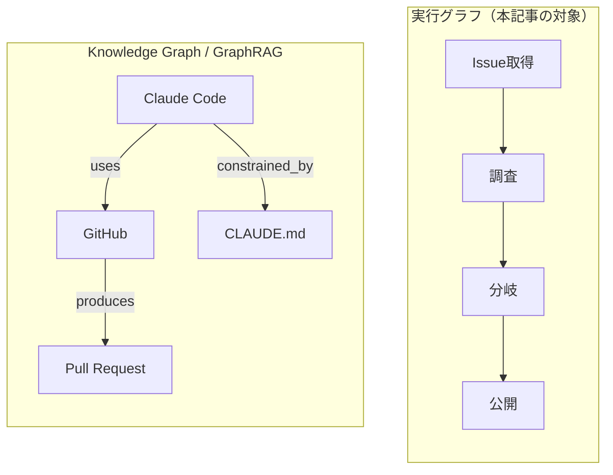
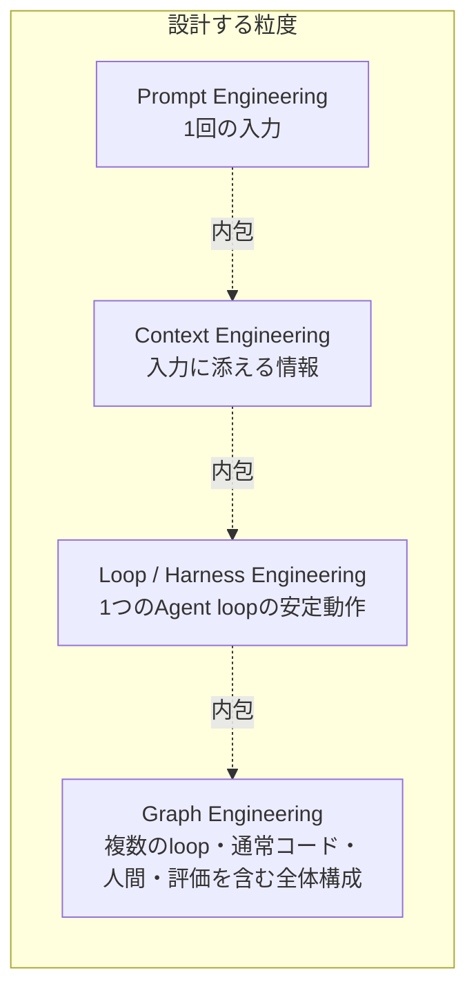
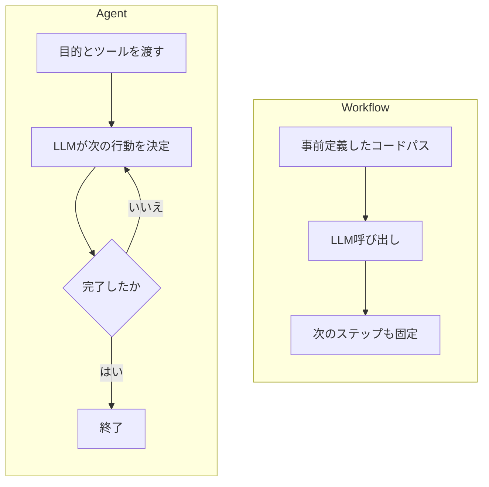
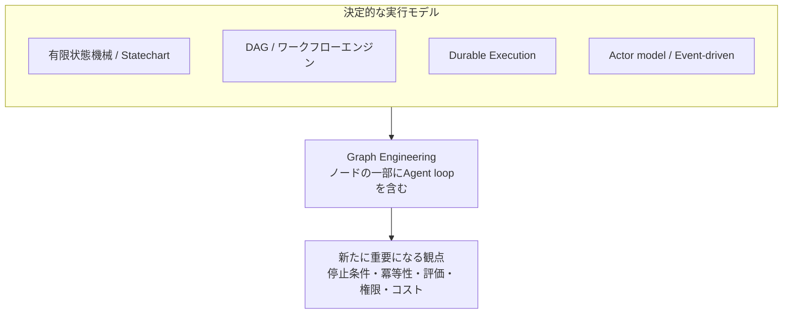
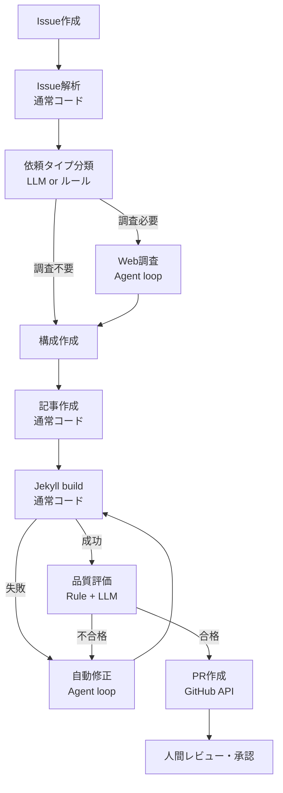
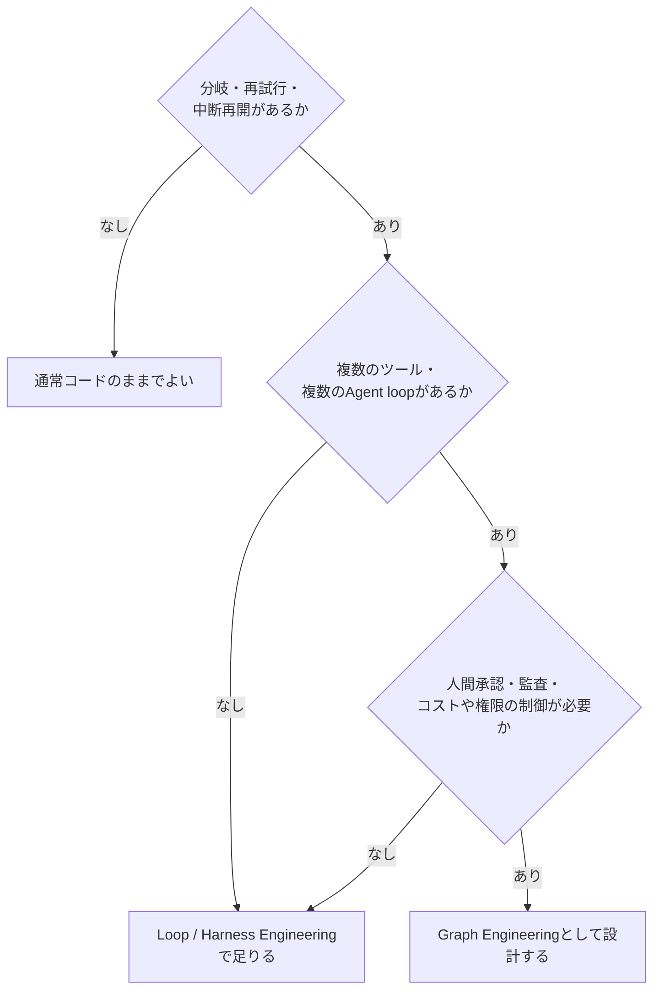

2026年7月18日、Peter Steinberger（@steipete）が「まだloopの話をしているのか、それとももうgraphに移ったのか」という趣旨の投稿をXに出した。数日で数百万回表示され、AIエージェント開発者の間で「Graph Engineering」という語が急速に広まった。

ちょうど1か月前には同じ界隈で「Loop Engineering」が話題になっていた。本ブログでも[Loop Engineeringの14段階ロードマップ]()として取り上げたばかりだ。それがひと月足らずで「次はGraphだ」と言われている。

この移り変わりの速さ自体が、Graph Engineeringがまだ確立した技術用語ではないことを示している。実際、後述するように懐疑的な論者は「State machine、DAG、workflow engineは何十年も前から同じことをやっている」と指摘している。一方で、LangGraphやTemporalのような具体的な基盤が既に実務で使われているのも事実だ。

この記事では、2026年7月27日時点で確認できる一次情報をもとに、Graph Engineeringという言葉の下で何が語られているかを整理する。流行語としての側面と、既存のソフトウェア工学・分散システムの技術として連続している側面を分けて見ていく。

---

## 結論を先に

Graph Engineeringという名前自体は数週間前に広まったばかりで、業界標準の定義は存在しない。ただし、その中身の多くは新発明ではない。State machine、DAG、workflow engine、Durable Executionといった既存技術の蓄積の上に、確率的に動作するLLM／Agentをノードとして含めたときに何を設計し直す必要があるか、という問いが乗っている。

本記事では作業定義として次のように扱う。

> Graph Engineeringとは、不確実に振る舞うAgent loopを、決定的なソフトウェアシステムの中にどう配置し、接続し、観測し、停止・復旧可能にするかを、状態を持つ実行グラフとして設計する考え方。

これは筆者がこの記事のために採用する整理であり、業界で合意された定義ではない。同じ語が指すものが論者によって割れている点は、後述する「どのグラフか」の節で扱う。

価値があるのは複雑なグラフを描くことではない。不確実な処理を局所化し、システム全体の状態、遷移、停止条件、復旧方法を明示することにある。逆に、分岐も再試行も長時間実行もない処理を無理にグラフ化すると、抽象化と運用コストだけが増える。

---

## 「どのグラフか」を最初に分離する

Graph Engineeringという言葉が混乱を招きやすいのは、少なくとも性質の異なる3種類のグラフが同じ単語で語られているためだ。

1. **エージェント実行グラフ** — 処理・判断・状態遷移・分岐・ループ・人間承認を表すグラフ。LangGraphやTemporalが対象とする領域で、今回の記事の中心になる
2. **Knowledge Graph / GraphRAG** — 人・文書・コード・概念・イベントなどの実体と関係を表すグラフ。Microsoft GraphRAGはこちらに属し、実行順序ではなく意味的な関係を表す
3. **その他のグラフ** — 機械学習の計算グラフ、タスク依存グラフ、ビルドグラフ、データリネージ、組織やソーシャルネットワークのグラフなど

実際、AI Operatorの整理では2026年7月の拡散時に「オーケストレーショングラフ（LangGraph・Temporal領域）」「ループのグラフ（自己改善サイクルの相互監視網）」「グラフ構造化された知識と記憶」という3つの異なる解釈が同時に生まれ、互いを指して議論がすれ違っていたと指摘されている。

実行グラフは「次に何をするか」という手順の集合であり、ノードを一つずつ辿って処理を進める。Knowledge GraphやGraphRAGは「何と何が関係しているか」という意味構造であり、辿るというより問い合わせて関連情報を取り出す使い方をする。両者は同じ「ノードと辺」という表現形式を共有しているだけで、設計する対象も評価の基準も異なる。本記事は前者、つまりエージェント実行グラフとしてのGraph Engineeringだけを扱う。

---

## Loop Engineeringとの関係

Loop EngineeringとGraph Engineeringは単純な新旧関係ではない。前者を置き換えるものとして後者を語ると、扱っている粒度の違いを見誤る。

Loop Engineeringは、単一または局所的なAgent loopを安定させる設計だった。起動条件、実行環境、検証、状態、停止条件、承認という要素を、一つのループの内側に配置する。

Graph Engineeringが扱うのは、複数のloop、通常の決定的コード、人間の承認、ツール呼び出し、評価処理を含む、システム全体の構成である。個々のloopの内部設計を置き換えるのではなく、複数のloopと非loopの処理がどう繋がり、どう制御されるかという一段上の層を扱う。

この図は「置き換え」ではなく「内包」の関係として描いている。Graph Engineeringのグラフを構成するノードの一つが、そのままLoop Engineeringで設計したAgent loopになる場合が多い。[ハーネスエンジニアリングとは何か]()で扱ったHooksやSupervisor Patternも、グラフの中の1ノードの内部実装として使われ続ける。

---

## WorkflowとAgentの違い

Graph Engineeringを考えるうえで避けて通れないのが、AnthropicがBuilding Effective Agentsで示したWorkflowとAgentの区別だ。

- **Workflow** — LLMやツールが、事前に定義されたコードパスに沿って動くシステム。制御フローは開発者が持つ
- **Agent** — LLMが、目的達成のための手順やツール利用を動的に自ら決定するシステム。開発者は目的とガードレールを渡し、個々の分岐までは持たない

同資料はWorkflowの型として、prompt chaining（順序立った処理連鎖）、routing（分類による振り分け）、parallelization（並行実行と多数決）、orchestrator-workers（動的な分解と委譲）、evaluator-optimizer（生成と評価の反復）の5パターンを挙げている。そのうえで、"most production systems don't need agents" という趣旨の姿勢を取り、まずシンプルな解決策を探し、柔軟性が必要な場面でだけAgencyを足すよう勧めている。

Graph Engineeringの要点は、システムのすべてをAgent化することではない。予測可能な処理は通常コードやWorkflowのノードとして残し、不確実性が必要な部分だけをAgent loopのノードとして埋め込む。「何でもAgentにする」のではなく「どこだけをAgentにするか」が、グラフ設計における実質的な判断になる。

---

## 既存技術との連続性

Graph Engineeringの中身の多くは、新発明というより既存技術の再構成だ。ノードとエッジで処理を表現し、状態を持ち、再試行や複数経路を扱うという発想は、以下の分野で数十年にわたって扱われてきた。

| 既存技術 | 対応する考え方 |
| :--- | :--- |
| 有限状態機械 / Statechart | 状態と遷移の明示的な定義 |
| DAG / ワークフローエンジン（Airflow, Dagster, Prefect） | タスク依存関係の管理と実行順序の決定 |
| BPMN | 業務プロセスをノードと分岐で図式化する記法 |
| Saga Pattern | 分散トランザクションの補償処理 |
| Event-driven architecture | イベントを起点にした疎結合な処理連鎖 |
| Actor model | メッセージパッシングによる並行処理単位 |
| Durable Execution（Temporal, AWS Step Functions, Azure Durable Functions） | 実行状態の永続化とクラッシュ後の再開 |
| CI/CDパイプライン / データパイプライン | 段階的な処理とゲートによる品質管理 |

Temporalは自社をDurable Execution基盤と位置づけ、ワークフロー実行の全ステップをイベント履歴として記録し、途中で失敗しても最初からではなく直前のステップから再開できる仕組みを提供している（[Temporal Workflow Execution overview](https://docs.temporal.io/workflow-execution)）。近年はAgentをラップして非決定的なI/O（モデル呼び出し、ツール呼び出し、MCP通信）だけをactivityとして切り出す統合も進めている。

違いがあるとすれば、従来の処理ノードに、出力や実行経路が確率的なLLM・Agentが含まれる点だ。ノードの中身が決定的な関数から確率的な推論に置き換わることで、従来以上に次の観点が重要になる。

- 実行上限・停止条件
- 冪等性・再試行戦略
- チェックポイント・トレース
- 評価（outcomeベースの判定）
- 権限制御・コスト管理
- 人間へのエスカレーション

これらはLoop Engineeringの記事でも扱った要素だが、Graph Engineeringではそれをグラフ全体、つまり複数ノードをまたいだ経路単位で設計する必要がある点が異なる。

---

## LangGraphの位置づけ

LangGraphをGraph Engineeringそのものとして扱うのは誤りだ。LangGraphは、状態を持つ長時間実行のエージェントやワークフローを実装するための代表的なフレームワークの一つに過ぎない。

公式ドキュメントによれば、LangGraphはStateGraphに型付きの状態スキーマを定義し、状態を読み書きするノードを登録し、決定的またはconditionalなエッジで接続する、という構成を取る。実行のたびにPostgreSQLやメモリへ自動的にチェックポイントを保存し、中断・再開・タイムトラベルデバッグ・複数インスタンスでの水平スケーリングを標準機能として提供する（[LangGraph — Durable execution](https://docs.langchain.com/oss/python/langgraph/durable-execution)、[langchain-ai/langgraph](https://github.com/langchain-ai/langgraph)）。以前の記事で扱った[GraphAI]()も同じ問題領域に属するが、グラフ定義自体をYAML/JSONという「データ」として持つ点でLangGraphのコードファーストな設計とは異なる。

一方でOpenAI Agents SDKは、あえてグラフを事前に宣言しないアプローチを取る。公式ドキュメントは、ノードとエッジをあらかじめ全部定義するグラフベースの設計は視覚的な分かりやすさと引き換えに、ワークフローが動的で複雑になるほど扱いにくくなると述べ、代わりにagent・tool・handoff・guardrailという4つのプリミティブをコードで組み合わせる方式を採っている（[Agents SDK | OpenAI API](https://developers.openai.com/api/docs/guides/agents)、[Handoffs - OpenAI Agents SDK](https://openai.github.io/openai-agents-python/handoffs/)）。

つまり、なぜLangGraphのような明示的グラフ基盤とOpenAI Agents SDKのようなコードファーストな基盤の両方が存在するかといえば、グラフ構造をあらかじめ固定して可視化・監査しやすくするか、実行時の柔軟性を優先するかというトレードオフの違いに行き着く。Graph Engineeringという考え方自体は、どちらの実装方式にも依存しない。TemporalやAWS Step Functions、Prefect、Dagsterのような既存のワークフロー基盤の上に同様の設計を載せることもできる。

---

## 具体例: GitHub Issueからブログ記事PRを作るフロー

抽象的な議論だけでは実感が湧きにくいので、具体例で考える。[スマホでAI開発を回すIssue/PRベースワークフローの設計]()で扱った「GitHub Issueからブログ記事のPRを作る」フローを、実行グラフとして描き直してみる。

このグラフを設計するとき、実際に決めなければならないことは次のようなものだ。

| 設計対象 | このフローでの内容 |
| :--- | :--- |
| State | Issue本文、分類結果、調査メモ、生成した記事、build結果、評価結果、再試行回数 |
| Node | 「調査」「記事作成」「build」「評価」のように、責任範囲が異なる単位で分ける |
| どこをLLMに任せるか | 依頼タイプ分類、Web調査、記事作成、自動修正、品質評価 |
| どこを通常コードにするか | Issue取得、ファイル作成、Jekyll build実行、PR作成 |
| Retry上限 | build失敗からの自動修正は例えば3回までとし、超えたら人間へエスカレーション |
| Checkpoint | build失敗時に、失敗直前の記事内容を保持し、最初から書き直させない |
| Stop condition | 品質評価が合格するか、再試行上限に達するまで |
| Human-in-the-loop | PR作成後の人間レビューを最終ゲートとして必ず経由させる |

ここで重要なのは、「Web調査」と「自動修正」だけがAgent loopであり、それ以外の大半のノードは普通のコードだという点だ。すべてをAgent化せず、不確実性が必要な箇所だけに局所化することで、build失敗時の再試行やコスト管理の設計がしやすくなる。

---

## どこからグラフ化を検討すべきか

小規模な処理まで無理にグラフ化すると、抽象化のコストと運用コストが増えるだけで見返りが薄い。次の条件が重なり始めた段階で、Graph Engineeringとして設計する価値が高くなる。

- 分岐がある
- 再試行がある
- 中断と再開が必要
- 長時間実行する
- 人間承認がある
- 複数ツールを使う
- 複数のAgent loopがある
- 失敗時の復旧経路がある
- 実行経路を監査したい
- コストや権限を制御したい

逆に言えば、単発のLLM呼び出しで完結する処理や、分岐も再試行もない一本道の処理にまでノードとエッジの表現を持ち込む必要はない。判断すべきは「グラフとして描けるか」ではなく「グラフとして描く効果が運用コストを上回るか」である。

---

## まとめ

| 問い | この記事の整理 |
| :--- | :--- |
| 誰が言い始め、なぜ今注目されているか | Peter Steinbergerの2026年7月18日の投稿が広く拡散した。ただし内容自体は既存技術の再構成に近い |
| 確立した用語かバズワードか | 2026年7月時点では定義が割れており、確立した用語とは言えない |
| Loop Engineeringとの違い | 新旧関係ではなく、内包関係。Graphは複数のloopと通常コードを含む一段上の粒度を扱う |
| WorkflowとAgentの違い | 制御フローを開発者が持つか、LLMが動的に決定するか |
| Knowledge Graph / GraphRAGとの違い | 実行順序を表すか、意味的な関係を表すかという対象の違い |
| FSMやDAGとの違い | 大きな違いはなく、ノードにLLM/Agentが含まれる点が新しい要素 |
| LangGraphは必須か | 必須ではない。TemporalやOpenAI Agents SDK、自前の状態機械でも同じ設計思想は実現できる |
| 小規模でも導入すべきか | 分岐・再試行・中断再開・人間承認などの条件が揃うまでは通常コードやLoop Engineeringで足りる |

Graph Engineeringは、完全に新しい工学分野というより、状態機械・ワークフロー・分散システム・Durable Executionといった既存技術を、確率的に動作するAIエージェントを含むシステム向けに再整理した設計概念だと捉えるのが妥当だろう。価値は複雑なグラフを作ることではなく、不確実な処理を局所化し、システム全体の状態・遷移・停止条件・復旧方法を明示することにある。

---

## 今後変わりうる論点

このテーマは2026年7月時点で用語や主要プレイヤーの整理が固まっていない。以下は今後変わる可能性がある点として、確認日とあわせて残しておく。

- 「Graph Engineering」という語自体が定着するか、数か月で別の呼び方に置き換わるか（2026-07-27時点で未確定）
- LangGraph・Temporal・OpenAI Agents SDK以外に、グラフ指向を明示的に打ち出す新しいAgent SDKが増えるか
- Knowledge Graph / GraphRAG側の文脈と実行グラフ側の文脈が、ツールの統合によって再び混ざり始めるか
- 「Work graph」と「Improvement graph（自己改善ループの網）」のような下位分類が業界標準として定着するか
- 本記事で「作業定義」として採用した説明が、今後の一次情報の蓄積によって見直しを要するか

---

## 参考

- [Peter Steinberger（@steipete）の投稿（X）](https://x.com/steipete/status/2078277297791189132)
- [Building Effective Agents（Anthropic）](https://www.anthropic.com/engineering/building-effective-agents)
- [LangGraph — Durable execution（LangChain Docs）](https://docs.langchain.com/oss/python/langgraph/durable-execution)
- [langchain-ai/langgraph（GitHub）](https://github.com/langchain-ai/langgraph)
- [Project GraphRAG（Microsoft Research）](https://www.microsoft.com/en-us/research/project/graphrag/)
- [microsoft/graphrag（GitHub）](https://github.com/microsoft/graphrag)
- [Temporal Workflow Execution overview（Temporal Docs）](https://docs.temporal.io/workflow-execution)
- [Agents SDK（OpenAI API Docs）](https://developers.openai.com/api/docs/guides/agents)
- [Handoffs - OpenAI Agents SDK](https://openai.github.io/openai-agents-python/handoffs/)
- [FOD#159: Is Graph Engineering Real? Why Everyone Is Talking About It（Turing Post）](https://www.turingpost.com/p/is-graph-engineering-real-why-everyone-is-talking-about-it)
- [What Is Graph Engineering? A Field Guide for Builders（The AI Operator）](https://theaioperator.io/p/what-is-graph-engineering-a-field)
